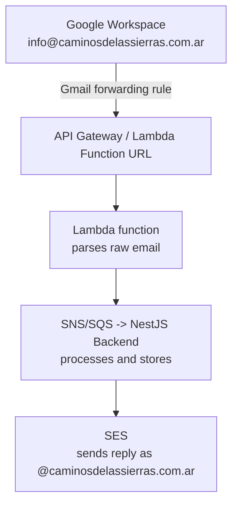
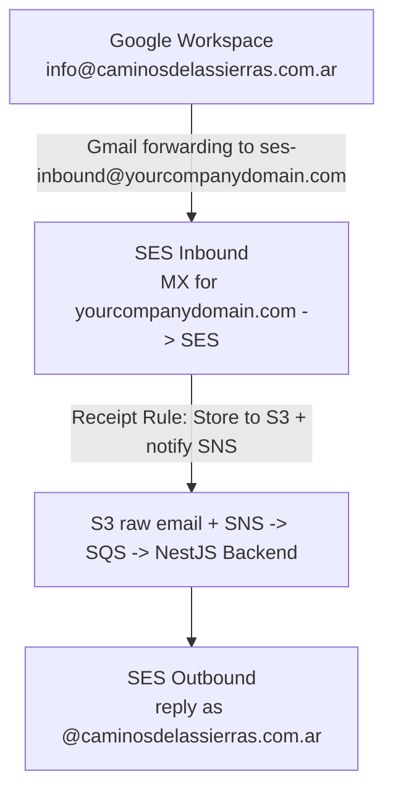
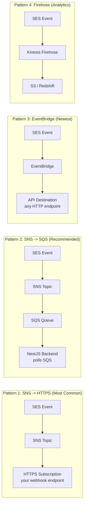
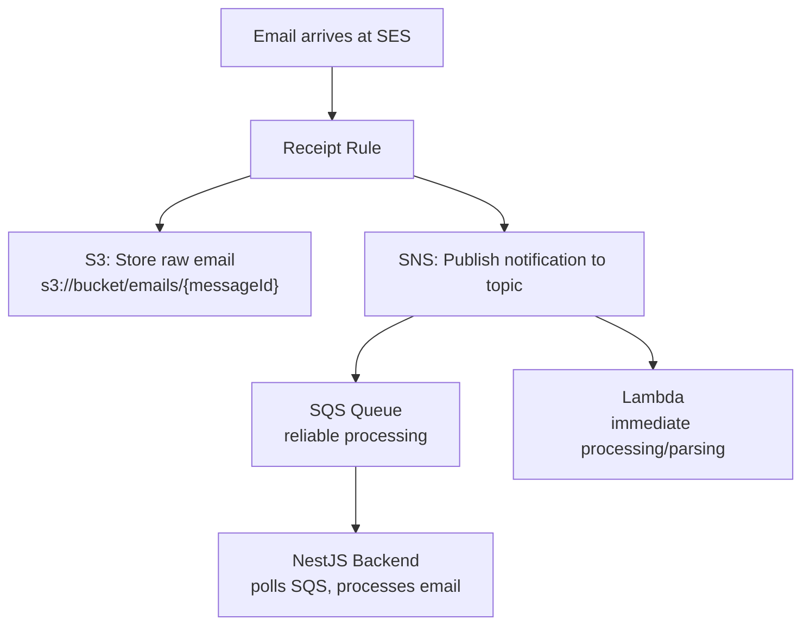
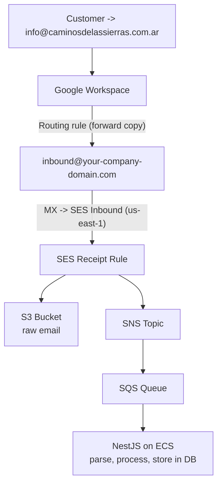
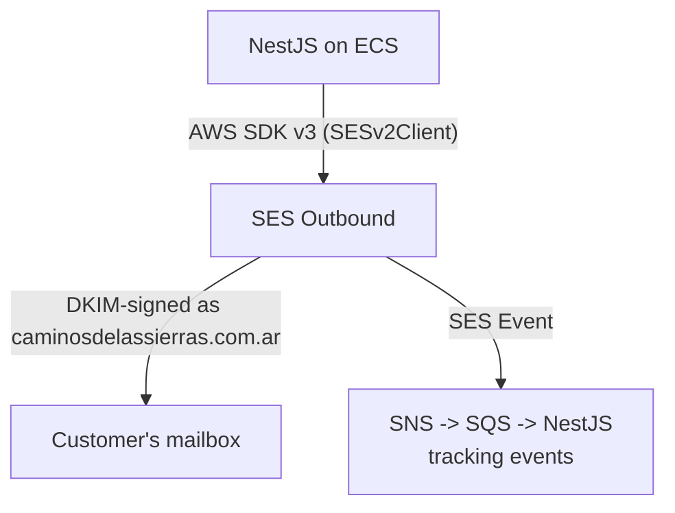

# Amazon SES (Simple Email Service) - Technical POC Research

> **Provider**: Amazon Web Services
> **Service**: Simple Email Service (SES)
> **Research date**: 2025 (based on current SES documentation and pricing)
> **Context**: Evaluate SES for receiving emails at `info@caminosdelassierras.com.ar` (Google Workspace + Cloudflare DNS, DMARC `p=reject`), processing in NestJS/Node.js backend on AWS, and replying as `@caminosdelassierras.com.ar`.

---

## Challenge A - Sending and Receiving

### A1. Inbound Email Receiving

#### How SES Receives Inbound Email

SES can act as an inbound mail server via **SES Email Receiving** (also called "SES Receipt" or "SES Inbound"). The mechanism works as follows:

1. You configure SES to accept mail for a verified domain or specific email addresses.
2. You create **Receipt Rule Sets** containing one or more **Receipt Rules** that define what happens when mail arrives.
3. SES processes the incoming email through the rules and executes the configured actions.

#### MX Record Requirement

**Yes, SES inbound email REQUIRES MX records pointing to SES.** The MX record must point to the SES inbound SMTP endpoint for the region you're using:

| Region | MX Record Value |
|---|---|
| us-east-1 | `inbound-smtp.us-east-1.amazonaws.com` |
| us-west-2 | `inbound-smtp.us-west-2.amazonaws.com` |
| eu-west-1 | `inbound-smtp.eu-west-1.amazonaws.com` |

The MX record format is:
```
10 inbound-smtp.<region>.amazonaws.com
```

**CRITICAL LIMITATION**: SES inbound email is only available in **three regions**:
- `us-east-1` (N. Virginia)
- `us-west-2` (Oregon)
- `eu-west-1` (Ireland)

#### Can It Work With Email Forwarding From Google Workspace Instead of Changing MX?

**Yes, but with significant caveats.** There are two approaches:

**Approach 1: Google Workspace Forwarding (Recommended for this scenario)**

Instead of changing MX records, you can set up forwarding in Google Workspace:

1. Configure a **routing rule** in Google Admin Console (or a Gmail filter on the `info@` mailbox) to forward incoming emails to an address that SES can process.
2. However, SES itself cannot "receive" these forwarded emails unless MX records for the *forwarding destination domain* point to SES. The typical pattern would be:
   - Keep MX records pointing to Google (`aspmx.l.google.com`)
   - Forward from Google to a subdomain you control, e.g., `inbound@mail.yourdomain.com`
   - Point MX for `mail.yourdomain.com` to SES
   - SES Receipt Rules process the forwarded email

**Approach 2: Bypass SES Inbound Entirely (More Practical)**

Since Google Workspace already receives the email, you can skip SES inbound altogether:

1. Set up a Google Workspace routing rule or Gmail filter to forward to an SNS topic via an intermediary (e.g., a webhook endpoint on your NestJS backend, or to a Google Pub/Sub -> Lambda bridge).
2. **Better alternative**: Use the **Gmail API with push notifications** (Google Pub/Sub) to detect new emails and pull them programmatically from your NestJS backend.
3. **Even simpler**: Configure Google Workspace to forward to a Lambda function URL or API Gateway endpoint that processes the raw email.

**Recommended architecture for this POC** (avoiding MX changes):



Alternatively, the simplest approach:



#### Impact of Forwarding on DMARC/SPF

When Google forwards an email, the original sender's SPF may break (because Google's IP is not in the original sender's SPF). However, **DKIM signatures typically survive forwarding** if the message body/headers are not modified. This is relevant if you want to validate the authenticity of the original sender, but for this use case (you just want to receive and process the content), it's not a blocking issue.

---

### A2. SES Receipt Rules

#### How They Work

Receipt Rules are organized into **Receipt Rule Sets**. Only one rule set can be **active** at a time. Within a rule set, rules are evaluated in order.

Each Receipt Rule has:
- **Recipients**: Email addresses or domains this rule applies to (e.g., `info@yourdomain.com` or `yourdomain.com`)
- **Actions**: Ordered list of actions to execute (up to several per rule)
- **TLS requirement**: Option to require TLS for inbound connections
- **Spam/virus scanning**: Option to enable scanning

#### Available Actions

| Action | Description |
|---|---|
| **S3 Action** | Store the raw email (MIME format) in an S3 bucket. Can optionally use a key prefix and KMS encryption. |
| **SNS Action** | Publish a notification to an SNS topic. Can include the full email content (up to 150 KB) or just metadata. |
| **Lambda Action** | Invoke a Lambda function synchronously or asynchronously. The Lambda receives the email event and can control mail flow (STOP_RULE, STOP_RULE_SET, CONTINUE). |
| **Bounce Action** | Send a bounce response to the sender. |
| **Stop Action** | Stop processing further rules in the rule set. |
| **WorkMail Action** | Forward to Amazon WorkMail. |
| **Add Header Action** | Add a custom header to the email. |

#### Important Constraints

- **Email size limit**: SES can receive emails up to **40 MB** (the MIME message). For S3 action, the full message is stored. For SNS action, if the message exceeds **150 KB**, the SNS notification will contain only the metadata (headers, etc.) and you must fetch the full content from S3.
- **The domain or email address must be verified** in SES for receipt rules to work.
- **Receipt rules only work in the 3 supported inbound regions** (us-east-1, us-west-2, eu-west-1).

---

### A3. Sending From External Domain - DNS Requirements

To send emails as `@caminosdelassierras.com.ar` via SES, you need to:

#### Step 1: Verify the Domain in SES

Add `caminosdelassierras.com.ar` as a verified identity in SES. This requires adding a **TXT record** to DNS. Alternatively, with SES v2, domain verification is done via DKIM (see below) -- adding the 3 DKIM CNAME records serves as both domain verification and DKIM setup simultaneously.

#### Step 2: DKIM Configuration (Easy DKIM)

SES generates **three CNAME records** that must be added to DNS. The actual selectors are unique tokens generated by SES (e.g., `abcdef1234ghijkl._domainkey...`). The exact values are provided in the SES console or API response when you initiate domain verification.

**Key detail**: The CNAME records point to `*.dkim.amazonses.com`, which allows AWS to **automatically rotate DKIM keys** without requiring DNS changes. This is a significant advantage over providers that require you to manage keys manually.

#### Step 3: SPF via Custom MAIL FROM Domain

SES sends emails using its own MAIL FROM domain by default (e.g., `amazonses.com`). The SPF check passes against `amazonses.com`, but the SPF alignment with `caminosdelassierras.com.ar` fails.

**With DMARC `p=reject`, SPF alignment failure is acceptable AS LONG AS DKIM alignment passes.** DMARC requires either SPF alignment OR DKIM alignment, not both.

However, for maximum deliverability, you should configure a **Custom MAIL FROM domain**:

1. Choose a subdomain, e.g., `mail.caminosdelassierras.com.ar`
2. Add an MX record for the subdomain pointing to `feedback-smtp.<region>.amazonses.com`
3. Add an SPF record for the subdomain: `v=spf1 include:amazonses.com ~all`

**Important for this domain**: The current SPF record is `v=spf1 include:_spf.google.com ~all`. If you use a Custom MAIL FROM subdomain (e.g., `mail.caminosdelassierras.com.ar`), you do NOT need to modify the root domain's SPF record. The SPF check happens against the MAIL FROM domain (the subdomain), not the header `From` domain.

**However**, some receiving servers may also check the root domain SPF as a secondary signal. For belt-and-suspenders, you could add `include:amazonses.com` to the root SPF: `v=spf1 include:_spf.google.com include:amazonses.com ~all`

#### Summary of DNS Records Needed

| Record Type | Name | Value | Purpose |
|---|---|---|---|
| CNAME | `token1._domainkey.caminosdelassierras.com.ar` | `token1.dkim.amazonses.com` | DKIM (1 of 3) |
| CNAME | `token2._domainkey.caminosdelassierras.com.ar` | `token2.dkim.amazonses.com` | DKIM (2 of 3) |
| CNAME | `token3._domainkey.caminosdelassierras.com.ar` | `token3.dkim.amazonses.com` | DKIM (3 of 3) |
| MX | `mail.caminosdelassierras.com.ar` | `10 feedback-smtp.us-east-1.amazonses.com` | Custom MAIL FROM |
| TXT | `mail.caminosdelassierras.com.ar` | `v=spf1 include:amazonses.com ~all` | SPF for MAIL FROM |
| TXT (optional) | `caminosdelassierras.com.ar` | Modify existing SPF to add `include:amazonses.com` | Root SPF (optional) |

**Total DNS changes**: 5 mandatory records + 1 optional modification. All can be added in Cloudflare.

---

### A4. Can SES Send From a Domain You Don't Own?

**SES requires domain verification via DNS records.** You cannot send from a domain unless you can add the verification records (DKIM CNAMEs or TXT verification token) to that domain's DNS.

In this case, the company does not own `caminosdelassierras.com.ar`, but they need cooperation from whoever manages the Cloudflare DNS to add the records. **Without DNS access, SES cannot send from this domain.**

The verification process:
1. Go to SES Console -> Verified Identities -> Create Identity
2. Choose "Domain" and enter `caminosdelassierras.com.ar`
3. Enable Easy DKIM (recommended: DKIM signing key length 2048-bit)
4. Optionally configure Custom MAIL FROM domain
5. SES provides the DNS records to add
6. Add records in Cloudflare
7. SES periodically checks DNS and marks the domain as "Verified" once records propagate (usually minutes to hours)

**The domain remains verified as long as the DNS records exist.** If records are removed, SES revokes verification after a period.

---

### A5. Reply-To Handling

SES gives you **full control** over the `Reply-To` header:

- When sending via SES API (`SendEmail`, `SendRawEmail`, or v2 `SendEmail`), you can set the `Reply-To` header to any email address.
- The `Reply-To` header does NOT need to be a verified identity in SES.
- The `From` header MUST be a verified identity.

**Use case for this POC**: Set `From` to `info@caminosdelassierras.com.ar` and `Reply-To` to the same address or a routing address. You could also set Reply-To to a unique tracking address (e.g., `case-12345@inbound.yourdomain.com`) to route replies back to your system while maintaining the appearance of sending from the client's domain.

---

### A6. DKIM - Easy DKIM

#### How Easy DKIM Works

1. When you verify a domain with Easy DKIM enabled, SES generates a **DKIM key pair** (public/private).
2. SES stores the private key internally and uses it to sign every outbound email from that domain.
3. The public key is published via the 3 CNAME records you add to DNS.
4. The CNAME records point to `*.dkim.amazonses.com`, where AWS hosts the actual DKIM TXT records (the public keys).
5. When a receiving server gets the email, it looks up the DKIM signature, follows the CNAME to get the public key, and verifies the signature.

#### Key Features

- **Automatic key rotation**: Because the CNAME points to AWS-hosted records, AWS can rotate keys without you changing DNS.
- **Key length options**: 1024-bit or 2048-bit RSA keys. **2048-bit is recommended.**
- **DKIM signing is automatic**: Every email sent from the verified domain through SES is automatically DKIM-signed. No code changes needed.
- **DKIM alignment**: The `d=` domain in the DKIM signature matches `caminosdelassierras.com.ar`, so DMARC DKIM alignment passes.

#### BYODKIM (Bring Your Own DKIM)

As an alternative, SES also supports BYODKIM where you provide your own key pair. This is useful if you need specific selectors or want to manage your own keys. For this POC, Easy DKIM is simpler and recommended.

---

## Challenge B - Thread Tracking

### B1. Message-ID

**Yes, SES automatically generates a `Message-ID` header** for every email sent. The format is `<unique-id@email.amazonses.com>`, or if using a Custom MAIL FROM domain, it may appear as `<unique-id@mail.caminosdelassierras.com.ar>`.

**Important**: SES also returns a **SES Message ID** in the API response (different from the RFC Message-ID header). You can correlate the SES Message ID with the RFC Message-ID in the email headers. SES uses the format `Message-ID: <SES-Message-ID@email.amazonses.com>`. This means the SES API response gives you enough to construct or predict the `Message-ID` header value.

### B2. Custom Headers (In-Reply-To, References)

**Yes, SES fully supports custom headers.** There are two ways:

#### Option 1: Using `SendRawEmail` / v2 `SendEmail` with Raw Content

You construct the entire MIME message yourself, including all headers (From, To, Subject, Message-ID, In-Reply-To, References, MIME-Version, Content-Type). This gives you **complete control** over all headers.

#### Option 2: Using SES v2 `SendEmail` with Headers Parameter

The SES v2 API's `SendEmail` action with `Content.Simple` supports a `Headers` parameter that lets you add custom headers (In-Reply-To, References) without constructing raw MIME. **Note**: The `Headers` parameter in the simple content path was added in SES v2. If it's not available in the SDK version you're using, use `SendRawEmail`.

### B3. Built-in Threading Support

**SES has NO built-in threading support.** Thread management is entirely your responsibility:

- You must store the `Message-ID` of every email sent.
- When a reply comes in (via inbound processing), you must extract the `In-Reply-To` and `References` headers from the incoming email.
- When sending a reply, you must set:
  - `In-Reply-To`: The Message-ID of the email you're replying to
  - `References`: The chain of Message-IDs from the thread (space-separated)
  - `Subject`: Prefix with "Re: " matching the original subject

### B4. Raw Email Sending

SES provides full raw email capability via **SES v1 API** (`SendRawEmail`) and **SES v2 API** (`SendEmail` with `Content.Raw`). Both approaches give you complete control over every header, MIME part, and attachment.

---

## Challenge C - Email Tracking

### C1. Tracking/Notification Features

SES provides extensive tracking through **event notifications**:

| Event Type | Description |
|---|---|
| **Send** | Email was successfully accepted by SES for delivery |
| **Delivery** | SES successfully delivered the email to the recipient's mail server |
| **Bounce** | Email bounced (hard bounce = permanent, soft bounce = temporary) |
| **Complaint** | Recipient marked the email as spam |
| **Reject** | SES rejected the email (e.g., virus detected) |
| **Open** | Recipient opened the email (requires open tracking enabled) |
| **Click** | Recipient clicked a link (requires click tracking enabled) |
| **Rendering Failure** | Template rendering failed |
| **Delivery Delay** | Temporary delivery failure (still retrying) |
| **Subscription** | Related to SES subscription management |

### C2. SNS Notification Configuration

#### Domain/Identity-Level Notifications (SES v1 style)

You can configure SNS topics per identity for three event types:
- **Bounce notifications** -> SNS Topic A
- **Complaint notifications** -> SNS Topic B
- **Delivery notifications** -> SNS Topic C

#### Configuration Sets + Event Destinations (SES v2 style - Recommended)

This is the more modern and flexible approach:

1. **Create a Configuration Set** with tracking options (e.g., CustomRedirectDomain for click tracking).

2. **Create Event Destinations** on the Configuration Set:

Event destinations can send to:
- **SNS Topic** (all event types)
- **Kinesis Data Firehose** (all event types, for streaming to S3/Redshift/etc.)
- **CloudWatch** (dimension-based metrics)
- **EventBridge** (all event types, enables routing to any AWS service)
- **Pinpoint** (for Pinpoint analytics)

3. **Specify the Configuration Set when sending** via the `ConfigurationSetName` parameter in the SendEmail command. This enables tracking for that email.

### C3. Open Tracking and Click Tracking

#### Open Tracking

- **Native support**: Yes, SES supports open tracking.
- **Mechanism**: SES inserts a tiny 1x1 transparent tracking pixel (`` tag) into the HTML body of the email.
- **Activation**: Enable on the Configuration Set via `PutConfigurationSetTrackingOptionsCommand` (or as part of TrackingOptions when creating the configuration set). Open tracking is **enabled per configuration set** by having an event destination that listens for `OPEN` events.
- **Limitations**: Only works for HTML emails. Doesn't work if the recipient's mail client blocks images (common in Outlook, Apple Mail privacy features, etc.).

#### Click Tracking

- **Native support**: Yes, SES supports click tracking.
- **Mechanism**: SES rewrites all links in the HTML body to go through an SES tracking domain. When the recipient clicks, SES records the event and redirects to the original URL.
- **Default tracking domain**: A subdomain of `amazonses.com`.
- **Custom tracking domain**: You can set a custom domain (e.g., `track.yourdomain.com`) via the Configuration Set's `TrackingOptions.CustomRedirectDomain`. This requires:
  - A CNAME record: `track.yourdomain.com CNAME <varies by region, e.g., r.us-east-1.awstrack.me>`
- **Activation**: Similar to open tracking, enable by having event destinations for `CLICK` events.

**Important note on tracking and DKIM**: Open/click tracking modifies the email body, which happens BEFORE DKIM signing. So DKIM signatures remain valid.

### C4. SES + CloudWatch Metrics

SES publishes these metrics to CloudWatch automatically:

| Metric | Description |
|---|---|
| `Send` | Number of send API calls |
| `Delivery` | Number of successful deliveries |
| `Bounce` | Number of bounces |
| `Complaint` | Number of complaints |
| `Reject` | Number of rejected sends |
| `Open` | Number of opens (if tracking enabled) |
| `Click` | Number of clicks (if tracking enabled) |
| `RenderingFailure` | Number of template rendering failures |

With **Configuration Sets** that have CloudWatch as an event destination, you can add custom dimensions (e.g., campaign, dimension value source from MESSAGE_TAG, EMAIL_HEADER, or LINK_TAG). You can then create CloudWatch dashboards and alarms based on these metrics.

**SES Account-Level Metrics** (always available without configuration sets):
- Sending quota utilization
- Bounce rate (SES monitors this; if it exceeds ~5%, your account may be put on probation)
- Complaint rate (SES monitors this; threshold is ~0.1%)

### C5. Webhook-Style Event Notifications

SES doesn't have a native "webhook" feature, but you can achieve webhook-style behavior through several patterns:



- **Pattern 1** (SNS -> HTTPS): SNS can deliver to an HTTPS endpoint, which is effectively a webhook. Your NestJS backend exposes an endpoint that SNS calls with the event payload.
- **Pattern 2** (SNS -> SQS, recommended): More resilient because SQS provides guaranteed delivery, retry, and dead-letter queue support.
- **Pattern 3** (EventBridge): Provides filtering, transformation, and reliable delivery to HTTP endpoints. Closest to a native webhook, allows complex event routing.
- **Pattern 4** (Kinesis Firehose): Good for historical analytics and reporting.

---

## Pricing

### Current SES Pricing Model (as of 2025)

SES pricing is straightforward and among the cheapest in the industry.

#### Outbound Email (Sending)

| Scenario | Price |
|---|---|
| Sending from EC2-hosted application | **$0.00** for the first **62,000 emails/month** (Free Tier) |
| Beyond free tier / non-EC2 | **$0.10 per 1,000 emails** ($0.0001 per email) |
| Attachments | **$0.12 per GB** of attachments sent |

**Free Tier detail**: The 62,000 emails/month free tier applies when emails are sent from an application hosted on **Amazon EC2** (or services that run on EC2 like ECS, EKS, Elastic Beanstalk, Lambda). Since the company runs on ECS, they qualify.

#### Inbound Email (Receiving)

| Scenario | Price |
|---|---|
| First 1,000 emails/month | **Free** |
| Beyond 1,000 | **$0.10 per 1,000 emails** |
| Incoming email chunks (per 256 KB) | **$0.09 per 1,000 chunks** |

**Note**: "Chunks" means each 256 KB of an incoming email counts as one chunk. A 1 KB email = 1 chunk. A 300 KB email = 2 chunks.

#### Additional Costs

| Feature | Cost |
|---|---|
| **Dedicated IP** | **$24.95/month per IP** (minimum 1 IP per region) |
| **Dedicated IPs (managed)** | **$24.95/month per IP** with automatic warm-up and scaling |
| **Virtual Deliverability Manager** | **$0.07 per 100 emails** (advisory dashboard for deliverability insights) |
| **SES Mailbox Simulator** | Free (for testing bounces, complaints, etc.) |

#### Cost Estimate for This POC

Assuming:
- Hosted on ECS (qualifies for free tier)
- ~500 inbound emails/month
- ~500 outbound replies/month
- Small attachments (< 1 GB total)

| Item | Monthly Cost |
|---|---|
| Outbound (500 emails, covered by free tier) | $0.00 |
| Inbound (500 emails, covered by free 1,000) | $0.00 |
| SNS notifications | ~$0.00 (SNS first 1M requests free) |
| S3 storage for raw emails | ~$0.01 |
| Lambda invocations | ~$0.00 (covered by free tier) |
| **Total** | **~$0.01/month** |

Even at higher volumes (10,000 emails/month):

| Item | Monthly Cost |
|---|---|
| Outbound (10,000 emails, 62,000 free on EC2) | $0.00 |
| Inbound (10,000 emails) | $0.90 |
| Attachments (~2 GB) | $0.24 |
| **Total** | **~$1.14/month** |

---

## Integration

### I2. SES v2 API vs SES v1 API

| Feature | SES v1 (`@aws-sdk/client-ses`) | SES v2 (`@aws-sdk/client-sesv2`) |
|---|---|---|
| API style | Older, more granular operations | Modern, consolidated operations |
| Send email | `SendEmail`, `SendRawEmail`, `SendTemplatedEmail`, `SendBulkTemplatedEmail` | Single `SendEmail` with content type options (Simple, Raw, Template) |
| Configuration sets | Supported | First-class, more features |
| Custom headers in simple sends | Not supported (must use `SendRawEmail`) | Supported via `Headers` parameter |
| Event destinations | SNS, CloudWatch, Kinesis Firehose | SNS, CloudWatch, Kinesis Firehose, **EventBridge**, Pinpoint |
| Contact lists / subscription management | Not available | Built-in list management |
| Virtual Deliverability Manager | Not available | Supported |
| Domain verification | TXT record or DKIM | DKIM-based (preferred) |
| **Recommendation** | Legacy; avoid for new projects | **Use this for all new projects** |

### I3. Processing Inbound Emails

#### Architecture: S3 + SNS + Lambda (or SQS -> NestJS)



### I4. Integration With Existing AWS Infrastructure

Since the company already uses AWS extensively, SES integrates naturally:

| AWS Service | Integration with SES |
|---|---|
| **ECS** | Backend on ECS uses AWS SDK to send via SES. IAM task role provides credentials. No API keys needed. |
| **S3** | Store inbound raw emails. Store email templates. Archive sent emails. |
| **SNS** | Receive SES event notifications (bounces, deliveries, opens, clicks). Fan out to multiple consumers. |
| **SQS** | Buffer inbound email processing. Decouple event handling. Dead-letter queue for failed processing. |
| **Lambda** | Process inbound emails. Handle SES events. |
| **CloudWatch** | SES metrics, alarms on bounce/complaint rates, dashboards. |
| **EventBridge** | Route SES events to any AWS service with filtering rules. |
| **IAM** | Fine-grained permissions for sending (can restrict to specific From addresses). |
| **KMS** | Encrypt stored emails at rest (S3 server-side encryption). |
| **CloudFormation/CDK** | Full IaC support for all SES resources. |

---

## Limitations

### L1. Sandbox Mode Restrictions

**Every new SES account starts in Sandbox mode.** Restrictions:

| Restriction | Sandbox | Production |
|---|---|---|
| Send to | Only verified email addresses/domains | Any recipient |
| Send from | Only verified identities | Only verified identities |
| Daily sending limit | **200 emails/day** | Starts at 50,000/day (adjustable) |
| Sending rate | **1 email/second** | Starts at 14 emails/second (adjustable) |

**To move out of Sandbox**: Submit a request via AWS Console or Support. You need to provide:
- Your use case
- How you handle bounces and complaints
- Expected sending volume
- Content type (transactional vs. marketing)

**Typical approval time**: 24-48 hours. Sometimes requires back-and-forth with AWS support.

**Important for POC**: You can do the entire POC in sandbox mode by verifying the specific recipient email addresses you'll test with.

### L2. Sending Limits

| Metric | Default (Production) | Maximum |
|---|---|---|
| Daily sending quota | 50,000 emails/day | Can be increased to millions via request |
| Maximum send rate | 14 emails/second | Can be increased to hundreds/second |
| Maximum message size | **10 MB** (including attachments, after encoding) | Cannot be increased |
| Maximum recipients per message | 50 | Cannot be increased |
| Maximum `SendEmail` API calls | 1 per message | N/A |

**Sending rate increases**: SES automatically increases your limits over time if you maintain good sending reputation. You can also request increases manually.

### L3. Region Availability

#### SES Sending (Outbound) - Available in many regions:

- us-east-1 (N. Virginia)
- us-east-2 (Ohio)
- us-west-1 (N. California)
- us-west-2 (Oregon)
- af-south-1 (Cape Town)
- ap-south-1 (Mumbai)
- ap-northeast-1 (Tokyo)
- ap-northeast-2 (Seoul)
- ap-northeast-3 (Osaka)
- ap-southeast-1 (Singapore)
- ap-southeast-2 (Sydney)
- ca-central-1 (Canada)
- eu-central-1 (Frankfurt)
- eu-west-1 (Ireland)
- eu-west-2 (London)
- eu-west-3 (Paris)
- eu-north-1 (Stockholm)
- eu-south-1 (Milan)
- me-south-1 (Bahrain)
- sa-east-1 (Sao Paulo)
- il-central-1 (Tel Aviv)

#### SES Receiving (Inbound) - ONLY 3 regions:

| Region | Endpoint |
|---|---|
| us-east-1 (N. Virginia) | `inbound-smtp.us-east-1.amazonaws.com` |
| us-west-2 (Oregon) | `inbound-smtp.us-west-2.amazonaws.com` |
| eu-west-1 (Ireland) | `inbound-smtp.eu-west-1.amazonaws.com` |

**This is a significant limitation.** If your primary AWS infrastructure is in a different region, inbound email processing must be in one of these three regions, and you'll need cross-region integration.

### L4. Gotchas With Inbound Email Processing

1. **SNS message size limit**: If the incoming email exceeds **150 KB**, the SNS notification will NOT contain the email content. You MUST store to S3 first and fetch from there. Always design your architecture to handle both paths.

2. **No built-in spam filtering for custom actions**: SES provides basic spam/virus scanning (via SpamAssassin) in receipt rules, but you can only choose to bounce spam or let it through. There's no sophisticated filtering.

3. **Receipt rules are regional**: If you set up inbound in us-east-1, you can't access those receipt rules from eu-west-1.

4. **Domain verification for receiving**: The domain must be verified in SES for receipt rules to accept mail for it. But this is the same verification needed for sending.

5. **No built-in email parsing**: SES delivers raw MIME content. You need a library like `mailparser` to parse it into structured data (headers, body, attachments).

6. **Forwarded emails break SPF/DKIM of original sender**: If you use Google Workspace forwarding to SES, the SPF of the original sender may fail (since Google is relaying, not the original server). DKIM may survive if Google doesn't modify the message. This affects your ability to verify the original sender's authenticity but doesn't block receiving.

7. **No webhook/inbound parse API like SendGrid**: Unlike SendGrid's Inbound Parse (which POSTs parsed email data to your webhook), SES inbound requires you to set up the S3/SNS/Lambda pipeline yourself. It's more flexible but requires more setup.

8. **Encryption concerns**: Emails stored in S3 via receipt rules are unencrypted by default. You should enable S3 server-side encryption (SSE-S3 or SSE-KMS) on the bucket.

9. **SES does not handle catch-all well**: Receipt rules match exact addresses or entire domains. There's no regex or pattern matching for recipient addresses.

10. **Bounce rate monitoring**: SES actively monitors your bounce and complaint rates. If your bounce rate exceeds ~5% or complaint rate exceeds ~0.1%, SES may put your account on probation or suspend sending. This is important to monitor, especially when sending to customer addresses you haven't validated.

---

## Architecture Recommendation for This Specific POC

Given the constraints (Google Workspace, Cloudflare DNS, DMARC `p=reject`, NestJS on ECS):

### Recommended Architecture

#### Inbound Flow



#### Outbound Flow



### DNS Records Required (in Cloudflare)

For **caminosdelassierras.com.ar**:

| # | Type | Name | Value | Purpose |
|---|---|---|---|---|
| 1 | CNAME | `token1._domainkey` | `token1.dkim.amazonses.com` | SES DKIM (1/3) |
| 2 | CNAME | `token2._domainkey` | `token2.dkim.amazonses.com` | SES DKIM (2/3) |
| 3 | CNAME | `token3._domainkey` | `token3.dkim.amazonses.com` | SES DKIM (3/3) |
| 4 | MX | `mail` | `10 feedback-smtp.us-east-1.amazonses.com` | Custom MAIL FROM |
| 5 | TXT | `mail` | `v=spf1 include:amazonses.com ~all` | SPF for MAIL FROM subdomain |

**Existing MX records for root domain stay unchanged** (Google Workspace).
**Existing SPF for root domain optionally updated** to add `include:amazonses.com`.

### Key Advantages for This Use Case

1. **Already on AWS**: Native integration, IAM-based auth, no API keys to manage, same billing.
2. **Extremely cheap**: Effectively free at POC scale (and low-cost at production scale).
3. **Full header control**: Can set In-Reply-To, References, custom Message-ID for threading.
4. **Event notifications**: Comprehensive tracking via SNS/SQS (already in their stack).
5. **DKIM alignment**: Easy DKIM with auto-rotation satisfies DMARC `p=reject`.
6. **Scalability**: No practical limits for their volume.

### Key Disadvantages / Risks

1. **No built-in inbound parse webhook**: Must build the S3/SNS/Lambda pipeline yourself (unlike SendGrid's simpler Inbound Parse).
2. **Inbound only in 3 regions**: May need cross-region setup if primary infra is elsewhere.
3. **Sandbox escape required**: Need to request production access (24-48 hours).
4. **No built-in threading**: All thread management is manual (but this is true for all providers).
5. **DNS access required**: The 5+ DNS records must be added in Cloudflare by whoever controls the domain.
6. **No built-in email templating UI**: Unlike SendGrid's dynamic templates or marketing features, SES is more bare-bones. Templates exist (SES Templates API) but are basic Handlebars-style.
7. **Forward detection**: SES does not provide "forwarded" event tracking. Only open, click, bounce, complaint, delivery.

---

## Comparison Notes (vs. Other Providers in Evaluation)

| Feature | Amazon SES | SendGrid | Notes |
|---|---|---|---|
| **Inbound parsing** | DIY (S3+SNS+Lambda) | Built-in Inbound Parse webhook | SendGrid simpler for inbound |
| **Outbound sending** | API/SMTP | API/SMTP | Comparable |
| **DKIM setup** | 3 CNAME records | 2 CNAME records | SES slightly more DNS records |
| **Thread management** | Manual (full header control) | Manual (full header control) | Same effort |
| **Open/Click tracking** | Native (config set) | Native (built-in) | Comparable |
| **Event webhooks** | SNS->SQS/HTTP | Native Event Webhook | SES requires more plumbing |
| **Pricing (sending)** | $0.10/1K ($0 on EC2 free tier) | $0.35-0.80/1K (tiered) | SES 3-8x cheaper |
| **Pricing (inbound)** | $0.10/1K | Included in plan | SES cheaper at volume |
| **AWS integration** | Native | Third-party | Huge advantage for SES |
| **Ease of setup** | Medium (more DIY) | Easy (more batteries-included) | SendGrid faster to prototype |
| **Deliverability tools** | Virtual Deliverability Manager ($) | Deliverability insights (plan-dependent) | Both adequate |

---

## Summary Assessment

| Criterion | Rating | Notes |
|---|---|---|
| **Can receive inbound email?** | Yes (with MX change or forwarding pattern) | Requires MX for SES inbound, OR use Google forwarding + own domain's MX |
| **Can send as @caminosdelassierras.com.ar?** | Yes (with DNS records) | 3 DKIM CNAMEs + Custom MAIL FROM MX/TXT = 5 DNS records in Cloudflare |
| **Passes DMARC p=reject?** | Yes | DKIM alignment via Easy DKIM satisfies DMARC |
| **Thread continuity?** | Yes (manual) | Full control via In-Reply-To/References headers |
| **Email tracking?** | Yes | Open, click, delivery, bounce, complaint via Configuration Sets |
| **Cost for POC?** | ~$0/month | Free tier covers POC volume easily |
| **Cost at scale (10K/mo)?** | ~$1-2/month | Extremely competitive |
| **Integration with existing AWS?** | Excellent | Native IAM, SNS, SQS, S3, CloudWatch, EventBridge |
| **Setup complexity?** | Medium-High | More DIY than SendGrid, but more flexible |
| **Time to production?** | 2-4 days | Sandbox escape (24-48h) + DNS propagation + development |

---

## References

### Pricing
- SES Pricing: <https://aws.amazon.com/ses/pricing/>
- SES FAQs: <https://aws.amazon.com/ses/faqs/>

### Inbound Email Receiving (Receipt Rules)
- Email receiving with Amazon SES: <https://docs.aws.amazon.com/ses/latest/dg/receiving-email.html>
- SES email receiving concepts and use cases: <https://docs.aws.amazon.com/ses/latest/dg/receiving-email-concepts.html>
- Creating receipt rules (console walkthrough): <https://docs.aws.amazon.com/ses/latest/dg/receiving-email-receipt-rules-console-walkthrough.html>
- ReceiptRule API Reference: <https://docs.aws.amazon.com/ses/latest/APIReference/API_ReceiptRule.html>

### Domain Verification and DKIM
- Verified identities in Amazon SES: <https://docs.aws.amazon.com/ses/latest/dg/verify-addresses-and-domains.html>
- Configuring identities in Amazon SES: <https://docs.aws.amazon.com/ses/latest/dg/configure-identities.html>
- Easy DKIM in Amazon SES: <https://docs.aws.amazon.com/ses/latest/dg/send-email-authentication-dkim-easy.html>
- Authenticating email with DKIM in SES: <https://docs.aws.amazon.com/ses/latest/dg/send-email-authentication-dkim.html>

### SPF and Custom MAIL FROM Domain
- Authenticating email with SPF in Amazon SES: <https://docs.aws.amazon.com/ses/latest/dg/send-email-authentication-spf.html>
- Complying with DMARC in Amazon SES: <https://docs.aws.amazon.com/ses/latest/dg/send-email-authentication-dmarc.html>

### Configuration Sets, Event Destinations and Tracking
- Setting up event notifications for SES: <https://docs.aws.amazon.com/ses/latest/dg/monitor-sending-activity-using-notifications.html>
- Creating Amazon SES event destinations: <https://docs.aws.amazon.com/ses/latest/dg/event-destinations-manage.html>
- Set up an Amazon SNS event destination: <https://docs.aws.amazon.com/ses/latest/dg/event-publishing-add-event-destination-sns.html>
- Create a configuration set: <https://docs.aws.amazon.com/ses/latest/dg/event-publishing-create-configuration-set.html>
- PutConfigurationSetTrackingOptions (open/click tracking): <https://docs.aws.amazon.com/ses/latest/APIReference-V2/API_PutConfigurationSetTrackingOptions.html>

### Sending Limits and Sandbox
- Service quotas in Amazon SES: <https://docs.aws.amazon.com/ses/latest/dg/quotas.html>
- Managing your Amazon SES sending limits: <https://docs.aws.amazon.com/ses/latest/dg/manage-sending-quotas.html>
- Increasing your SES sending quotas: <https://docs.aws.amazon.com/ses/latest/dg/manage-sending-quotas-request-increase.html>

### Region Availability
- Regions and Amazon SES: <https://docs.aws.amazon.com/ses/latest/dg/regions.html>
- SES email receiving expands to new regions (2023 announcement): <https://aws.amazon.com/about-aws/whats-new/2023/09/amazon-ses-email-service-7-regions/>

### SDK and Integration
- `@aws-sdk/client-sesv2` (npm): <https://www.npmjs.com/package/@aws-sdk/client-sesv2>
- AWS SDK for JavaScript v3 - SESv2 Client: <https://docs.aws.amazon.com/AWSJavaScriptSDK/v3/latest/client/sesv2>
- `@aws-sdk/client-ses` (npm, v1 API): <https://www.npmjs.com/package/@aws-sdk/client-ses>
- Nodemailer with SES transport: <https://nodemailer.com/transports/ses/>
