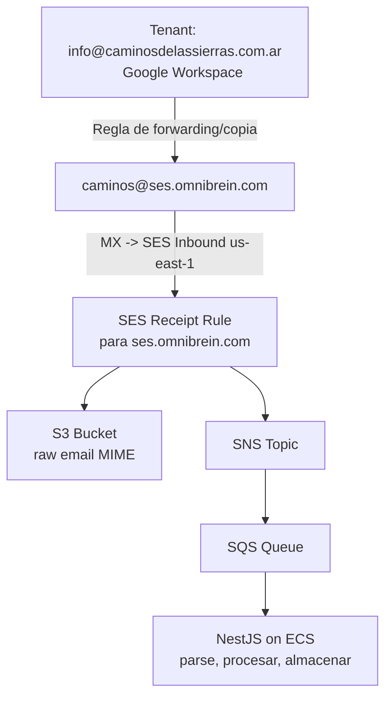
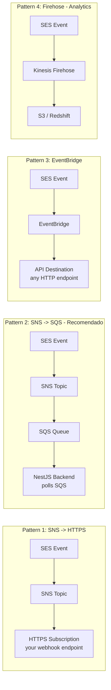
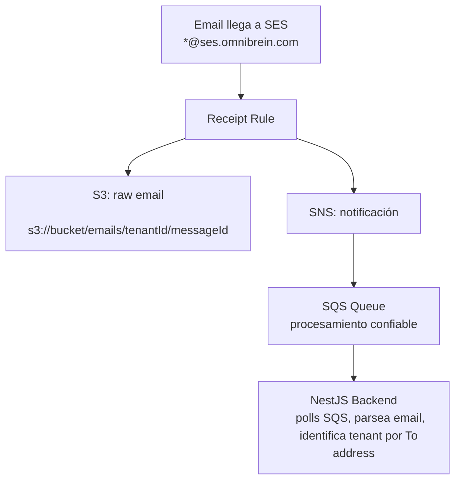
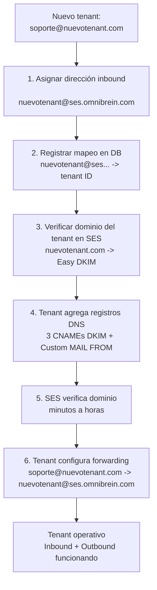
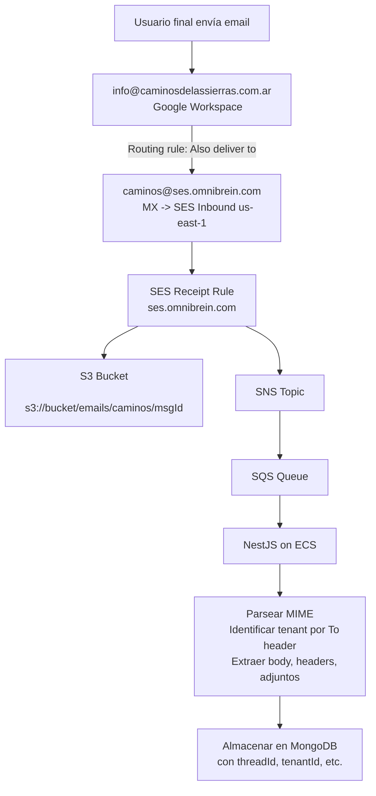
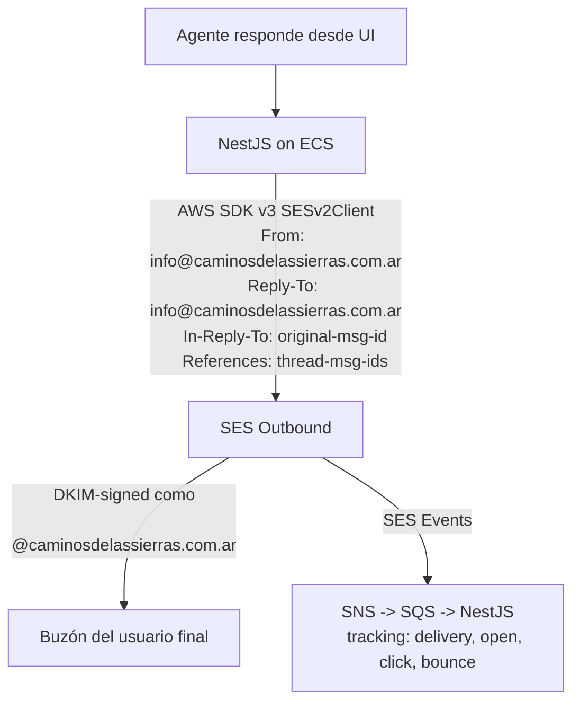

# Amazon SES (Simple Email Service) - Investigación Técnica

> **Provider**: Amazon Web Services
>
> **Service**: Simple Email Service (SES)
>
> **Fecha de investigación**: 2025 (basado en documentación y pricing actual de SES)
>
> **Contexto**: Evaluar SES para una arquitectura **multi-tenant** de email donde:
> - Se usa el subdominio `ses.omnibrein.com` (dominio propio) con MX apuntando a SES para recepción inbound
> - Cada tenant (ej: `info@caminosdelassierras.com.ar`) configura forwarding hacia una dirección dedicada en `ses.omnibrein.com` (ej: `caminos@ses.omnibrein.com`)
> - SES procesa los emails inbound y los envía al backend NestJS/Node.js en AWS (ECS)
> - SES envía respuestas firmadas con DKIM del dominio del tenant (ej: `@caminosdelassierras.com.ar`)
>
> **Tenant de referencia**: Caminos de las Sierras (`info@caminosdelassierras.com.ar`, Google Workspace + Cloudflare DNS, DMARC `p=reject`)

---

## Challenge A - Envío y Recepción

### A1. Recepción de Email Inbound

#### Arquitectura de recepción: ses.omnibrein.com

La arquitectura de recepción se basa en usar un **subdominio propio** (`ses.omnibrein.com`) como punto de entrada para todos los emails inbound de todos los tenants. SES actúa como servidor de correo inbound para este subdominio mediante **SES Email Receiving**.

El flujo es el siguiente:

1. El tenant configura una **regla de forwarding/copia** en su proveedor de email (ej: Google Workspace) para reenviar los emails entrantes a una dirección dedicada en `ses.omnibrein.com`.
2. El registro MX de `ses.omnibrein.com` apunta a SES, que recibe el email reenviado.
3. Las **Receipt Rules** de SES procesan el email: lo almacenan en S3 y notifican via SNS.
4. El backend NestJS (via SQS) procesa el email, lo parsea y lo almacena en la base de datos.



#### Configuración del subdominio ses.omnibrein.com

**Paso 1: Registro MX en DNS de omnibrein.com**

El registro MX del subdominio debe apuntar al endpoint SMTP inbound de SES para la región elegida:

| Región | Valor del registro MX |
|---|---|
| us-east-1 | `inbound-smtp.us-east-1.amazonaws.com` |
| us-west-2 | `inbound-smtp.us-west-2.amazonaws.com` |
| eu-west-1 | `inbound-smtp.eu-west-1.amazonaws.com` |

Registro MX a agregar en el DNS de `omnibrein.com`:
```
ses.omnibrein.com    MX    10 inbound-smtp.us-east-1.amazonaws.com
```

**Paso 2: Verificar el subdominio en SES**

Verificar `ses.omnibrein.com` como identidad en SES (vía DKIM o registro TXT). Esto permite que SES acepte correo para cualquier dirección `*@ses.omnibrein.com`.

**Paso 3: Crear Receipt Rule**

Crear una Receipt Rule para el dominio `ses.omnibrein.com` que aplique a **todas las direcciones** del subdominio. Esto permite agregar nuevos tenants sin modificar las reglas de SES.

**LIMITACIÓN CRÍTICA**: El email inbound de SES solo está disponible en **tres regiones**:
- `us-east-1` (N. Virginia)
- `us-west-2` (Oregon)
- `eu-west-1` (Ireland)

#### Configuración del forwarding en el tenant

El tenant (ej: Caminos de las Sierras) debe configurar una regla para copiar/reenviar todos los emails entrantes a su dirección dedicada en `ses.omnibrein.com`. Dependiendo del proveedor de email del tenant:

| Proveedor del tenant | Método de forwarding |
|---|---|
| **Google Workspace** | Routing rule en Admin Console, o filtro de Gmail con "Forward a copy to" |
| **Microsoft 365** | Transport rule en Exchange Admin Center, o regla de Outlook |
| **Otro proveedor** | Regla de forwarding equivalente en su panel de administración |

Para el tenant de referencia (Caminos de las Sierras, Google Workspace):
- Configurar en Google Admin Console → Gmail → Routing → **"Add rule"**
- Condición: emails recibidos en `info@caminosdelassierras.com.ar`
- Acción: **"Also deliver to"** → `caminos@ses.omnibrein.com`

Esto garantiza que:
- El email original permanece en el buzón del tenant (Google Workspace)
- Una copia llega a SES para ser procesada por el backend

#### Impacto del forwarding en DMARC/SPF

Cuando Google reenvía un email, el SPF del remitente original puede fallar (porque la IP de Google no está en el SPF del remitente original). Sin embargo, **las firmas DKIM típicamente sobreviven al forwarding** si el cuerpo/headers del mensaje no se modifican. Esto es relevante si se quiere validar la autenticidad del remitente original, pero para este caso de uso (recibir y procesar el contenido), no es un bloqueo.

#### Escalabilidad multi-tenant

La arquitectura escala naturalmente a múltiples tenants sin cambios en infraestructura:

| Tenant | Email del tenant | Dirección en ses.omnibrein.com | Forwarding |
|---|---|---|---|
| Caminos de las Sierras | `info@caminosdelassierras.com.ar` | `caminos@ses.omnibrein.com` | Google Workspace routing rule |
| Tenant B | `contacto@tenantb.com` | `tenantb@ses.omnibrein.com` | Según su proveedor de email |
| Tenant C | `soporte@tenantc.com.ar` | `tenantc@ses.omnibrein.com` | Según su proveedor de email |

**Para agregar un nuevo tenant** al sistema inbound:
1. Asignar una dirección única en `ses.omnibrein.com` (ej: `nuevotenantX@ses.omnibrein.com`)
2. El tenant configura forwarding desde su email hacia esa dirección
3. La Receipt Rule existente (para todo `ses.omnibrein.com`) ya cubre la nueva dirección automáticamente
4. **No se requieren cambios en DNS, ni en SES, ni en las Receipt Rules**

Para outbound (enviar respuestas como `@dominiodelTenant`), sí se requiere verificar el dominio del tenant en SES (ver sección A3).

---

### A2. SES Receipt Rules

#### Cómo funcionan

Las Receipt Rules se organizan en **Receipt Rule Sets**. Solo un rule set puede estar **activo** a la vez. Dentro de un rule set, las reglas se evalúan en orden.

Cada Receipt Rule tiene:
- **Recipients**: Direcciones de email o dominios a los que aplica la regla (ej: `ses.omnibrein.com` para aceptar todo el subdominio)
- **Actions**: Lista ordenada de acciones a ejecutar (hasta varias por regla)
- **TLS requirement**: Opción de requerir TLS para conexiones inbound
- **Spam/virus scanning**: Opción de habilitar escaneo

#### Acciones disponibles

| Acción | Descripción |
|---|---|
| **S3 Action** | Almacena el email raw (formato MIME) en un bucket S3. Opcionalmente puede usar un prefijo de key y cifrado KMS. |
| **SNS Action** | Publica una notificación en un topic de SNS. Puede incluir el contenido completo del email (hasta 150 KB) o solo metadata. |
| **Lambda Action** | Invoca una función Lambda de forma síncrona o asíncrona. La Lambda recibe el evento del email y puede controlar el flujo de correo (STOP_RULE, STOP_RULE_SET, CONTINUE). |
| **Bounce Action** | Envía una respuesta bounce al remitente. |
| **Stop Action** | Detiene el procesamiento de más reglas en el rule set. |
| **WorkMail Action** | Reenvía a Amazon WorkMail. |
| **Add Header Action** | Añade un header personalizado al email. |

#### Restricciones importantes

- **Límite de tamaño de email**: SES puede recibir emails de hasta **40 MB** (el mensaje MIME). Para la acción S3, el mensaje completo se almacena. Para la acción SNS, si el mensaje supera **150 KB**, la notificación SNS contendrá solo la metadata (headers, etc.) y se debe obtener el contenido completo desde S3.
- **El dominio o dirección de email debe estar verificado** en SES para que las receipt rules funcionen.
- **Las receipt rules solo funcionan en las 3 regiones soportadas para inbound** (us-east-1, us-west-2, eu-west-1).

---

### A3. Requisitos DNS por dominio

La arquitectura requiere configuración DNS en **dos dominios distintos** con responsabilidades separadas:

#### DNS en omnibrein.com (dominio propio - control total)

Estos registros se agregan en el DNS de `omnibrein.com` y están **bajo nuestro control total**. Solo se configuran **una vez** y cubren a todos los tenants.

| # | Tipo | Nombre | Valor | Propósito |
|---|---|---|---|---|
| 1 | MX | `ses` | `10 inbound-smtp.us-east-1.amazonaws.com` | SES Inbound - recepción de email |
| 2 | CNAME | `token1._domainkey.ses` | `token1.dkim.amazonses.com` | DKIM del subdominio (1/3) |
| 3 | CNAME | `token2._domainkey.ses` | `token2.dkim.amazonses.com` | DKIM del subdominio (2/3) |
| 4 | CNAME | `token3._domainkey.ses` | `token3.dkim.amazonses.com` | DKIM del subdominio (3/3) |

**Total**: 4 registros (1 MX + 3 CNAME DKIM). Se configuran una sola vez.

**Importante**: Los registros MX del dominio raíz `omnibrein.com` **no se modifican**. Solo se agrega MX para el subdominio `ses`.

#### DNS en el dominio del tenant (requiere cooperación del tenant)

Estos registros se agregan en el DNS del dominio del tenant y son necesarios **solo para envío outbound** (enviar emails como `@caminosdelassierras.com.ar`). Para recepción inbound, el tenant **solo necesita configurar la regla de forwarding**, sin cambios en DNS.

Ejemplo para el tenant Caminos de las Sierras (`caminosdelassierras.com.ar`, DNS en Cloudflare):

| # | Tipo | Nombre | Valor | Propósito |
|---|---|---|---|---|
| 1 | CNAME | `token1._domainkey.caminosdelassierras.com.ar` | `token1.dkim.amazonses.com` | DKIM (1 de 3) |
| 2 | CNAME | `token2._domainkey.caminosdelassierras.com.ar` | `token2.dkim.amazonses.com` | DKIM (2 de 3) |
| 3 | CNAME | `token3._domainkey.caminosdelassierras.com.ar` | `token3.dkim.amazonses.com` | DKIM (3 de 3) |
| 4 | MX | `mail.caminosdelassierras.com.ar` | `10 feedback-smtp.us-east-1.amazonses.com` | Custom MAIL FROM |
| 5 | TXT | `mail.caminosdelassierras.com.ar` | `v=spf1 include:amazonses.com ~all` | SPF para MAIL FROM |
| 6 | TXT (opcional) | `caminosdelassierras.com.ar` | Modificar SPF existente para añadir `include:amazonses.com` | SPF raíz (opcional) |

**Los registros MX existentes del dominio raíz permanecen sin cambios** (Google Workspace: `aspmx.l.google.com`).

**Nota sobre SPF**: El registro SPF actual de `caminosdelassierras.com.ar` es `v=spf1 include:_spf.google.com ~all`. El Custom MAIL FROM usa un subdominio (`mail.caminosdelassierras.com.ar`), por lo que NO necesita modificar el SPF raíz. Sin embargo, opcionalmente se puede añadir `include:amazonses.com` al SPF raíz como señal secundaria.

**Nota sobre DMARC**: Con DMARC `p=reject`, el fallo de alineación SPF es aceptable **siempre que la alineación DKIM pase**. DMARC requiere alineación SPF O alineación DKIM, no ambas. Los registros DKIM de SES garantizan que la alineación DKIM pase.

#### Resumen: qué necesita cada parte

| Requisito | omnibrein.com (nosotros) | Dominio del tenant |
|---|---|---|
| **Para inbound (recibir)** | MX + verificación DKIM de `ses.omnibrein.com` (una sola vez) | Solo regla de forwarding (sin cambios DNS) |
| **Para outbound (enviar como @tenant)** | N/A | 3 CNAMEs DKIM + MX/TXT Custom MAIL FROM (5-6 registros) |

---

### A4. Envío desde dominio del tenant - Verificación

**SES requiere verificación de dominio vía registros DNS.** No se puede enviar desde un dominio a menos que se puedan añadir los registros de verificación (CNAMEs de DKIM o token de verificación TXT) al DNS de ese dominio.

En esta arquitectura, se necesita la cooperación de cada tenant (o de quien gestione su DNS) para añadir los registros DKIM. **Sin acceso al DNS del tenant, SES no puede enviar desde su dominio.**

El proceso de verificación por cada nuevo tenant:
1. Ir a SES Console → Verified Identities → Create Identity
2. Elegir "Domain" e introducir el dominio del tenant (ej: `caminosdelassierras.com.ar`)
3. Habilitar Easy DKIM (recomendado: longitud de clave DKIM 2048-bit)
4. Opcionalmente configurar Custom MAIL FROM domain
5. SES proporciona los registros DNS a añadir
6. El tenant (o quien administre su DNS) añade los registros
7. SES verifica periódicamente el DNS y marca el dominio como "Verified" (normalmente minutos a horas)

**El dominio permanece verificado mientras existan los registros DNS.** Si se eliminan los registros, SES revoca la verificación tras un período.

---

### A5. Manejo de Reply-To

SES otorga **control total** sobre el header `Reply-To`:

- Al enviar vía API de SES (`SendEmail`, `SendRawEmail`, o v2 `SendEmail`), es posible establecer el header `Reply-To` a cualquier dirección de email.
- El header `Reply-To` NO necesita ser una identidad verificada en SES.
- El header `From` DEBE ser una identidad verificada.

**Caso de uso multi-tenant**: Establecer `From` como `info@caminosdelassierras.com.ar` y `Reply-To` a la misma dirección. Cuando el usuario final responde, el email llega a Google Workspace del tenant, que lo reenvía a `caminos@ses.omnibrein.com`, cerrando el ciclo.

Alternativamente, se puede usar `Reply-To` como dirección de tracking (ej: `case-12345@ses.omnibrein.com`) para enrutar respuestas directamente al sistema sin depender del forwarding del tenant para las respuestas.

---

### A6. DKIM - Easy DKIM

#### Cómo funciona

1. Cuando verificas un dominio con Easy DKIM habilitado, SES genera un **par de claves DKIM** (pública/privada).
2. SES almacena la clave privada internamente y la usa para firmar cada email outbound de ese dominio.
3. La clave pública se publica vía los 3 registros CNAME que se añaden al DNS.
4. Los registros CNAME apuntan a `*.dkim.amazonses.com`, donde AWS aloja los registros TXT DKIM reales (las claves públicas).
5. Cuando un servidor receptor recibe el email, busca la firma DKIM, sigue el CNAME para obtener la clave pública, y verifica la firma.

#### Características principales

- **Rotación automática de claves**: Como el CNAME apunta a registros alojados en AWS, AWS puede rotar claves sin que cambies el DNS.
- **Opciones de longitud de clave**: Claves RSA de 1024-bit o 2048-bit. **Se recomienda 2048-bit.**
- **El signing DKIM es automático**: Cada email enviado desde el dominio verificado a través de SES se firma DKIM automáticamente. No se necesitan cambios de código.
- **Alineación DKIM**: El dominio `d=` en la firma DKIM coincide con el dominio del tenant (ej: `caminosdelassierras.com.ar`), por lo que la alineación DMARC DKIM pasa.

#### BYODKIM (Bring Your Own DKIM)

Como alternativa, SES también soporta BYODKIM donde se proporciona el propio par de claves. Es útil si se necesitan selectores específicos o se quieren gestionar claves propias. Para esta arquitectura, Easy DKIM es más simple y recomendado.

---

## Challenge B - Thread Tracking

### B1. Message-ID

**Sí, SES genera automáticamente un header `Message-ID`** para cada email enviado. El formato es `<unique-id@email.amazonses.com>`, o si se usa un Custom MAIL FROM domain, puede aparecer como `<unique-id@mail.caminosdelassierras.com.ar>`.

**Importante**: SES también devuelve un **SES Message ID** en la respuesta de la API (diferente del header RFC Message-ID). Es posible correlacionar el SES Message ID con el RFC Message-ID en los headers del email. SES usa el formato `Message-ID: <SES-Message-ID@email.amazonses.com>`. Esto significa que la respuesta de la API de SES proporciona suficiente información para construir o predecir el valor del header `Message-ID`.

### B2. Headers personalizados (In-Reply-To, References)

**Sí, SES soporta completamente headers personalizados.** Hay dos formas:

#### Opción 1: Usando `SendRawEmail` / v2 `SendEmail` con contenido Raw

Se construye todo el mensaje MIME manualmente, incluyendo todos los headers (From, To, Subject, Message-ID, In-Reply-To, References, MIME-Version, Content-Type). Esto otorga **control completo** sobre todos los headers.

#### Opción 2: Usando SES v2 `SendEmail` con parámetro Headers

La acción `SendEmail` de la API SES v2 con `Content.Simple` soporta un parámetro `Headers` que permite añadir headers personalizados (In-Reply-To, References) sin construir MIME raw. **Nota**: El parámetro `Headers` en la ruta de contenido simple se añadió en SES v2. Si no está disponible en la versión del SDK que se usa, usa `SendRawEmail`.

### B3. Soporte de threading incorporado

**SES NO tiene soporte de threading incorporado.** La gestión de threads es enteramente responsabilidad del desarrollador:

- Se debe almacenar el `Message-ID` de cada email enviado.
- Cuando llega una respuesta (vía procesamiento inbound), se deben extraer los headers `In-Reply-To` y `References` del email entrante.
- Al enviar una respuesta, se debe establecer:
  - `In-Reply-To`: El Message-ID del email al que respondes
  - `References`: La cadena de Message-IDs del thread (separados por espacios)
  - `Subject`: Prefijo con "Re: " coincidiendo con el asunto original

### B4. Envío de email raw

SES proporciona capacidad completa de email raw vía **API SES v1** (`SendRawEmail`) y **API SES v2** (`SendEmail` con `Content.Raw`). Ambos enfoques otorgan control completo sobre cada header, parte MIME y adjunto.

---

## Challenge C - Email Tracking

### C1. Características de tracking/notificación

SES proporciona tracking extensivo mediante **event notifications**:

| Tipo de evento | Descripción |
|---|---|
| **Send** | El email fue aceptado exitosamente por SES para entrega |
| **Delivery** | SES entregó exitosamente el email al servidor de correo del destinatario |
| **Bounce** | El email rebotó (hard bounce = permanente, soft bounce = temporal) |
| **Complaint** | El destinatario marcó el email como spam |
| **Reject** | SES rechazó el email (ej: virus detectado) |
| **Open** | El destinatario abrió el email (requiere open tracking habilitado) |
| **Click** | El destinatario hizo click en un enlace (requiere click tracking habilitado) |
| **Rendering Failure** | Falló el rendering del template |
| **Delivery Delay** | Fallo temporal de entrega (aún reintentando) |
| **Subscription** | Relacionado con gestión de suscripciones de SES |

### C2. Configuración de notificaciones SNS

#### Notificaciones a nivel de dominio/identidad (estilo SES v1)

Es posible configurar topics de SNS por identidad para tres tipos de eventos:
- **Bounce notifications** -> SNS Topic A
- **Complaint notifications** -> SNS Topic B
- **Delivery notifications** -> SNS Topic C

#### Configuration Sets + Event Destinations (estilo SES v2 - Recomendado)

Este es el enfoque más moderno y flexible:

1. **Crear un Configuration Set** con opciones de tracking (ej: CustomRedirectDomain para click tracking).

2. **Crear Event Destinations** en el Configuration Set:

Los event destinations pueden enviar a:
- **SNS Topic** (todos los tipos de eventos)
- **Kinesis Data Firehose** (todos los tipos de eventos, para streaming a S3/Redshift/etc.)
- **CloudWatch** (métricas basadas en dimensiones)
- **EventBridge** (todos los tipos de eventos, permite routing a cualquier servicio AWS)
- **Pinpoint** (para analytics de Pinpoint)

3. **Especificar el Configuration Set al enviar** vía el parámetro `ConfigurationSetName` en el comando SendEmail. Esto habilita el tracking para ese email.

### C3. Open Tracking y Click Tracking

#### Open Tracking

- **Soporte nativo**: Sí, SES soporta open tracking.
- **Mecanismo**: SES inserta un pixel de tracking transparente de 1x1 (``) en el cuerpo HTML del email.
- **Activación**: Habilitar en el Configuration Set vía `PutConfigurationSetTrackingOptionsCommand` (o como parte de TrackingOptions al crear el configuration set). El open tracking se **habilita por configuration set** teniendo un event destination que escucha eventos `OPEN`.
- **Limitaciones**: Solo funciona para emails HTML. No funciona si el cliente de correo del destinatario bloquea imágenes (común en Outlook, funciones de privacidad de Apple Mail, etc.).

#### Click Tracking

- **Soporte nativo**: Sí, SES soporta click tracking.
- **Mecanismo**: SES reescribe todos los enlaces en el cuerpo HTML para que pasen por un dominio de tracking de SES. Cuando el destinatario hace click, SES registra el evento y redirige a la URL original.
- **Dominio de tracking por defecto**: Un subdominio de `amazonses.com`.
- **Dominio de tracking personalizado**: Es posible establecer un dominio personalizado (ej: `track.omnibrein.com`) vía `TrackingOptions.CustomRedirectDomain` del Configuration Set. Esto requiere:
  - Un registro CNAME: `track.omnibrein.com CNAME <varía por región, ej: r.us-east-1.awstrack.me>`
- **Activación**: Similar al open tracking, habilitar teniendo event destinations para eventos `CLICK`.

**Nota importante sobre tracking y DKIM**: El open/click tracking modifica el cuerpo del email, lo cual ocurre ANTES del signing DKIM. Por tanto las firmas DKIM permanecen válidas.

### C4. SES + CloudWatch Metrics

SES publica estas métricas a CloudWatch automáticamente:

| Métrica | Descripción |
|---|---|
| `Send` | Número de llamadas a la API de envío |
| `Delivery` | Número de entregas exitosas |
| `Bounce` | Número de bounces |
| `Complaint` | Número de complaints |
| `Reject` | Número de envíos rechazados |
| `Open` | Número de opens (si tracking habilitado) |
| `Click` | Número de clicks (si tracking habilitado) |
| `RenderingFailure` | Número de fallos de rendering de templates |

Con **Configuration Sets** que tienen CloudWatch como event destination, es posible añadir dimensiones personalizadas (ej: tenant, campaign, dimension value source desde MESSAGE_TAG, EMAIL_HEADER, o LINK_TAG). Luego es posible crear dashboards y alarmas de CloudWatch basados en estas métricas, segmentados por tenant.

**Métricas a nivel de cuenta SES** (siempre disponibles sin configuration sets):
- Utilización de cuota de envío
- Tasa de bounce (SES monitorea esto; si supera ~5%, la cuenta puede ponerse en probation)
- Tasa de complaint (SES monitorea esto; el umbral es ~0.1%)

### C5. Notificaciones de eventos estilo webhook

SES no tiene una función "webhook" nativa, pero se puede lograr comportamiento estilo webhook mediante varios patrones:



- **Pattern 1** (SNS -> HTTPS): SNS puede entregar a un endpoint HTTPS, que es efectivamente un webhook. El backend NestJS expone un endpoint que SNS llama con el payload del evento.
- **Pattern 2** (SNS -> SQS, recomendado): Más resiliente porque SQS proporciona entrega garantizada, retry y soporte de dead-letter queue.
- **Pattern 3** (EventBridge): Proporciona filtrado, transformación y entrega confiable a endpoints HTTP. Lo más cercano a un webhook nativo, permite routing complejo de eventos.
- **Pattern 4** (Kinesis Firehose): Bueno para analytics históricos y reporting.

---

## Pricing

### Modelo de pricing actual de SES (a 2025)

El pricing de SES es directo y está entre los más baratos del mercado.

#### Email Outbound (Envío)

| Escenario | Precio |
|---|---|
| Envío desde aplicación alojada en EC2 | **$0.00** para los primeros **62,000 emails/mes** (Free Tier) |
| Más allá del free tier / no-EC2 | **$0.10 por 1,000 emails** ($0.0001 por email) |
| Adjuntos | **$0.12 por GB** de adjuntos enviados |

**Detalle del Free Tier**: Los 62,000 emails/mes del free tier aplican cuando los emails se envían desde una aplicación alojada en **Amazon EC2** (o servicios que corren en EC2 como ECS, EKS, Elastic Beanstalk, Lambda). Como la empresa corre en ECS, califican.

#### Email Inbound (Recepción)

| Escenario | Precio |
|---|---|
| Primeros 1,000 emails/mes | **Gratis** |
| Más de 1,000 | **$0.10 por 1,000 emails** |
| Chunks de email entrante (por 256 KB) | **$0.09 por 1,000 chunks** |

**Nota**: "Chunks" significa que cada 256 KB de un email entrante cuenta como un chunk. Un email de 1 KB = 1 chunk. Un email de 300 KB = 2 chunks.

#### Costes adicionales

| Característica | Coste |
|---|---|
| **Dedicated IP** | **$24.95/mes por IP** (mínimo 1 IP por región) |
| **Dedicated IPs (managed)** | **$24.95/mes por IP** con warm-up y escalado automático |
| **Virtual Deliverability Manager** | **$0.07 por 100 emails** (dashboard consultivo para insights de deliverability) |
| **SES Mailbox Simulator** | Gratis (para testing de bounces, complaints, etc.) |

#### Estimación de coste para un tenant (POC)

Asumiendo:
- Alojado en ECS (califica para free tier)
- ~500 emails inbound/mes
- ~500 respuestas outbound/mes
- Adjuntos pequeños (< 1 GB total)

| Ítem | Coste mensual |
|---|---|
| Outbound (500 emails, cubierto por free tier) | $0.00 |
| Inbound (500 emails, cubierto por 1,000 gratis) | $0.00 |
| Notificaciones SNS | ~$0.00 (SNS primeros 1M requests gratis) |
| Almacenamiento S3 para emails raw | ~$0.01 |
| Invocaciones Lambda | ~$0.00 (cubierto por free tier) |
| **Total** | **~$0.01/mes** |

Estimación a mayor escala (10 tenants, 10,000 emails/mes total):

| Ítem | Coste mensual |
|---|---|
| Outbound (10,000 emails, 62,000 gratis en EC2) | $0.00 |
| Inbound (10,000 emails) | $0.90 |
| Adjuntos (~2 GB) | $0.24 |
| **Total** | **~$1.14/mes** |

---

## Integración

### I2. API SES v2 vs API SES v1

| Característica | SES v1 (`@aws-sdk/client-ses`) | SES v2 (`@aws-sdk/client-sesv2`) |
|---|---|---|
| Estilo de API | Operaciones más granulares, más antiguas | Operaciones modernas, consolidadas |
| Enviar email | `SendEmail`, `SendRawEmail`, `SendTemplatedEmail`, `SendBulkTemplatedEmail` | Único `SendEmail` con opciones de tipo de contenido (Simple, Raw, Template) |
| Configuration sets | Soportado | First-class, más características |
| Headers personalizados en envíos simples | No soportado (debe usarse `SendRawEmail`) | Soportado vía parámetro `Headers` |
| Event destinations | SNS, CloudWatch, Kinesis Firehose | SNS, CloudWatch, Kinesis Firehose, **EventBridge**, Pinpoint |
| Contact lists / gestión de suscripciones | No disponible | Gestión de listas incorporada |
| Virtual Deliverability Manager | No disponible | Soportado |
| Verificación de dominio | Registro TXT o DKIM | Basado en DKIM (preferido) |
| **Recomendación** | Legacy; evitar para proyectos nuevos | **Usar esto para todos los proyectos nuevos** |

### I3. Procesamiento de emails inbound

#### Arquitectura: S3 + SNS + SQS -> NestJS



**Identificación del tenant**: El backend identifica a qué tenant pertenece el email inbound analizando el header `To` (ej: `caminos@ses.omnibrein.com` → tenant "Caminos de las Sierras"). Este mapeo se gestiona en la base de datos.

### I4. Integración con infraestructura AWS existente

Dado que la empresa ya usa AWS extensivamente, SES se integra naturalmente:

| Servicio AWS | Integración con SES |
|---|---|
| **ECS** | El backend en ECS usa AWS SDK para enviar vía SES. El IAM task role proporciona credenciales. No se necesitan API keys. |
| **S3** | Almacenar emails raw inbound (organizados por tenant). Almacenar templates de email. Archivar emails enviados. |
| **SNS** | Recibir notificaciones de eventos SES (bounces, deliveries, opens, clicks). Fan out a múltiples consumidores. |
| **SQS** | Buffer de procesamiento de email inbound. Desacoplar manejo de eventos. Dead-letter queue para procesamiento fallido. |
| **Lambda** | Procesar emails inbound. Manejar eventos SES. |
| **CloudWatch** | Métricas SES por tenant, alarmas en tasas de bounce/complaint, dashboards. |
| **EventBridge** | Enrutar eventos SES a cualquier servicio AWS con reglas de filtrado. |
| **IAM** | Permisos granulares para envío (puede restringir a dominios de tenants verificados). |
| **KMS** | Cifrar emails almacenados en reposo (cifrado server-side S3). |
| **CloudFormation/CDK** | Soporte completo de IaC para todos los recursos SES. |

---

## Limitaciones

### L1. Restricciones del modo Sandbox

**Toda cuenta SES nueva comienza en modo Sandbox.** Restricciones:

| Restricción | Sandbox | Producción |
|---|---|---|
| Enviar a | Solo direcciones de email/dominios verificados | Cualquier destinatario |
| Enviar desde | Solo identidades verificadas | Solo identidades verificadas |
| Límite de envío diario | **200 emails/día** | Comienza en 50,000/día (ajustable) |
| Tasa de envío | **1 email/segundo** | Comienza en 14 emails/segundo (ajustable) |

**Para salir del Sandbox**: Enviar una solicitud vía AWS Console o Support. Se debe proporcionar:
- El caso de uso
- Cómo manejas bounces y complaints
- Volumen de envío esperado
- Tipo de contenido (transactional vs. marketing)

**Tiempo de aprobación típico**: 24-48 horas. A veces requiere ida y vuelta con soporte de AWS.

**Importante para POC**: Es posible hacer toda la POC en modo sandbox verificando las direcciones de email de destinatario específicas con las que se probará.

### L2. Límites de envío

| Métrica | Por defecto (Producción) | Máximo |
|---|---|---|
| Cuota de envío diaria | 50,000 emails/día | Puede aumentarse a millones vía solicitud |
| Tasa máxima de envío | 14 emails/segundo | Puede aumentarse a cientos/segundo |
| Tamaño máximo de mensaje | **10 MB** (v1 API) / **40 MB** (v2 API/SMTP), incluyendo adjuntos tras base64 encoding | No puede aumentarse (se recomienda migrar a v2 API) |
| Máximo de destinatarios por mensaje | 50 | No puede aumentarse |
| Máximo de llamadas API `SendEmail` | 1 por mensaje | N/A |

**Aumentos de tasa de envío**: SES aumenta automáticamente los límites con el tiempo si se mantiene buena reputación de envío. También se pueden solicitar aumentos manualmente.

**Nota multi-tenant**: Los límites son **por cuenta AWS**, no por tenant. Si múltiples tenants comparten la misma cuenta SES, los límites se comparten. Es importante monitorear las tasas de bounce/complaint por tenant para evitar que un tenant con mala reputación afecte a los demás.

### L3. Disponibilidad por región

#### SES Sending (Outbound) - Disponible en muchas regiones:

- us-east-1 (N. Virginia)
- us-east-2 (Ohio)
- us-west-1 (N. California)
- us-west-2 (Oregon)
- af-south-1 (Cape Town)
- ap-south-1 (Mumbai)
- ap-northeast-1 (Tokyo)
- ap-northeast-2 (Seoul)
- ap-northeast-3 (Osaka)
- ap-southeast-1 (Singapore)
- ap-southeast-2 (Sydney)
- ca-central-1 (Canada)
- eu-central-1 (Frankfurt)
- eu-west-1 (Ireland)
- eu-west-2 (London)
- eu-west-3 (Paris)
- eu-north-1 (Stockholm)
- eu-south-1 (Milan)
- me-south-1 (Bahrain)
- sa-east-1 (Sao Paulo)
- il-central-1 (Tel Aviv)

#### SES Receiving (Inbound) - SOLO 3 regiones:

| Región | Endpoint |
|---|---|
| us-east-1 (N. Virginia) | `inbound-smtp.us-east-1.amazonaws.com` |
| us-west-2 (Oregon) | `inbound-smtp.us-west-2.amazonaws.com` |
| eu-west-1 (Ireland) | `inbound-smtp.eu-west-1.amazonaws.com` |

**Esta es una limitación significativa.** Si la infraestructura AWS principal está en otra región, el procesamiento de email inbound debe estar en una de estas tres regiones, y se necesitará integración cross-region.

### L4. Gotchas con procesamiento de email inbound

1. **Límite de tamaño de mensaje SNS**: Si el email entrante supera **150 KB**, la notificación SNS NO contendrá el contenido del email. Se debe almacenar en S3 primero y obtener desde ahí. Siempre se debe diseñar la arquitectura para manejar ambos caminos.

2. **Sin filtrado de spam incorporado para acciones personalizadas**: SES proporciona escaneo básico de spam/virus (vía SpamAssassin) en receipt rules, pero solo se puede elegir hacer bounce al spam o dejarlo pasar. No hay filtrado sofisticado.

3. **Las receipt rules son regionales**: Si se configura inbound en us-east-1, no se puede acceder a esas receipt rules desde eu-west-1.

4. **Verificación de dominio para recepción**: `ses.omnibrein.com` debe estar verificado en SES para que las receipt rules acepten correo. Esta verificación está bajo nuestro control total.

5. **Sin parsing de email incorporado**: SES entrega contenido MIME raw. Se necesita una librería como `mailparser` para parsearlo a datos estructurados (headers, body, adjuntos).

6. **Los emails reenviados rompen SPF/DKIM del remitente original**: Cuando el tenant reenvía un email desde Google Workspace a `ses.omnibrein.com`, el SPF del remitente original puede fallar (ya que Google está relayando, no el servidor original). DKIM puede sobrevivir si Google no modifica el mensaje. Esto afecta la capacidad de verificar la autenticidad del remitente original pero no bloquea la recepción.

7. **Sin webhook/API de inbound parse como SendGrid**: A diferencia del Inbound Parse de SendGrid (que hace POST de datos de email parseados al webhook), el inbound de SES requiere que se configure el pipeline S3/SNS/SQS. Es más flexible pero requiere más setup.

8. **Preocupaciones de cifrado**: Los emails almacenados en S3 vía receipt rules están sin cifrar por defecto. Se debe habilitar cifrado server-side de S3 (SSE-S3 o SSE-KMS) en el bucket.

9. **Identificación de tenant en inbound**: El backend debe parsear el header `To` del email inbound para identificar a qué tenant pertenece (ej: `caminos@ses.omnibrein.com` → tenant "Caminos de las Sierras"). Se debe mantener un mapeo en base de datos.

10. **Monitoreo de tasa de bounce por tenant**: SES monitorea activamente las tasas de bounce y complaint a nivel de cuenta. Si un tenant genera bounces excesivos (>5%) o complaints (>0.1%), puede afectar a todos los tenants. Es importante monitorear por tenant y tomar acciones preventivas.

---

## Onboarding de un nuevo tenant

### Proceso paso a paso

Para agregar un nuevo tenant al sistema:



### Qué necesita el tenant

| Paso | Responsable | Acción | Dependencia DNS |
|---|---|---|---|
| Configurar regla de forwarding | Tenant | Crear regla en su proveedor de email | Ninguna |
| Agregar registros DKIM | Tenant (o admin DNS) | 3 CNAMEs en su DNS | Sí - acceso a DNS |
| Agregar Custom MAIL FROM | Tenant (o admin DNS) | 1 MX + 1 TXT en su DNS | Sí - acceso a DNS |
| Verificar en SES | Nosotros | Crear identidad en SES Console | Esperar propagación DNS |

### Qué hacemos nosotros

| Paso | Acción | Frecuencia |
|---|---|---|
| Crear dirección `tenantX@ses.omnibrein.com` | Registrar en BD del backend | Por cada nuevo tenant |
| Iniciar verificación de dominio en SES | SES Console o API | Por cada nuevo tenant |
| Proporcionar registros DNS al tenant | Extraer de SES y comunicar al tenant | Por cada nuevo tenant |
| Configurar DNS de `ses.omnibrein.com` | Ya está hecho (MX + DKIM) | **Una sola vez** |
| Configurar Receipt Rules | Ya está hecho (para todo `ses.omnibrein.com`) | **Una sola vez** |
| Configurar pipeline S3/SNS/SQS | Ya está hecho | **Una sola vez** |

**Ventaja clave**: La infraestructura base (DNS de `ses.omnibrein.com`, Receipt Rules, pipeline S3/SNS/SQS) se configura **una sola vez**. Agregar tenants no requiere cambios en infraestructura.

---

## Recomendación de arquitectura

Dadas las restricciones (dominio propio `omnibrein.com`, tenants con Google Workspace/otros proveedores, DMARC `p=reject`, NestJS en ECS):

### Flujo Inbound completo



### Flujo Outbound completo



### Registros DNS requeridos

#### En omnibrein.com (una sola vez, todos los tenants):

| # | Tipo | Nombre | Valor | Propósito |
|---|---|---|---|---|
| 1 | MX | `ses` | `10 inbound-smtp.us-east-1.amazonaws.com` | SES Inbound |
| 2 | CNAME | `token1._domainkey.ses` | `token1.dkim.amazonses.com` | DKIM (1/3) |
| 3 | CNAME | `token2._domainkey.ses` | `token2.dkim.amazonses.com` | DKIM (2/3) |
| 4 | CNAME | `token3._domainkey.ses` | `token3.dkim.amazonses.com` | DKIM (3/3) |

#### En caminosdelassierras.com.ar (por tenant, para outbound):

| # | Tipo | Nombre | Valor | Propósito |
|---|---|---|---|---|
| 1 | CNAME | `token1._domainkey` | `token1.dkim.amazonses.com` | SES DKIM (1/3) |
| 2 | CNAME | `token2._domainkey` | `token2.dkim.amazonses.com` | SES DKIM (2/3) |
| 3 | CNAME | `token3._domainkey` | `token3.dkim.amazonses.com` | SES DKIM (3/3) |
| 4 | MX | `mail` | `10 feedback-smtp.us-east-1.amazonses.com` | Custom MAIL FROM |
| 5 | TXT | `mail` | `v=spf1 include:amazonses.com ~all` | SPF para subdominio MAIL FROM |

### Ventajas clave para esta arquitectura

1. **Dominio propio para inbound**: Control total sobre `ses.omnibrein.com`, sin dependencia del DNS del tenant para recepción.
2. **Escalabilidad multi-tenant sin cambios de infra**: Agregar un tenant no requiere cambios en DNS, Receipt Rules ni pipeline.
3. **Ya en AWS**: Integración nativa, auth basada en IAM, no hay API keys que gestionar, misma facturación.
4. **Extremadamente barato**: Efectivamente gratis a escala POC (y bajo coste a escala de producción).
5. **Control total de headers**: Puede establecer In-Reply-To, References, Message-ID personalizado para threading.
6. **Event notifications**: Tracking comprehensivo vía SNS/SQS (ya en su stack).
7. **Alineación DKIM**: Easy DKIM con auto-rotación satisface DMARC `p=reject`.
8. **Separación de responsabilidades**: Inbound es 100% nuestro; outbound requiere cooperación del tenant solo para DNS.

### Desventajas clave / Riesgos

1. **Sin webhook de inbound parse incorporado**: Se debe construir el pipeline S3/SNS/SQS (a diferencia del Inbound Parse más simple de SendGrid).
2. **Inbound solo en 3 regiones**: Puede requerir setup cross-region si la infra principal está en otro lugar.
3. **Salida de Sandbox requerida**: Se necesita solicitar acceso a producción (24-48 horas).
4. **Sin threading incorporado**: Toda la gestión de threads es manual (pero esto es cierto para todos los proveedores).
5. **Dependencia DNS del tenant para outbound**: Cada nuevo tenant requiere que agreguen 5 registros DNS para poder enviar como su dominio. Sin esto, solo funciona el inbound.
6. **Límites compartidos entre tenants**: Las tasas de bounce/complaint son a nivel de cuenta AWS. Un tenant problemático puede afectar a todos.
7. **Forwarding puede fallar silenciosamente**: Si el tenant desactiva la regla de forwarding, el inbound se interrumpe sin notificación. Se debe monitorear la actividad por tenant.
8. **Sin UI de email templating incorporada**: SES es más básico que SendGrid. Los templates existen (SES Templates API) pero son Handlebars-style básicos.

---

## Notas de comparación (vs. otros proveedores en evaluación)

| Característica | Amazon SES | SendGrid | Notas |
|---|---|---|---|
| **Inbound parsing** | DIY (S3+SNS+SQS) via `ses.omnibrein.com` | Built-in Inbound Parse webhook | SendGrid más simple para inbound |
| **Outbound sending** | API/SMTP | API/SMTP | Comparable |
| **Setup DKIM** | 3 registros CNAME por tenant | 2 registros CNAME por tenant | SES ligeramente más registros DNS |
| **Gestión de threads** | Manual (control total de headers) | Manual (control total de headers) | Mismo esfuerzo |
| **Open/Click tracking** | Nativo (config set) | Nativo (incorporado) | Comparable |
| **Event webhooks** | SNS->SQS/HTTP | Native Event Webhook | SES requiere más plumbing |
| **Pricing (envío)** | $0.10/1K ($0 en free tier EC2) | $0.35-0.80/1K (por niveles) | SES 3-8x más barato |
| **Pricing (inbound)** | $0.10/1K | Incluido en plan | SES más barato a volumen |
| **Integración AWS** | Nativa | Third-party | Gran ventaja para SES |
| **Facilidad de setup** | Media (más DIY) | Fácil (más batteries-included) | SendGrid más rápido para prototipar |
| **Multi-tenant** | Natural (dominio propio + receipt rules) | Requiere subuser o domain authentication por tenant | SES más flexible para multi-tenant |
| **Herramientas de deliverability** | Virtual Deliverability Manager ($) | Deliverability insights (depende del plan) | Ambos adecuados |

---

## Resumen de evaluación

| Criterio | Valoración | Notas |
|---|---|---|
| **¿Puede recibir email inbound?** | Sí (via `ses.omnibrein.com`) | MX propio, el tenant solo configura forwarding. Sin cambios DNS del tenant para inbound. |
| **¿Puede enviar como @tenant?** | Sí (con registros DNS del tenant) | 3 CNAMEs DKIM + MX/TXT Custom MAIL FROM = 5 registros DNS en el DNS del tenant |
| **¿Pasa DMARC p=reject?** | Sí | La alineación DKIM vía Easy DKIM satisface DMARC |
| **¿Continuidad de thread?** | Sí (manual) | Control total vía headers In-Reply-To/References |
| **¿Email tracking?** | Sí | Open, click, delivery, bounce, complaint vía Configuration Sets |
| **¿Multi-tenant?** | Sí (nativo) | Un subdominio, una Receipt Rule, múltiples tenants. Escala sin cambios de infra. |
| **¿Coste para POC?** | ~$0/mes | El free tier cubre fácilmente el volumen POC |
| **¿Coste a escala (10 tenants, 10K/mes)?** | ~$1-2/mes | Extremadamente competitivo |
| **¿Integración con AWS existente?** | Excelente | IAM nativo, SNS, SQS, S3, CloudWatch, EventBridge |
| **¿Complejidad de setup?** | Media-Alta | Más DIY que SendGrid, pero más flexible |
| **¿Tiempo a producción?** | 2-4 días | Salida de Sandbox (24-48h) + propagación DNS + desarrollo |
| **¿Onboarding de nuevo tenant?** | Rápido | Solo registrar en BD + verificar dominio en SES + tenant agrega DNS y forwarding |

---

## Referencias

### Pricing
- SES Pricing: <https://aws.amazon.com/ses/pricing/>
- SES FAQs: <https://aws.amazon.com/ses/faqs/>

### Recepción de email inbound (Receipt Rules)
- Email receiving with Amazon SES: <https://docs.aws.amazon.com/ses/latest/dg/receiving-email.html>
- SES email receiving concepts and use cases: <https://docs.aws.amazon.com/ses/latest/dg/receiving-email-concepts.html>
- Creating receipt rules (console walkthrough): <https://docs.aws.amazon.com/ses/latest/dg/receiving-email-receipt-rules-console-walkthrough.html>
- ReceiptRule API Reference: <https://docs.aws.amazon.com/ses/latest/APIReference/API_ReceiptRule.html>

### Verificación de dominio y DKIM
- Verified identities in Amazon SES: <https://docs.aws.amazon.com/ses/latest/dg/verify-addresses-and-domains.html>
- Configuring identities in Amazon SES: <https://docs.aws.amazon.com/ses/latest/dg/configure-identities.html>
- Easy DKIM in Amazon SES: <https://docs.aws.amazon.com/ses/latest/dg/send-email-authentication-dkim-easy.html>
- Authenticating email with DKIM in SES: <https://docs.aws.amazon.com/ses/latest/dg/send-email-authentication-dkim.html>

### SPF y Custom MAIL FROM Domain
- Authenticating email with SPF in Amazon SES: <https://docs.aws.amazon.com/ses/latest/dg/send-email-authentication-spf.html>
- Complying with DMARC in Amazon SES: <https://docs.aws.amazon.com/ses/latest/dg/send-email-authentication-dmarc.html>

### Configuration Sets, Event Destinations y Tracking
- Setting up event notifications for SES: <https://docs.aws.amazon.com/ses/latest/dg/monitor-sending-activity-using-notifications.html>
- Creating Amazon SES event destinations: <https://docs.aws.amazon.com/ses/latest/dg/event-destinations-manage.html>
- Set up an Amazon SNS event destination: <https://docs.aws.amazon.com/ses/latest/dg/event-publishing-add-event-destination-sns.html>
- Create a configuration set: <https://docs.aws.amazon.com/ses/latest/dg/event-publishing-create-configuration-set.html>
- PutConfigurationSetTrackingOptions (open/click tracking): <https://docs.aws.amazon.com/ses/latest/APIReference-V2/API_PutConfigurationSetTrackingOptions.html>

### Límites de envío, tamanio de mensaje y Sandbox
- Service quotas in Amazon SES (tamanio max mensaje: 10 MB en v1 API, 40 MB en v2 API/SMTP): <https://docs.aws.amazon.com/ses/latest/dg/quotas.html>
- Amazon SES V2 supports email size of up to 40MB (anuncio 2022): <https://aws.amazon.com/about-aws/whats-new/2022/04/amazon-ses-v2-supports-email-size-40mb-inbound-outbound-emails-default/>
- Managing your Amazon SES sending limits: <https://docs.aws.amazon.com/ses/latest/dg/manage-sending-quotas.html>
- Increasing your SES sending quotas: <https://docs.aws.amazon.com/ses/latest/dg/manage-sending-quotas-request-increase.html>

### Disponibilidad por región
- Regions and Amazon SES: <https://docs.aws.amazon.com/ses/latest/dg/regions.html>
- SES email receiving expands to new regions (anuncio 2023): <https://aws.amazon.com/about-aws/whats-new/2023/09/amazon-ses-email-service-7-regions/>

### SDK e integración
- `@aws-sdk/client-sesv2` (npm): <https://www.npmjs.com/package/@aws-sdk/client-sesv2>
- AWS SDK for JavaScript v3 - SESv2 Client: <https://docs.aws.amazon.com/AWSJavaScriptSDK/v3/latest/client/sesv2>
- `@aws-sdk/client-ses` (npm, API v1): <https://www.npmjs.com/package/@aws-sdk/client-ses>
- Nodemailer with SES transport: <https://nodemailer.com/transports/ses/>
