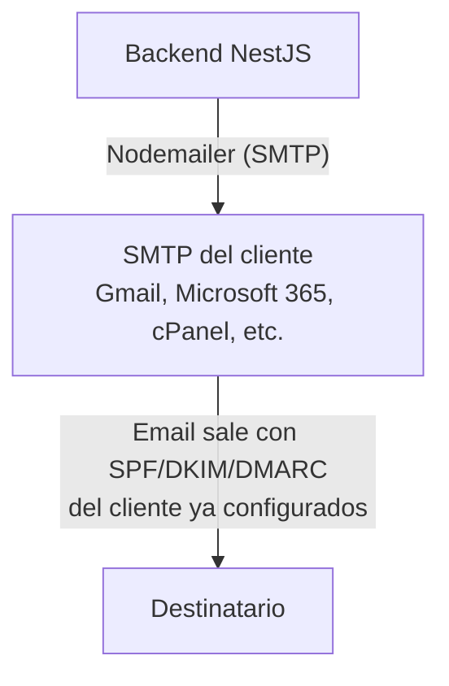
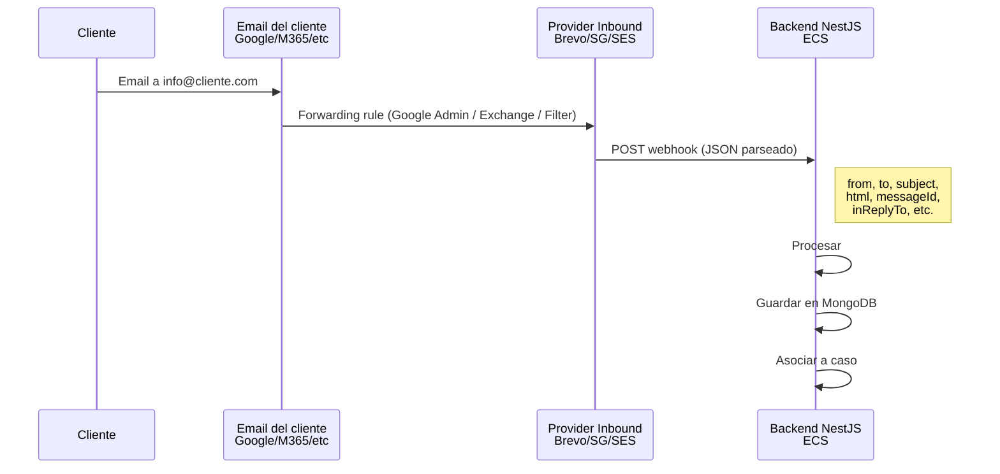
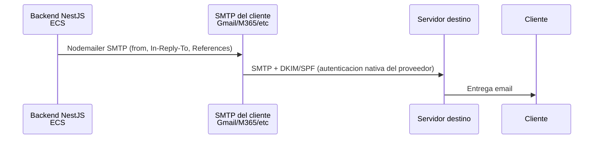

# SMTP Directo del Cliente - Evaluacion Tecnica

> **Enfoque**: Conectarse directamente al servidor SMTP del proveedor de email del cliente (Google Workspace, Microsoft 365, cPanel, etc.) en lugar de usar un servicio transaccional intermediario.
> **Fecha de investigacion**: 2026-02-11
> **Contexto**: Evaluar como alternativa a SendGrid/SES/Brevo para el envio de emails, reutilizando la infraestructura de email que el cliente ya tiene.

---

## Concepto General

En lugar de enviar emails a traves de un servicio transaccional (SendGrid, SES, Brevo), la plataforma se conecta directamente al servidor SMTP que el cliente ya usa para su email corporativo. El email sale desde la misma infraestructura que usa el cliente dia a dia.

---

## Proveedores SMTP Comunes y su Configuracion

### Google Workspace

Dos opciones de SMTP:

| Opcion | Host | Puerto | Auth | Limite diario |
|---|---|---|---|---|
| **Gmail SMTP** | `smtp.gmail.com` | 587 (TLS) / 465 (SSL) | OAuth2 o App Password | 2,000/dia por usuario |
| **SMTP Relay** | `smtp-relay.gmail.com` | 587 (TLS) / 465 (SSL) | IP allowlist o SMTP AUTH | Hasta 10,000/dia (configurable por admin) |

**Gmail SMTP** (`smtp.gmail.com`):
- Requiere OAuth2 (recomendado) o App Password (legacy, requiere 2FA habilitado)
- El limite de 2,000/dia es por usuario y es un hard cap
- Incluye emails enviados por UI, API y SMTP combinados
- Recomendado para volumenes bajos

**SMTP Relay** (`smtp-relay.gmail.com`):
- Requiere configuracion en Google Admin Console (Apps > Google Workspace > Gmail > Routing > SMTP Relay)
- Se puede autenticar por IP (allowlist) o por credenciales SMTP
- Limite configurable por admin, default hasta 10,000 mensajes/dia
- Mas apropiado para envio automatizado desde servidores
- Requiere que el admin del Workspace lo habilite

### Microsoft 365 / Exchange Online

| Opcion | Host | Puerto | Auth | Limite diario |
|---|---|---|---|---|
| **SMTP AUTH** | `smtp.office365.com` | 587 (STARTTLS) | Usuario + contraseña (Basic Auth) o OAuth2 | 10,000 recipients/dia |
| **Direct Send** | MX endpoint del tenant | 25 | Sin auth (solo desde IPs conocidas) | 10,000 recipients/dia |
| **SMTP Relay (Connector)** | Configurable | 25 / 587 | Certificado TLS o IP | 10,000 recipients/dia |

**SMTP AUTH** (`smtp.office365.com`):
- Microsoft esta deprecando Basic Auth gradualmente. OAuth2 es el metodo recomendado
- Requiere que SMTP AUTH este habilitado para el mailbox (deshabilitado por default en tenants nuevos)
- El admin de M365 debe habilitarlo en: Admin Center > Users > Mail > Email apps

**Notas importantes**:
- Microsoft limita a 30 mensajes/minuto via SMTP AUTH
- Max 10,000 destinatarios/dia (no 10,000 emails, sino 10,000 direcciones)
- Un email a 10 destinatarios = 10 contra el limite

### Hosting tradicional (cPanel, Plesk, DirectAdmin)

| Parametro | Valor tipico |
|---|---|
| Host | `mail.dominiocliente.com` o IP del servidor |
| Puerto | 587 (TLS) / 465 (SSL) / 25 (sin encriptar, no recomendado) |
| Auth | Usuario + contraseña (Basic Auth) |
| Limite diario | **100-500/hora** (varia mucho segun hosting) |

**Consideraciones**:
- Los limites son muy restrictivos en hosting compartido
- La reputacion de IP es impredecible (IPs compartidas con otros clientes del hosting)
- SPF/DKIM pueden no estar configurados correctamente
- La configuracion varia enormemente entre proveedores de hosting
- Algunos hostings bloquean SMTP desde IPs externas

### Servidores propios (Postfix, Zimbra, etc.)

| Parametro | Valor tipico |
|---|---|
| Host | IP o hostname del servidor de mail |
| Puerto | 587 / 465 / 25 |
| Auth | Usuario + contraseña o certificado |
| Limite | Depende de la configuracion del servidor |

- Control total pero responsabilidad total (deliverability, IP reputation, mantenimiento)
- Requiere que el servidor permita conexiones SMTP desde IPs externas (firewall)

---

## Challenge A - Envio y Recepcion

### A1. Envio (Outbound)

**Ventaja principal**: Zero cambios DNS.

El email sale desde la misma infraestructura que el cliente ya usa. SPF, DKIM y DMARC ya estan configurados para ese servidor. No hay que agregar `include:sendgrid.net` ni CNAMEs de DKIM de terceros.

**Implementacion con Nodemailer** (estandar en NestJS): La integracion se realiza via Nodemailer, configurando host, port, auth y headers (In-Reply-To, References) por cliente.

### A2. Recepcion (Inbound)

El SMTP directo resuelve el **envio**, pero para la **recepcion** se necesita una estrategia separada. El enfoque recomendado es **forwarding desde el email del cliente hacia un provider de inbound parsing** que entregue el email parseado via webhook:

| Estrategia | Descripcion | Complejidad | Recomendada |
|---|---|---|---|
| **Forwarding + Brevo Inbound Parse** | Regla en Gmail/Outlook que reenvia a Brevo, que parsea y envia webhook JSON | Baja | **Si** |
| **Forwarding + SendGrid Inbound Parse** | Regla en Gmail/Outlook que reenvia a subdomain con MX a SendGrid | Baja-Media | Si |
| **Forwarding + SES Inbound** | Regla en Gmail/Outlook que reenvia a subdomain con MX a SES + S3/SNS pipeline | Media | Si (si ya usan AWS) |
| **Gmail API Pub/Sub** | Push notifications via Pub/Sub (solo Google Workspace) | Media | Alternativa |
| ~~IMAP polling~~ | ~~Conectarse al IMAP del cliente y leer emails periodicamente~~ | ~~Media~~ | **No recomendado** |
| ~~IMAP IDLE~~ | ~~Conexion IMAP persistente que recibe notificaciones push~~ | ~~Media-Alta~~ | **No recomendado** |

**Por que se descarta IMAP**: IMAP polling es ineficiente (consume recursos constantemente aunque no haya emails nuevos), IMAP IDLE es fragil (conexiones persistentes que se caen y requieren reconexion), ambos requieren gestionar credenciales IMAP por cliente (incluyendo OAuth2 token refresh), y el parsing de emails crudos en formato MIME agrega complejidad innecesaria cuando los providers ya ofrecen webhooks con JSON parseado.

**Recomendacion para multi-tenant**: Usar forwarding desde el email del cliente hacia un provider de inbound parsing. El provider parsea el email y lo entrega como un POST JSON a tu backend. Esto funciona con cualquier proveedor de email del cliente (Google Workspace, M365, cPanel, etc.) siempre que soporte reglas de forwarding, lo cual es universal.

### A3. DNS: Zero Cambios

| Aspecto | SMTP Directo | SendGrid | Amazon SES | Brevo |
|---|---|---|---|---|
| Cambios DNS requeridos | **0** | 3-4 | 5 | 1 |
| Coordinacion con IT del cliente | **Solo credenciales SMTP** | DNS + credenciales | DNS + credenciales | DNS + credenciales |
| Riesgo DMARC | **Ninguno** | Medio (hasta config correcta) | Medio (hasta config correcta) | Bajo (DKIM pre-existente) |

### A4. Autenticacion por Proveedor

| Proveedor | Metodo recomendado | Metodo legacy | Notas |
|---|---|---|---|
| **Google Workspace** | OAuth2 (service account o refresh token) | App Password | Google depreco "Less Secure Apps". OAuth2 o App Password con 2FA |
| **Microsoft 365** | OAuth2 (client credentials o auth code) | Basic Auth (SMTP AUTH) | Microsoft deprecando Basic Auth. OAuth2 es el camino |
| **cPanel/Hosting** | Basic Auth (user + pass) | N/A | Generalmente no soportan OAuth2 |
| **Zimbra** | Basic Auth | N/A | SMTP AUTH estandar |
| **Exchange On-Premise** | NTLM o Basic Auth | N/A | Depende de la config del server |

**Tendencia importante**: Google y Microsoft estan migrando a OAuth2 y deprecando autenticacion por contraseña. Para una solucion multi-tenant duradera, se debe soportar OAuth2.

---

## Arquitectura Hibrida: SMTP Outbound + Provider Inbound

El enfoque mas practico para produccion multi-tenant combina el SMTP directo del cliente para enviar con un provider de inbound parsing para recibir:

#### Inbound (via provider)

#### Outbound (via SMTP directo)

### Combinaciones viables

| Combinacion | Outbound | Inbound | DNS del cliente | Tracking | Costo inbound | Complejidad |
|---|---|---|---|---|---|---|
| **SMTP + Brevo Inbound** | SMTP cliente | Forwarding -> Brevo webhook | **0 cambios** | DIY outbound + Nativo inbound events | $0 (free tier Brevo) | Baja |
| **SMTP + SendGrid Inbound** | SMTP cliente | Forwarding -> SendGrid parse (subdomain propio) | **0 cambios** cliente | DIY outbound | $19.95+/mes | Media |
| **SMTP + SES Inbound** | SMTP cliente | Forwarding -> SES -> S3/SNS (subdomain propio) | **0 cambios** cliente | DIY outbound | ~$0 (free tier SES) | Media-Alta |
| **SMTP + Gmail API** | SMTP cliente | Pub/Sub + Gmail API (solo Workspace) | **0 cambios** | DIY outbound | $0 | Media |

### Ventajas del enfoque hibrido

1. **Zero DNS changes en el dominio del cliente** - No se necesita agregar SPF includes ni DKIM CNAMEs porque el outbound sale del propio SMTP del cliente
2. **DMARC nativo** - El email es genuinamente del cliente, pasa SPF/DKIM/DMARC sin configuracion adicional
3. **Zero costo por email enviado** - Usa la infraestructura que el cliente ya paga
4. **Inbound simple via webhooks** - Sin IMAP polling, sin conexiones persistentes, sin parsing de MIME crudo
5. **Escalable para multi-tenant** - Cada cliente nuevo solo necesita: credenciales SMTP + regla de forwarding

### Limitaciones del enfoque hibrido

1. **Sin tracking nativo en outbound** - Open/click tracking requiere implementacion DIY (pixel + link wrapping)
2. **Limites de envio del SMTP del cliente** - 2,000/dia Gmail, 10,000/dia M365, variable en hosting
3. **Gestion de credenciales SMTP** - Cada cliente tiene credenciales distintas (incluyendo OAuth2 para Google/Microsoft)
4. **Forwarding debe configurarse por cliente** - Requiere que cada cliente configure una regla de forwarding en su email

---

## Challenge B - Thread Tracking

**El threading funciona identicamente** que con servicios transaccionales, ya que se basa en headers RFC 2822 que son universales:

| Criterio | SMTP Directo |
|---|---|
| Message-ID | Generado por el servidor SMTP del cliente (o custom via Nodemailer) |
| In-Reply-To | Se setea manualmente en headers |
| References | Se setea manualmente en headers |
| Threading automatico | No (manual, igual que SendGrid/SES/Brevo) |

**Ventaja con Gmail SMTP**: Si el email se envia via `smtp.gmail.com` o SMTP Relay de Workspace, el email aparece en la carpeta "Enviados" del usuario de Gmail. Esto significa que el thread se mantiene visualmente en la UI de Gmail del cliente, igual que con la Gmail API.

**Con otros proveedores SMTP**: El email NO aparece en la carpeta Enviados del cliente (salvo que se use IMAP APPEND para copiarlo manualmente).

---

## Challenge C - Email Tracking

**Esta es la debilidad principal del SMTP directo.**

| Criterio | SMTP Directo | SendGrid/Brevo (referencia) |
|---|---|---|
| **Open tracking** | DIY (pixel manual) | Nativo |
| **Click tracking** | DIY (link wrapping manual) | Nativo |
| **Delivered** | No | Webhook |
| **Bounced** | Parcial (parsear NDRs que llegan al inbox) | Webhook automatico |
| **Spam report** | No | Webhook |
| **Deferred** | No | Webhook |
| **Dashboard analytics** | No | Si |
| **Suppression lists** | No (manual) | Automaticas |

### Implementar tracking DIY

Para tener open/click tracking, hay que implementarlo manualmente:

**Open tracking**:
- Insertar un pixel `` en el HTML que apunte a un endpoint propio
- ``
- Mismas limitaciones que cualquier pixel tracking (Apple Mail Privacy, image blocking)

**Click tracking**:
- Reescribir URLs en el HTML para pasar por un redirect propio
- `<a href="https://tu-api.com/track/click/{emailId}?url=https://destino-real.com">`
- El backend loguea el click y redirige al destino

**Delivery/Bounce**:
- No hay forma directa de saber si el email fue entregado
- Los bounces (NDR) llegan como emails al inbox del remitente
- Se pueden detectar via IMAP polling, pero el parsing de NDRs es complejo y no estandarizado

**Esfuerzo estimado**: 2-3 dias adicionales de desarrollo para implementar tracking basico (open + click). Bounce detection via NDR parsing es significativamente mas complejo.

---

## Arquitectura Multi-Tenant

### Modelo de datos

La configuracion por cliente incluye: parametros SMTP (host, port, auth type), credenciales (basic auth o OAuth2 con client ID, secret, refresh token), configuracion de inbound (provider y direccion de forwarding), y limites de envio (diario, por hora).

### Desafios del multi-tenant

| Desafio | Descripcion | Mitigacion |
|---|---|---|
| **Variedad de proveedores** | Cada cliente puede tener un SMTP distinto | Abstraccion con interfaz comun, testing por proveedor |
| **Gestion de credenciales** | Almacenar credenciales SMTP de cada cliente | Encriptacion en DB, vault, rotacion de tokens |
| **OAuth2 token refresh** | Tokens expiran, hay que renovarlos | Job de renovacion automatica, manejo de token refresh |
| **Limites variados** | Cada proveedor tiene limites distintos | Rate limiter configurable por cliente |
| **Soporte tecnico** | Si falla el SMTP, el problema puede ser del cliente | Monitoring, health checks, alertas |
| **Onboarding** | Cada cliente nuevo requiere config SMTP especifica | Wizard de configuracion, deteccion automatica de settings |

---

## Pricing

### Costo por email: $0.00

El SMTP directo **no tiene costo por email**. Se usa la infraestructura que el cliente ya paga:

| Concepto | Costo |
|---|---|
| Costo por email enviado | **$0.00** |
| Costo por email recibido | **$0.00** |
| Suscripcion mensual | **$0.00** (el cliente ya paga su proveedor de email) |
| IP dedicada | **N/A** (usa las IPs del proveedor del cliente) |
| Tracking | **$0.00** (pero requiere desarrollo DIY) |

### Costos ocultos

| Concepto | Costo estimado |
|---|---|
| Desarrollo tracking DIY (open + click) | 2-3 dias de desarrollo |
| Integracion con provider inbound (webhook endpoint) | 1 dia de desarrollo |
| Desarrollo multi-provider SMTP support | 2-3 dias de desarrollo |
| Gestion OAuth2 (Google + Microsoft) | 1-2 dias de desarrollo |
| Mantenimiento y debugging por proveedor | Ongoing (medio) |
| **Total desarrollo adicional vs servicio transaccional puro** | **~5-8 dias extra** |

---

## Limites de Envio por Proveedor

| Proveedor | Limite diario | Limite por minuto | Tamanio max mensaje |
|---|---|---|---|
| **Google Workspace (SMTP)** | 2,000/dia/usuario | No publicado | 25 MB |
| **Google Workspace (Relay)** | Hasta 10,000/dia | No publicado | 25 MB |
| **Microsoft 365** | 10,000 recipients/dia | 30 mensajes/min | 25 MB |
| **cPanel (hosting compartido)** | 100-500/hora (varia) | Varia | 10-50 MB |
| **Zimbra** | Configurable por admin | Configurable | 20 MB |
| **Exchange On-Premise** | Configurable por admin | Configurable | Configurable |

---

## Comparacion con Servicios Transaccionales

| Criterio | SMTP Directo (hibrido) | SendGrid | Amazon SES | Brevo |
|---|---|---|---|---|
| **Cambios DNS del cliente** | **0** | 3-4 | 5 | 1 |
| **Costo por email enviado** | $0 | $0.40-0.90/1K | $0.10/1K | $0.63-0.75/1K |
| **Tracking nativo outbound** | No (DIY) | Si | Si | Si |
| **Inbound parsing** | Forwarding + provider webhook | Webhook nativo | S3+SNS (DIY) | Webhook nativo |
| **Multi-tenant** | Config SMTP por cliente | Simple (1 API key) | Simple (1 cuenta AWS) | Simple (1 API key) |
| **Delivery webhooks** | No (outbound) / Si (inbound provider) | Si | Si | Si |
| **Bounce handling** | Manual (NDR) outbound / Automatico (inbound provider) | Automatico | Automatico | Automatico |
| **Setup time POC** | 2-4 dias | 1-2 dias | 2-4 dias | 1-2 dias |
| **Escalabilidad** | Limitada por SMTP del cliente | Alta | Muy alta | Alta |
| **Dependencia outbound** | Del SMTP del cliente | De SendGrid | De AWS | De Brevo |
| **Dependencia inbound** | Del provider elegido | De SendGrid | De AWS | De Brevo |

---

## Ventajas

1. **Zero cambios DNS**: La ventaja mas significativa. No hay coordinacion con IT del cliente para registros DNS.
2. **Zero costo por email**: Sin fees de servicio transaccional.
3. **DMARC nativo**: El email sale de la infra autorizada del cliente. SPF/DKIM/DMARC pasan sin configuracion adicional.
4. **Email genuino**: El email es indistinguible de uno enviado manualmente desde el webmail del cliente.
5. **Carpeta Enviados** (Gmail/Outlook via SMTP): Los emails pueden aparecer en la carpeta Enviados del cliente.
6. **Sin vendor lock-in**: No dependes de un tercero para el envio.

## Desventajas

1. **Sin tracking nativo en outbound**: Open, click, delivery, bounce en emails enviados requieren implementacion DIY o aceptar la limitacion.
2. **Complejidad multi-tenant**: Cada cliente tiene un SMTP distinto con auth, limites y comportamientos distintos.
3. **Gestion de credenciales**: Almacenar y mantener credenciales SMTP de cada cliente (incluyendo OAuth2 token refresh).
4. **Limites de envio restrictivos**: Especialmente en hosting compartido (100-500/hora) y Gmail (2,000/dia).
5. **Sin bounce handling automatico en outbound**: Los NDRs llegan al inbox y parsearlos es complejo y no estandarizado.
6. **OAuth2 migration**: Google y Microsoft estan deprecando basic auth. Hay que soportar OAuth2 con refresh tokens.
7. **Debugging distribuido**: Si un email no llega, el problema puede estar en el SMTP del cliente, no en tu plataforma.
8. **Forwarding por cliente**: Cada cliente nuevo debe configurar una regla de forwarding hacia el provider de inbound (bajo esfuerzo pero es una dependencia).

---

## Cuando Usar SMTP Directo vs Servicio Transaccional

### SMTP Directo es mejor cuando:
- El cliente **no puede o no quiere modificar DNS** (escenario comun con DMARC `p=reject`)
- El volumen es **bajo** (< 500 emails/dia)
- El tracking (open/click) **no es critico**
- Se quiere **minimizar costos** de servicios externos
- Se necesita que el email sea **genuinamente del cliente** (aparezca en Enviados)

### Servicio transaccional es mejor cuando:
- Se necesita **tracking completo** (open, click, bounce, delivery)
- El volumen es **alto** (> 2,000 emails/dia)
- Se quiere un **setup rapido** para la POC
- Se necesita **bounce handling automatico** y suppression lists
- Se manejan **muchos clientes** y se quiere una sola integracion

### Enfoque hibrido (recomendado para produccion):
- **Outbound**: SMTP directo del cliente (zero DNS, zero cost, DMARC nativo)
- **Inbound**: Forwarding desde el email del cliente hacia un provider de inbound parsing (Brevo, SendGrid, o SES) que entrega el email parseado via webhook al backend
- **Escalamiento**: Si el cliente necesita tracking completo en outbound o tiene volumen alto, migrar outbound a servicio transaccional (requiere DNS changes en el dominio del cliente)
- La plataforma soporta ambos modos de outbound, configurable por cliente

---

## Resumen

| Criterio | Evaluacion |
|---|---|
| **Viable para POC** | Si, pero mas lento de implementar que un servicio transaccional puro |
| **Viable para produccion** | Si, especialmente para clientes que no pueden/quieren modificar DNS |
| **Costo por email enviado** | $0 (usa SMTP del cliente) |
| **Costo por email recibido** | $0 (provider de inbound parsing, free tier Brevo/SES) |
| **Tracking outbound** | DIY (open/click pixel + link wrapping) o sin tracking |
| **Inbound** | Forwarding + provider webhook (sin IMAP) |
| **Complejidad** | Media (multi-provider SMTP, OAuth2 para Google/Microsoft; inbound via webhooks de provider) |
| **Tiempo POC** | 2-4 dias |
| **Mayor ventaja** | Zero DNS changes en dominio del cliente, zero costo, DMARC nativo |
| **Mayor desventaja** | Sin tracking nativo en outbound, gestion de credenciales SMTP por cliente |

---

## Referencias

### Google Workspace SMTP
- Send email from a printer, scanner, or app (smtp.gmail.com y smtp-relay.gmail.com): <https://support.google.com/a/answer/176600>
- Route outgoing SMTP relay messages through Google: <https://support.google.com/a/answer/2956491>
- Gmail sending limits in Google Workspace (2,000/dia por usuario): <https://support.google.com/a/answer/166852>

### Microsoft 365 SMTP
- Enable or disable SMTP AUTH in Exchange Online: <https://learn.microsoft.com/en-us/exchange/clients-and-mobile-in-exchange-online/authenticated-client-smtp-submission>
- Exchange Online limits (sending limits, recipients/dia): <https://learn.microsoft.com/en-us/office365/servicedescriptions/exchange-online-service-description/exchange-online-limits>
- Use OAuth authentication for high volume emails (M365): <https://learn.microsoft.com/en-us/exchange/mail-flow-best-practices/oauth-high-volume-mails-m365>
- Tenant outbound email limits (announcement): <https://techcommunity.microsoft.com/blog/exchange/introducing-exchange-online-tenant-outbound-email-limits/4372797>

### Nodemailer (libreria SMTP para Node.js)
- Nodemailer SMTP transport: <https://nodemailer.com/smtp>
- Nodemailer usage: <https://nodemailer.com/usage>
- Nodemailer other transports (SES, etc.): <https://nodemailer.com/transports>
- `nodemailer` (npm): <https://www.npmjs.com/package/nodemailer>

### OAuth2 para SMTP
- Google OAuth2 for service accounts: <https://developers.google.com/identity/protocols/oauth2/service-account>
- Microsoft identity platform and OAuth 2.0 client credentials: <https://learn.microsoft.com/en-us/entra/identity-platform/v2-oauth2-client-creds-grant-flow>
