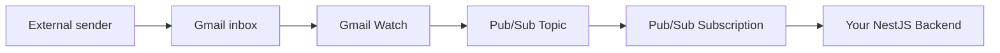
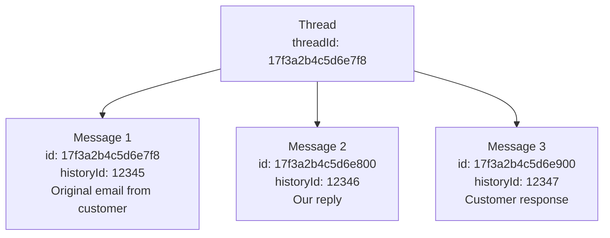

# Google Workspace Gmail API - Technical POC Evaluation

> **Provider**: Google Workspace Gmail API
> **Domain**: `caminosdelassierras.com.ar`
> **Target mailbox**: `info@caminosdelassierras.com.ar`
> **Date**: 2025-02 (research based on current Gmail API v1 documentation)

---

## Executive Summary

The Gmail API approach is **uniquely advantageous** for this specific scenario because Caminos de las Sierras **already uses Google Workspace**. Unlike SendGrid, SES, or any other transactional email provider, the Gmail API sends email **through Google's own infrastructure** -- meaning SPF, DKIM, and DMARC alignment happens automatically with **zero DNS changes**. This is the single biggest differentiator given the `p=reject` DMARC policy on the domain.

**Key advantages**:
- Zero DNS changes required (SPF already includes `_spf.google.com`, DKIM already configured for Google)
- DMARC alignment is automatic (emails are genuinely sent from Google's servers)
- Native Gmail threading works automatically
- Push notifications via Pub/Sub for real-time inbound detection
- No forwarding rules needed -- direct mailbox access

**Key limitations**:
- Not a transactional email service (no native open/click tracking, no delivery webhooks)
- Sending limits are per-user (2,000/day for Workspace, not pooled)
- Requires Workspace admin cooperation for domain-wide delegation
- More complex initial setup than transactional providers

---

## Challenge A -- Sending and Receiving

### A.1 Gmail API for Reading Emails

The Gmail API (`gmail.googleapis.com/v1`) provides full programmatic access to a Gmail mailbox. It exposes RESTful endpoints for messages, threads, labels, drafts, and settings.

#### Core Read Operations

| Endpoint | Purpose |
|---|---|
| `GET /users/{userId}/messages` | List message IDs matching a query |
| `GET /users/{userId}/messages/{id}` | Get full message (headers, body, attachments) |
| `GET /users/{userId}/threads` | List threads |
| `GET /users/{userId}/threads/{id}` | Get all messages in a thread |
| `GET /users/{userId}/history` | Get changes since a `historyId` |

The `userId` can be `me` (for the authenticated user) or a full email address like `info@caminosdelassierras.com.ar` when using domain-wide delegation.

#### Message Query Syntax

The `messages.list` endpoint supports Gmail's full query syntax via the `q` parameter:

```
q=is:unread
q=from:cliente@example.com
q=after:2025/01/01 before:2025/02/01
q=in:inbox is:unread -category:promotions
q=subject:"reclamo"
```

#### Two Approaches: Polling vs Push

**Polling (Pull Model)**:
- Periodically call `messages.list` with `q=is:unread` or `history.list` with a stored `historyId`
- Simple to implement but wasteful (consumes API quota even when no new messages)
- Latency depends on poll interval (e.g., every 30 seconds = up to 30s delay)
- `history.list` is more efficient than `messages.list` because it returns only changes since last check

**Push Notifications (Recommended)**:
- Uses Google Cloud Pub/Sub integration
- Gmail sends a notification to a Pub/Sub topic whenever the mailbox changes
- Near real-time (typically 1-5 seconds latency)
- Dramatically reduces API calls (only fetch when something actually changed)
- **This is the recommended approach** for production use

### A.2 Pub/Sub Integration (Push Notifications)

Gmail's push notification system works through Google Cloud Pub/Sub. Here is the complete flow:

#### Architecture



#### Setup Steps

1. **Create a Google Cloud Project** (or use existing one)
2. **Enable the Gmail API** in the GCP console
3. **Create a Pub/Sub Topic** (e.g., `projects/your-project/topics/gmail-notifications`)
4. **Grant publish permission** to Gmail's service account:
   - Grant `Pub/Sub Publisher` role to `gmail-api-push@system.gserviceaccount.com` on the topic
5. **Create a Pub/Sub Subscription**:
   - **Push subscription**: Pub/Sub sends HTTP POST to your webhook endpoint
   - **Pull subscription**: Your app polls Pub/Sub for messages (simpler for development)
6. **Call `users.watch`** to start watching the mailbox

#### Notification Payload

When a change occurs, Pub/Sub delivers a message containing the mailbox address and a `historyId`. **Critical detail**: The notification only tells you the mailbox changed and gives a `historyId`. It does NOT include the message content. Your backend must then call `history.list` with the previous `historyId` to find what changed, then `messages.get` to fetch the actual messages.

#### Watch Expiration and Renewal

- A watch expires after **7 days** (the `expiration` field in the response)
- You **must** renew it before expiration by calling `users.watch` again
- Best practice: set up a cron job to renew every 6 days
- Calling `watch` again before expiration is safe (it replaces the existing watch)

#### What Changes Trigger Notifications

- New messages arriving (INBOX)
- Messages being read/unread
- Labels being added/removed
- Messages being deleted/trashed
- Draft changes (if watching DRAFT label)

The `labelIds` filter in the watch request controls which changes generate notifications. For inbound email processing, filtering on `["INBOX"]` is sufficient.

#### Push vs Pull Subscription

| Aspect | Push Subscription | Pull Subscription |
|---|---|---|
| Delivery | HTTP POST to your endpoint | Your app polls Pub/Sub |
| Latency | Near real-time | Depends on poll frequency |
| Requires | Public HTTPS endpoint | No public endpoint needed |
| Best for | Production | Development/testing |
| Retry | Automatic with exponential backoff | Manual |

For a NestJS backend, a **Push subscription** is ideal: Pub/Sub sends an HTTP POST to your webhook endpoint (e.g., `https://your-api.com/webhooks/gmail`), and your controller processes it.

### A.3 Sending Emails via Gmail API

#### Basic Send

The message must be a complete RFC 2822 email, base64url-encoded. Example raw message before encoding:

```
From: info@caminosdelassierras.com.ar
To: cliente@example.com
Subject: Re: Consulta sobre peaje
Content-Type: text/html; charset=utf-8
In-Reply-To: <original-message-id@mail.gmail.com>
References: <original-message-id@mail.gmail.com>

<html><body>Estimado cliente, gracias por su consulta...</body></html>
```

#### Required OAuth Scopes

| Scope | Access Level |
|---|---|
| `https://www.googleapis.com/auth/gmail.send` | Send only |
| `https://www.googleapis.com/auth/gmail.compose` | Send + manage drafts |
| `https://www.googleapis.com/auth/gmail.modify` | Read + write (no delete) |
| `https://www.googleapis.com/auth/gmail.readonly` | Read only |
| `https://mail.google.com/` | Full access (read, write, delete, send) |

For this POC, the minimum scopes needed are:
- `https://www.googleapis.com/auth/gmail.modify` (read inbox, modify labels)
- `https://www.googleapis.com/auth/gmail.send` (send replies)

Or use the broader `https://mail.google.com/` scope for simplicity during POC.

#### Sending "As" a User

When using a **service account with domain-wide delegation**, you can impersonate any user in the Workspace domain. The service account creates a JWT token with the `sub` field set to the target user's email. The email is then sent **genuinely from** that user's Gmail account. It appears in their Sent folder, uses their signature, and is authenticated with Google's own SPF/DKIM.

### A.4 Domain-Wide Delegation

Domain-wide delegation allows a service account to act on behalf of any user in a Google Workspace domain without requiring each user's individual consent.

#### How It Works

1. **Service Account** is created in Google Cloud Console
2. **Workspace Admin** grants the service account specific OAuth scopes for the entire domain
3. **Service Account** creates JWT tokens with `subject` set to any domain user
4. **Google's auth server** validates that the service account has been granted those scopes for that domain
5. **Access token** is issued allowing API calls as that user

#### Setup Steps

**Step 1: Create Service Account (Developer)**
- Go to Google Cloud Console > IAM & Admin > Service Accounts
- Create a service account
- Create a JSON key file (contains `client_email` and `private_key`)
- Note the `client_id` (numeric, ~21 digits)

**Step 2: Enable Domain-Wide Delegation (Developer)**
- In the service account settings, check "Enable G Suite Domain-wide Delegation"
- This flags the service account as eligible for delegation

**Step 3: Authorize in Workspace Admin Console (Workspace Admin)**
- Go to `admin.google.com` > Security > API Controls > Domain-wide Delegation
- Click "Add new" (or "Manage Domain Wide Delegation")
- Enter the service account's `client_id`
- Enter the OAuth scopes to authorize, comma-separated:
  ```
  https://www.googleapis.com/auth/gmail.modify,https://www.googleapis.com/auth/gmail.send
  ```
- Save

**Critical dependency**: Step 3 requires a **Workspace administrator** from Caminos de las Sierras. Without this, the service account cannot impersonate users.

#### Security Considerations

- Domain-wide delegation is powerful -- the service account can impersonate ANY user for the granted scopes
- Best practice: grant the **minimum necessary scopes**
- The Workspace admin can revoke delegation at any time
- All API calls are logged in Workspace Admin audit logs
- The service account private key must be stored securely (e.g., GCP Secret Manager, Vault)

### A.5 DNS Changes: None Required

This is the **most significant advantage** of the Gmail API approach for this scenario.

| Aspect | Gmail API | SendGrid/SES/Others |
|---|---|---|
| SPF changes | **None** -- Google already in SPF | Must add `include:sendgrid.net` or similar |
| DKIM changes | **None** -- Google DKIM already configured | Must add CNAME/TXT records |
| DMARC impact | **None** -- emails pass alignment natively | Must ensure alignment or emails rejected |
| MX changes | **None** -- Gmail receives email natively | Not needed for outbound, but inbound may need forwarding |

Since the Gmail API sends emails through Google's actual mail infrastructure:
- The `From` header is `info@caminosdelassierras.com.ar`
- SPF check: Google's servers are already authorized via `include:_spf.google.com` -- **PASS**
- DKIM check: Google signs with the existing `google._domainkey` -- **PASS**
- DMARC check: Both SPF and DKIM align with the `From` domain -- **PASS**

**No DNS coordination with Caminos de las Sierras' IT team is needed for email authentication.** The only coordination needed is the Workspace admin granting domain-wide delegation.

### A.6 Authentication Setup Summary

| Method | Use Case | Complexity |
|---|---|---|
| **OAuth 2.0 (User consent)** | Single user, interactive apps | Medium -- requires user to click consent |
| **Service Account + Domain-Wide Delegation** | Server-to-server, automated, impersonate users | Higher initial setup, but fully automated |
| **API Key** | Not supported for Gmail API | N/A |

**Recommended for this POC**: Service Account with Domain-Wide Delegation.

Reasons:
- No user interaction needed (fully automated backend)
- Can access `info@caminosdelassierras.com.ar` mailbox without that user logging in
- Can send as that user
- Single credential manages everything
- Works perfectly for a NestJS backend service

---

## Challenge B -- Thread Tracking

### B.1 How Gmail Threading Works

Gmail uses a **`threadId`** to group related messages into conversations. Every message belongs to exactly one thread.

#### Threading Algorithm

Gmail determines thread membership using these headers (in order of priority):

1. **`References` header**: Lists all message IDs in the conversation chain
2. **`In-Reply-To` header**: Contains the message ID of the direct parent message
3. **`Subject` line**: Gmail may group messages with the same subject (with `Re:` prefix handling)

When a new message arrives, Gmail checks:
1. Does the `In-Reply-To` or `References` header match any existing message's `Message-ID`?
2. If yes, the message is added to that thread (same `threadId`)
3. If no, a new thread is created with a new `threadId`

#### Thread Data Model



### B.2 Replying to a Thread Programmatically

To reply to a thread and maintain threading, you must:

1. **Include the `threadId`** in the send request
2. **Set proper headers** in the raw message (`In-Reply-To`, `References`)
3. **Use `Re:` prefix** in the subject line

#### Raw Message for Reply

```
From: info@caminosdelassierras.com.ar
To: cliente@example.com
Subject: Re: Consulta sobre peaje ruta 20
In-Reply-To: <CABx+4AHr3w@mail.gmail.com>
References: <CABx+4AHr3w@mail.gmail.com> <CABx+4AHr4x@mail.gmail.com>
Content-Type: text/html; charset=utf-8
MIME-Version: 1.0

<html><body>Estimado cliente, gracias por su consulta...</body></html>
```

### B.3 Message-ID, In-Reply-To, References Headers

| Header | Purpose | Who Sets It |
|---|---|---|
| `Message-ID` | Unique identifier for this message | Gmail generates automatically when sending |
| `In-Reply-To` | Message-ID of the message being replied to | You set this in the raw message |
| `References` | Space-separated list of all Message-IDs in the conversation | You set this in the raw message |

#### How to Get These Headers

When reading a message via the API, headers are in the `payload.headers` array. You extract `Message-ID`, `Subject`, `From`, `References`, and `In-Reply-To` from the headers to build the reply chain.

#### Building the Reply Chain

When replying to a message, you must set `In-Reply-To` to the original message's `Message-ID`, append that ID to the `References` header (or use it as the sole value if no prior references exist), and use the `Re:` prefix on the subject if not already present.

### B.4 Is Threading Automatic?

**Partially automatic, but you must do your part.**

| What Gmail Does Automatically | What You Must Do |
|---|---|
| Assigns `Message-ID` to sent messages | Set `In-Reply-To` header correctly |
| Groups messages by thread when headers match | Set `References` header correctly |
| Provides `threadId` on all messages | Include `threadId` in the send request |
| Handles `Re:` subject prefix matching | Use `Re:` prefix in reply subjects |

**If you include the `threadId` in the send request AND set `In-Reply-To`/`References` correctly**, Gmail will:
- Add the reply to the correct thread
- Show it as part of the conversation in Gmail's UI
- The recipient's email client will also thread it correctly (because the RFC 2822 headers are correct)

**If you only include `threadId` but NOT the headers**, Gmail will still associate the message with the thread internally, but the recipient's email client might not thread it correctly.

**If you only set headers but NOT `threadId`**, Gmail API will return an error or create a new thread.

**Best practice**: Always set both `threadId` AND proper headers.

---

## Challenge C -- Email Tracking

### C.1 Read Receipts / Open Tracking

**Gmail API does NOT provide native open tracking.**

There is no built-in mechanism to:
- Track when a recipient opens an email
- Inject tracking pixels
- Get delivery confirmation beyond "message was sent"

Gmail does support **read receipts** (MDN - Message Disposition Notification) via the `Disposition-Notification-To` header, but:
- This depends on the recipient's email client supporting it
- Most clients ignore or suppress these
- Gmail itself does not honor read receipt requests by default
- This is NOT a reliable tracking mechanism

### C.2 Open/Click Tracking -- What's Possible

Since the Gmail API sends raw RFC 2822 messages, you **can implement your own tracking**:

#### DIY Open Tracking (Tracking Pixel)
- Insert a 1x1 transparent image in the HTML body with a unique URL pointing to your tracking endpoint
- When the recipient's email client loads images, your server receives the HTTP request
- **Limitations**:
  - Many clients block images by default (Apple Mail Privacy Protection, Outlook, etc.)
  - Gmail may proxy images through Google's servers (`googleusercontent.com`), masking IP/timing
  - Not reliable for accurate open rates (typically 40-60% accuracy)

#### DIY Click Tracking
- Wrap all links in the email body with redirect URLs that point to your tracking endpoint, which logs the click and redirects to the actual destination
- **More reliable** than open tracking, but still not 100% (some security scanners pre-click links)

#### DIY Delivery Tracking
- You can check if a message was sent successfully (the API returns the message ID)
- For bounces: monitor the inbox for bounce-back messages (NDR - Non-Delivery Reports)
- There is no webhook/callback for delivery events

### C.3 Detecting Read, Forwarded, etc.

| Event | Detectable? | How |
|---|---|---|
| Email sent | Yes | API returns message ID on success |
| Email delivered | No (no delivery confirmation) | N/A |
| Email bounced | Partial | Monitor inbox for NDR/bounce messages |
| Email opened | No (natively) | DIY tracking pixel (unreliable) |
| Email clicked | No (natively) | DIY link wrapping |
| Email forwarded | No | Not detectable |
| Email replied to | Yes | New message arrives in the thread |
| Email marked as spam | No | N/A |

### C.4 What Changes Can You Watch via Pub/Sub?

The Pub/Sub watch on a Gmail mailbox detects:

| Change Type | Detected | Useful For |
|---|---|---|
| New message received | Yes | Inbound processing |
| Message labels changed | Yes | Detecting read/unread changes |
| Message added to trash | Yes | Detecting deletions |
| Draft created/modified | Yes (if watching DRAFT) | N/A |
| Message sent | Yes (appears in SENT) | Confirming sends |

**Important**: These are changes to the **watched mailbox** only (i.e., `info@caminosdelassierras.com.ar`'s mailbox). You cannot watch what happens in the recipient's mailbox.

Via `history.list`, you can detect:
- `messagesAdded` -- new messages in the mailbox
- `messagesDeleted` -- messages removed
- `labelsAdded` -- labels added to messages (e.g., UNREAD removed = message was read in Gmail UI)
- `labelsRemoved` -- labels removed

### C.5 Comparison to Transactional Email Services

| Feature | Gmail API | SendGrid | Amazon SES |
|---|---|---|---|
| **Open tracking** | DIY only | Built-in, per-message | Built-in via configuration set |
| **Click tracking** | DIY only | Built-in, per-link | Built-in via configuration set |
| **Delivery events** | None | Webhook (delivered, deferred, dropped) | SNS notification (delivery, bounce, complaint) |
| **Bounce handling** | Manual (parse NDRs) | Automatic with webhooks | Automatic with SNS |
| **Spam complaints** | None | Feedback loops built-in | Complaint notifications via SNS |
| **Unsubscribe handling** | Manual | Built-in (List-Unsubscribe) | Manual |
| **Analytics dashboard** | None | Full dashboard with 30-day retention | CloudWatch metrics |
| **Suppression lists** | None | Automatic bounce/spam suppression | Account-level suppression |
| **Event webhook** | Pub/Sub (mailbox changes only) | Event Webhook (all events) | SNS (all events) |

**Verdict**: For email tracking, the Gmail API is **significantly weaker** than dedicated transactional services. If tracking is a hard requirement, the Gmail API alone may not be sufficient. However, DIY tracking pixel + click wrapping can cover basic use cases at the cost of reliability and development effort.

---

## Pricing (2025-2026)

### Google Workspace Pricing

| Plan | Price (USD/user/month) | Key Email Features |
|---|---|---|
| **Business Starter** | $7.20 | 30 GB storage, custom email, basic admin |
| **Business Standard** | $14.40 | 2 TB storage, enhanced admin, Vault |
| **Business Plus** | $21.60 | 5 TB storage, advanced security, Vault + eDiscovery |
| **Enterprise** | Custom pricing | Unlimited storage, advanced compliance, DLP |

**Note**: Caminos de las Sierras already has Google Workspace, so the per-user cost is already being paid. The Gmail API does not add any per-user cost -- it is included in all Workspace plans.

### Gmail API Quotas and Limits

#### API Call Quotas

| Quota | Limit |
|---|---|
| **Daily usage quota** | 1,000,000,000 quota units/day (per project) |
| **Per-user rate limit** | 250 quota units/second/user |

Individual operations consume different quota units:

| Operation | Quota Units |
|---|---|
| `messages.list` | 5 |
| `messages.get` | 5 |
| `messages.send` | 100 |
| `messages.modify` | 5 |
| `threads.get` | 10 |
| `history.list` | 2 |
| `users.watch` | 100 |

At 250 units/second/user, you can do approximately:
- 50 `messages.list` calls per second per user
- 2-3 `messages.send` calls per second per user

#### Sending Limits

| Account Type | Daily Sending Limit |
|---|---|
| Gmail (free, `@gmail.com`) | 500 emails/day |
| **Google Workspace** | **2,000 emails/day per user** |
| Google Workspace (new account, first 24h) | Lower limit (ramp-up period) |

**Important details**:
- The 2,000/day limit applies per user (per email address)
- This includes emails sent via the web UI, SMTP, and API combined
- Each unique recipient counts as one email (email to 10 recipients = 10 against the limit)
- Exceeding the limit temporarily locks sending (typically for 1-24 hours)
- There is no way to increase this limit -- it is a hard cap

**For the POC use case**: If `info@caminosdelassierras.com.ar` needs to send fewer than 2,000 emails per day, this is fine. For higher volumes, you would need to distribute across multiple Workspace users or use a transactional provider.

### Google Cloud Pub/Sub Costs

| Resource | Free Tier | Beyond Free Tier |
|---|---|---|
| **First 10 GB/month** of data delivery | Free | N/A |
| **Message delivery** (beyond 10 GB) | N/A | $40/TB |
| **Seek-related message storage** | First 10 GB free | $0.27/GB/month |

Gmail push notifications are extremely small (~200 bytes each), so even at thousands of notifications per day, the cost is **effectively zero** (well within the free tier).

**Estimated monthly cost for Pub/Sub**: $0.00 (unless processing millions of emails/month)

### Additional API Access Costs

**There is no additional cost for using the Gmail API.** It is included with Google Workspace. You only need:
- A Google Cloud project (free to create)
- The Gmail API enabled (free)
- A service account (free)
- Pub/Sub topic/subscription (free at low volumes)

The only GCP costs would be:
- Pub/Sub (free tier covers typical usage)
- If you host your NestJS backend on GCP (Cloud Run, GKE, etc.) -- those have their own costs

### Cost Summary for This POC

| Component | Monthly Cost |
|---|---|
| Google Workspace (already paid) | $0 additional |
| Gmail API usage | $0 (included) |
| Service Account | $0 |
| Pub/Sub notifications | ~$0 (free tier) |
| GCP Project | $0 |
| **Total additional cost** | **~$0/month** |

This is a massive cost advantage over SendGrid ($19.95+/month for Essentials) or SES ($0.10/1000 emails).

---

## Limitations and Gotchas

### L.1 Rate Limits and Sending Caps

| Limit | Value | Impact |
|---|---|---|
| **Sending limit** | 2,000 emails/day per Workspace user | Hard cap. Cannot be increased. |
| **API quota** | 250 quota units/second/user | Rarely hit in normal usage |
| **Watch expiration** | 7 days | Must renew proactively |
| **History retention** | ~30 days or limited by historyId gap | Must process changes promptly |

**The 2,000/day limit is the most significant constraint.** If `info@caminosdelassierras.com.ar` receives 100 emails/day and replies to each, that is 100 sends/day -- well within limits. But if the account is also used for sending newsletters or bulk communications, the limit could be reached.

**Workaround for higher volumes**: Use multiple Workspace accounts (e.g., `soporte@`, `consultas@`) to distribute the sending load. Each gets its own 2,000/day limit.

### L.2 This is NOT a Transactional Email Service

The Gmail API is fundamentally a **user email account API**, not a transactional email platform. Key differences:

| Aspect | Gmail API | Transactional Service |
|---|---|---|
| **Purpose** | Access a user's mailbox | Send programmatic emails at scale |
| **Sending limit** | 2,000/day per user | Millions/day |
| **Tracking** | None built-in | Full tracking suite |
| **Deliverability tools** | None (Google handles it) | Dedicated IPs, warmup, reputation management |
| **Bounce handling** | Manual (parse NDRs) | Automated with suppression lists |
| **Templates** | None | Built-in template engines |
| **Analytics** | None | Full dashboards |
| **Support** | Community/Workspace support | Dedicated email deliverability support |
| **Compliance** | You manage everything | CAN-SPAM, GDPR helpers built-in |

**When Gmail API is the right choice**:
- You are operating within a single Workspace domain
- Volume is moderate (< 2,000 emails/day per mailbox)
- You need the "genuine" identity of a domain user
- DNS changes are impossible or undesirable
- Two-way conversation (reply-to-reply) is the primary pattern
- Cost sensitivity is high

**When a transactional service is better**:
- High volume (> 2,000 emails/day)
- Need robust tracking (open, click, delivery events)
- Need advanced deliverability features
- One-to-many communication (notifications, marketing)
- Need dedicated IP reputation management

### L.3 Google's Terms of Service

Google's Acceptable Use Policy and Gmail Program Policies include:

- **No bulk unsolicited email**: You cannot use the Gmail API to send spam or mass marketing
- **Rate limits are enforced**: Automated systems that exceed limits may be throttled or suspended
- **Domain-wide delegation audit**: Google may audit usage of domain-wide delegation
- **Service account key security**: You are responsible for securing the private key
- **No scraping**: You should not use the API to scrape or index email content for non-user purposes

For this use case (replying to customer inquiries from a shared mailbox), the usage pattern is **well within acceptable use**. This is essentially automating what a human would do in the Gmail web interface.

### L.4 Complexity of Setup

| Step | Who | Complexity | Notes |
|---|---|---|---|
| Create GCP project | Developer | Low | Standard GCP setup |
| Enable Gmail API | Developer | Low | One click in GCP console |
| Create service account | Developer | Low | Standard IAM operation |
| Enable domain-wide delegation on SA | Developer | Low | Checkbox in SA settings |
| **Authorize SA in Workspace Admin** | **Workspace Admin** | **Medium** | **Requires admin.google.com access** |
| Create Pub/Sub topic + subscription | Developer | Low | Standard GCP setup |
| Grant Pub/Sub permissions to Gmail | Developer | Low | IAM role assignment |
| Implement watch + webhook handler | Developer | Medium | NestJS controller + history processing |
| Implement send/reply logic | Developer | Medium | RFC 2822 construction, threading |
| Implement watch renewal cron | Developer | Low | Scheduled task every 6 days |

**Total estimated POC development time**: 2-4 days for a senior Node.js developer familiar with GCP.

### L.5 What If Domain-Wide Delegation Is Not Granted?

Without domain-wide delegation, the service account **cannot impersonate users**. Alternatives:

1. **OAuth 2.0 User Consent Flow**: A human with access to `info@caminosdelassierras.com.ar` would need to:
   - Go through the OAuth consent screen
   - Grant your application access to their Gmail
   - Your app stores the refresh token for ongoing access
   - **Downside**: Requires manual user interaction; refresh tokens can expire (though rarely for Workspace)

2. **App Passwords** (not recommended): If 2FA is enabled, the user can generate an app password for IMAP/SMTP access. This is legacy and not recommended.

3. **Gmail Delegation (UI-level)**: A Workspace admin can delegate the `info@` inbox to another user account, and that user grants OAuth access. More complex and fragile.

**Bottom line**: Domain-wide delegation is strongly recommended. Without it, the solution is still possible but requires a user to manually authenticate once.

### L.6 Scalability Concerns

| Concern | Risk Level | Mitigation |
|---|---|---|
| **2,000 emails/day limit** | Medium | Distribute across multiple accounts |
| **API quota exhaustion** | Low | 1B units/day is very generous |
| **Watch expiration** | Low | Cron job to renew every 6 days |
| **Pub/Sub message ordering** | Low | Use historyId to process in order |
| **History gaps** | Medium | If > ~30 days pass without processing, history may be unavailable |
| **Concurrent processing** | Low | Use Pub/Sub acknowledgment to prevent duplicate processing |
| **Large attachments** | Low | Gmail API supports attachments up to 25 MB (50 MB with upload endpoint) |
| **Multiple mailboxes** | Medium | Each mailbox needs its own watch; manage multiple historyIds |

### L.7 Additional Gotchas

1. **Pub/Sub notifications are not message-level**: You get "something changed" notifications, not "here is the new message." You must always call `history.list` and then `messages.get` to find out what actually changed.

2. **Duplicate notifications**: Pub/Sub may deliver duplicate notifications. Your handler must be idempotent (processing the same historyId twice should be safe).

3. **History ID gaps**: If your service is down for an extended period and many changes occur, `history.list` may not return all changes (the starting historyId may be too old). You should implement a full sync fallback.

4. **Base64url encoding**: The Gmail API uses base64url encoding (not standard base64) for message bodies. Use `base64url` encoding/decoding consistently.

5. **Multipart MIME complexity**: Real-world emails have complex MIME structures (multipart/mixed, multipart/alternative, nested parts). Your body parser needs to handle this recursively.

6. **Confidential mode**: Gmail's Confidential Mode messages have restricted access and cannot be forwarded/downloaded via API in the usual way.

7. **Labels vs Folders**: Gmail uses labels, not folders. A message can have multiple labels. Understanding label semantics is important for proper message management.

8. **Watch scope**: A watch monitors a specific user's mailbox. If you need to watch multiple mailboxes (e.g., `info@` and `soporte@`), you need separate watch requests for each.

---

## Summary: Pros and Cons for This Specific Scenario

### Pros

1. **Zero DNS changes** -- The single biggest advantage given DMARC `p=reject`
2. **Zero additional cost** -- No per-email fees, no monthly subscription beyond existing Workspace
3. **Perfect email authentication** -- SPF, DKIM, DMARC all pass automatically
4. **Native Gmail threading** -- Thread management is a first-class feature
5. **Real-time inbound processing** -- Pub/Sub push notifications with low latency
6. **Genuine "from" identity** -- Emails truly come from `info@caminosdelassierras.com.ar`
7. **Sent mail in Gmail** -- Replies appear in the Gmail UI's Sent folder for auditability
8. **Two-way conversation** -- Perfect for the customer service use case
9. **Google's infrastructure** -- High deliverability, no IP warming needed
10. **Mature Node.js library** -- Official `googleapis` package with TypeScript support

### Cons

1. **No native email tracking** -- No open/click tracking; must DIY or accept the limitation
2. **2,000 emails/day hard limit** -- Cannot be increased; may need multiple accounts for scale
3. **Requires Workspace admin cooperation** -- For domain-wide delegation setup
4. **More complex webhook handling** -- Pub/Sub indirection vs direct inbound webhooks (SendGrid is simpler here)
5. **No deliverability analytics** -- No bounce rate dashboards, no reputation monitoring
6. **Watch renewal overhead** -- Must actively renew every 7 days
7. **Not designed for bulk sending** -- Terms of service prohibit mass/marketing email
8. **Single point of failure** -- If the Workspace account has issues, email stops

### Recommendation

For the Caminos de las Sierras use case, the Gmail API is **highly recommended as the primary approach** because:

1. The DMARC `p=reject` policy makes third-party sending **impossible without DNS changes**
2. DNS changes require coordination with the client's IT team (a dependency and risk)
3. The use case (customer service reply flow) fits perfectly within Gmail API's design
4. The volume is likely well under 2,000 emails/day
5. The cost is effectively zero

**However**, for tracking (open/click), consider a **hybrid approach**:
- Use Gmail API for sending/receiving (authentication, threading, identity)
- Implement DIY tracking pixels and link wrapping for basic open/click metrics
- Accept that tracking will be less reliable than SendGrid/SES

Alternatively, if tracking is critical, the Gmail API can be used for **inbound only** (receiving + reading), while a transactional service like SendGrid/SES handles **outbound** (sending with tracking). But this requires DNS changes for the outbound provider.

---

## References

### Gmail API
- Gmail API Documentation: <https://developers.google.com/gmail/api>
- Gmail API Push Notifications (Pub/Sub): <https://developers.google.com/gmail/api/guides/push>
- Gmail API Send Messages: <https://developers.google.com/gmail/api/guides/send>
- Gmail API Threads: <https://developers.google.com/gmail/api/guides/threads>
- Gmail API Quota and Usage Limits: <https://developers.google.com/gmail/api/reference/quota>

### Authentication and Authorization
- Domain-Wide Delegation: <https://developers.google.com/identity/protocols/oauth2/service-account#delegatingauthority>
- Google Auth Library (Node.js): <https://github.com/googleapis/google-auth-library-nodejs>

### Pricing and Limits
- Google Workspace Pricing: <https://workspace.google.com/pricing>
- Google Workspace Sending Limits: <https://support.google.com/a/answer/166852>
- Cloud Pub/Sub Pricing: <https://cloud.google.com/pubsub/pricing>

### SDK
- `googleapis` (npm): <https://www.npmjs.com/package/googleapis>
- `@googleapis/gmail` (npm): <https://www.npmjs.com/package/@googleapis/gmail>
