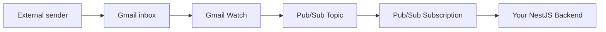
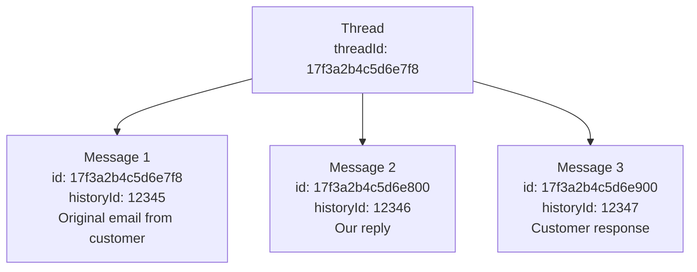

# Google Workspace Gmail API - Evaluación técnica del POC

> **Provider**: Google Workspace Gmail API
> **Domain**: `caminosdelassierras.com.ar`
> **Target mailbox**: `info@caminosdelassierras.com.ar`
> **Date**: 2025-02 (investigación basada en la documentación actual de Gmail API v1)

---

## Resumen ejecutivo

El enfoque con Gmail API es **excepcionalmente ventajoso** para este escenario específico porque Caminos de las Sierras **ya utiliza Google Workspace**. A diferencia de SendGrid, SES o cualquier otro proveedor de email transaccional, la Gmail API envía email **a través de la propia infraestructura de Google** — lo que significa que la alineación SPF, DKIM y DMARC ocurre automáticamente con **cero cambios en DNS**. Esta es la mayor ventaja diferencial dado el policy DMARC `p=reject` en el dominio.

**Ventajas principales**:
- Cero cambios en DNS requeridos (SPF ya incluye `_spf.google.com`, DKIM ya configurado para Google)
- La alineación DMARC es automática (los emails se envían genuinamente desde los servidores de Google)
- El threading nativo de Gmail funciona automáticamente
- Notificaciones push vía Pub/Sub para detección inbound en tiempo real
- No se necesitan reglas de forwarding — acceso directo al mailbox

**Limitaciones principales**:
- No es un servicio de email transaccional (sin tracking nativo de open/click, sin webhooks de entrega)
- Los límites de envío son por usuario (2.000/día para Workspace, no agrupados)
- Requiere cooperación del administrador de Workspace para la delegación a nivel de dominio
- Setup inicial más complejo que los proveedores transaccionales

---

## Challenge A — Envío y recepción

### A.1 Gmail API para leer emails

La Gmail API (`gmail.googleapis.com/v1`) proporciona acceso programático completo a un mailbox de Gmail. Expone endpoints RESTful para messages, threads, labels, drafts y settings.

#### Operaciones de lectura principales

| Endpoint | Propósito |
|---|---|
| `GET /users/{userId}/messages` | Listar IDs de mensajes que coinciden con una query |
| `GET /users/{userId}/messages/{id}` | Obtener mensaje completo (headers, body, attachments) |
| `GET /users/{userId}/threads` | Listar threads |
| `GET /users/{userId}/threads/{id}` | Obtener todos los mensajes de un thread |
| `GET /users/{userId}/history` | Obtener cambios desde un `historyId` |

El `userId` puede ser `me` (para el usuario autenticado) o una dirección de email completa como `info@caminosdelassierras.com.ar` cuando se usa domain-wide delegation.

#### Sintaxis de query para mensajes

El endpoint `messages.list` soporta la sintaxis completa de query de Gmail vía el parámetro `q`:

```
q=is:unread
q=from:cliente@example.com
q=after:2025/01/01 before:2025/02/01
q=in:inbox is:unread -category:promotions
q=subject:"reclamo"
```

#### Dos enfoques: Polling vs Push

**Polling (modelo Pull)**:
- Llamar periódicamente a `messages.list` con `q=is:unread` o `history.list` con un `historyId` almacenado
- Simple de implementar pero derrochador (consume cuota de API incluso cuando no hay mensajes nuevos)
- La latencia depende del intervalo de polling (ej. cada 30 segundos = hasta 30s de retraso)
- `history.list` es más eficiente que `messages.list` porque solo devuelve los cambios desde la última verificación

**Push Notifications (recomendado)**:
- Usa integración con Google Cloud Pub/Sub
- Gmail envía una notificación a un topic de Pub/Sub cuando el mailbox cambia
- Casi en tiempo real (típicamente 1-5 segundos de latencia)
- Reduce drásticamente las llamadas a la API (solo fetch cuando algo realmente cambió)
- **Este es el enfoque recomendado** para uso en producción

### A.2 Integración Pub/Sub (Push Notifications)

El sistema de push notifications de Gmail funciona a través de Google Cloud Pub/Sub. Este es el flujo completo:

#### Arquitectura



#### Pasos de configuración

1. **Crear un proyecto de Google Cloud** (o usar uno existente)
2. **Habilitar la Gmail API** en la consola de GCP
3. **Crear un Pub/Sub Topic** (ej. `projects/your-project/topics/gmail-notifications`)
4. **Otorgar permiso de publicación** a la service account de Gmail:
   - Otorgar rol `Pub/Sub Publisher` a `gmail-api-push@system.gserviceaccount.com` en el topic
5. **Crear una Pub/Sub Subscription**:
   - **Push subscription**: Pub/Sub envía HTTP POST al webhook endpoint
   - **Pull subscription**: La aplicación hace polling a Pub/Sub por mensajes (más simple para desarrollo)
6. **Llamar a `users.watch`** para comenzar a vigilar el mailbox

#### Payload de notificación

Cuando ocurre un cambio, Pub/Sub entrega un mensaje que contiene la dirección del mailbox y un `historyId`. **Detalle crítico**: La notificación indica que el mailbox cambió y proporciona un `historyId`. NO incluye el contenido del mensaje. El backend debe entonces llamar a `history.list` con el `historyId` anterior para encontrar qué cambió, y luego `messages.get` para obtener los mensajes reales.

#### Expiración y renovación del Watch

- Un watch expira después de **7 días** (el campo `expiration` en la respuesta)
- **Se debe renovar** antes de que expire llamando a `users.watch` nuevamente
- Mejor práctica: configurar un cron job para renovar cada 6 días
- Llamar a `watch` nuevamente antes de la expiración es seguro (reemplaza el watch existente)

#### Qué cambios disparan notificaciones

- Nuevos mensajes que llegan (INBOX)
- Mensajes marcados como leídos/no leídos
- Labels agregados o removidos
- Mensajes eliminados/enviados a papelera
- Cambios en drafts (si se vigila el label DRAFT)

El filtro `labelIds` en la request de watch controla qué cambios generan notificaciones. Para procesamiento inbound de email, filtrar por `["INBOX"]` es suficiente.

#### Push vs Pull Subscription

| Aspecto | Push Subscription | Pull Subscription |
|---|---|---|
| Entrega | HTTP POST al endpoint | La aplicación hace polling a Pub/Sub |
| Latencia | Casi en tiempo real | Depende de la frecuencia de polling |
| Requiere | Endpoint HTTPS público | No se necesita endpoint público |
| Mejor para | Producción | Desarrollo/testing |
| Reintentos | Automático con exponential backoff | Manual |

Para un backend NestJS, una **Push subscription** es ideal: Pub/Sub envía un HTTP POST al webhook endpoint (ej. `https://your-api.com/webhooks/gmail`), y el controller lo procesa.

### A.3 Envío de emails vía Gmail API

#### Envío básico

El mensaje debe ser un email RFC 2822 completo, codificado en base64url. Ejemplo de mensaje raw antes de codificar:

```
From: info@caminosdelassierras.com.ar
To: cliente@example.com
Subject: Re: Consulta sobre peaje
Content-Type: text/html; charset=utf-8
In-Reply-To: <original-message-id@mail.gmail.com>
References: <original-message-id@mail.gmail.com>

<html><body>Estimado cliente, gracias por su consulta...</body></html>
```

#### OAuth Scopes requeridos

| Scope | Nivel de acceso |
|---|---|
| `https://www.googleapis.com/auth/gmail.send` | Solo envío |
| `https://www.googleapis.com/auth/gmail.compose` | Envío + gestión de drafts |
| `https://www.googleapis.com/auth/gmail.modify` | Lectura + escritura (sin eliminar) |
| `https://www.googleapis.com/auth/gmail.readonly` | Solo lectura |
| `https://mail.google.com/` | Acceso completo (lectura, escritura, eliminación, envío) |

Para este POC, los scopes mínimos necesarios son:
- `https://www.googleapis.com/auth/gmail.modify` (leer inbox, modificar labels)
- `https://www.googleapis.com/auth/gmail.send` (enviar respuestas)

O usar el scope más amplio `https://mail.google.com/` por simplicidad durante el POC.

#### Enviar "como" un usuario

Cuando se usa una **service account con domain-wide delegation**, es posible impersonar a cualquier usuario en el dominio de Workspace. La service account crea un token JWT con el campo `sub` establecido al email del usuario objetivo. El email se envía entonces **genuinamente desde** la cuenta Gmail de ese usuario. Aparece en su carpeta Enviados, usa su firma, y está autenticado con el SPF/DKIM propio de Google.

### A.4 Domain-Wide Delegation

La domain-wide delegation permite que una service account actúe en nombre de cualquier usuario en un dominio de Google Workspace sin requerir el consentimiento individual de cada usuario.

#### Cómo funciona

1. Se crea una **Service Account** en Google Cloud Console
2. El **Administrador de Workspace** otorga a la service account scopes OAuth específicos para todo el dominio
3. La **Service Account** crea tokens JWT con `subject` establecido a cualquier usuario del dominio
4. El **servidor de auth de Google** valida que la service account ha sido autorizada con esos scopes para ese dominio
5. Se emite un **access token** que permite llamadas a la API como ese usuario

#### Pasos de configuración

**Paso 1: Crear Service Account (Desarrollador)**
- Ir a Google Cloud Console > IAM & Admin > Service Accounts
- Crear una service account
- Crear un archivo de clave JSON (contiene `client_email` y `private_key`)
- Anotar el `client_id` (numérico, ~21 dígitos)

**Paso 2: Habilitar Domain-Wide Delegation (Desarrollador)**
- En la configuración de la service account, marcar "Enable G Suite Domain-wide Delegation"
- Esto marca la service account como elegible para delegación

**Paso 3: Autorizar en Workspace Admin Console (Administrador de Workspace)**
- Ir a `admin.google.com` > Security > API Controls > Domain-wide Delegation
- Clic en "Add new" (o "Manage Domain Wide Delegation")
- Ingresar el `client_id` de la service account
- Ingresar los OAuth scopes a autorizar, separados por comas:
  ```
  https://www.googleapis.com/auth/gmail.modify,https://www.googleapis.com/auth/gmail.send
  ```
- Guardar

**Dependencia crítica**: El Paso 3 requiere un **administrador de Workspace** de Caminos de las Sierras. Sin esto, la service account no puede impersonar usuarios.

#### Consideraciones de seguridad

- La domain-wide delegation es poderosa — la service account puede impersonar a CUALQUIER usuario para los scopes otorgados
- Mejor práctica: otorgar los **scopes mínimos necesarios**
- El administrador de Workspace puede revocar la delegación en cualquier momento
- Todas las llamadas a la API se registran en los audit logs de Workspace Admin
- La clave privada de la service account debe almacenarse de forma segura (ej. GCP Secret Manager, Vault)

### A.5 Cambios en DNS: ninguno requerido

Esta es la **ventaja más significativa** del enfoque Gmail API para este escenario.

| Aspecto | Gmail API | SendGrid/SES/Otros |
|---|---|---|
| Cambios SPF | **Ninguno** — Google ya está en SPF | Debe agregar `include:sendgrid.net` o similar |
| Cambios DKIM | **Ninguno** — DKIM de Google ya configurado | Debe agregar registros CNAME/TXT |
| Impacto DMARC | **Ninguno** — los emails pasan la alineación nativamente | Debe asegurar alineación o los emails son rechazados |
| Cambios MX | **Ninguno** — Gmail recibe email nativamente | No necesario para outbound, pero inbound puede necesitar forwarding |

Dado que la Gmail API envía emails a través de la infraestructura real de mail de Google:
- El header `From` es `info@caminosdelassierras.com.ar`
- Verificación SPF: los servidores de Google ya están autorizados vía `include:_spf.google.com` — **PASS**
- Verificación DKIM: Google firma con el `google._domainkey` existente — **PASS**
- Verificación DMARC: Tanto SPF como DKIM alinean con el dominio `From` — **PASS**

**No se necesita coordinación DNS con el equipo de IT de Caminos de las Sierras para la autenticación de email.** La única coordinación necesaria es que el administrador de Workspace otorgue la domain-wide delegation.

### A.6 Resumen del setup de autenticación

| Método | Caso de uso | Complejidad |
|---|---|---|
| **OAuth 2.0 (consentimiento de usuario)** | Usuario único, apps interactivas | Media — requiere que el usuario haga clic en consentir |
| **Service Account + Domain-Wide Delegation** | Servidor a servidor, automatizado, impersonar usuarios | Setup inicial más alto, pero totalmente automatizado |
| **API Key** | No soportado para Gmail API | N/A |

**Recomendado para este POC**: Service Account con Domain-Wide Delegation.

Razones:
- No se necesita interacción del usuario (backend totalmente automatizado)
- Puede acceder al mailbox `info@caminosdelassierras.com.ar` sin que ese usuario inicie sesión
- Puede enviar como ese usuario
- Una sola credencial gestiona todo
- Funciona perfectamente para un servicio backend NestJS

---

## Challenge B — Thread tracking

### B.1 Cómo funciona el threading de Gmail

Gmail usa un **`threadId`** para agrupar mensajes relacionados en conversaciones. Cada mensaje pertenece exactamente a un thread.

#### Algoritmo de threading

Gmail determina la membresía al thread usando estos headers (en orden de prioridad):

1. **Header `References`**: Lista todos los message IDs en la cadena de conversación
2. **Header `In-Reply-To`**: Contiene el message ID del mensaje padre directo
3. **Línea `Subject`**: Gmail puede agrupar mensajes con el mismo subject (con manejo del prefijo `Re:`)

Cuando llega un mensaje nuevo, Gmail verifica:
1. ¿El header `In-Reply-To` o `References` coincide con el `Message-ID` de algún mensaje existente?
2. Si sí, el mensaje se agrega a ese thread (mismo `threadId`)
3. Si no, se crea un nuevo thread con un nuevo `threadId`

#### Modelo de datos del Thread



### B.2 Responder a un thread programáticamente

Para responder a un thread y mantener el threading, se debe:

1. **Incluir el `threadId`** en la request de envío
2. **Establecer los headers correctos** en el mensaje raw (`In-Reply-To`, `References`)
3. **Usar el prefijo `Re:`** en la línea del subject

#### Mensaje raw para respuesta

```
From: info@caminosdelassierras.com.ar
To: cliente@example.com
Subject: Re: Consulta sobre peaje ruta 20
In-Reply-To: <CABx+4AHr3w@mail.gmail.com>
References: <CABx+4AHr3w@mail.gmail.com> <CABx+4AHr4x@mail.gmail.com>
Content-Type: text/html; charset=utf-8
MIME-Version: 1.0

<html><body>Estimado cliente, gracias por su consulta...</body></html>
```

### B.3 Headers Message-ID, In-Reply-To, References

| Header | Propósito | Quién lo establece |
|---|---|---|
| `Message-ID` | Identificador único para este mensaje | Gmail lo genera automáticamente al enviar |
| `In-Reply-To` | Message-ID del mensaje al que se responde | Se establece en el mensaje raw |
| `References` | Lista separada por espacios de todos los Message-IDs en la conversación | Se establece en el mensaje raw |

#### Cómo obtener estos headers

Al leer un mensaje vía la API, los headers están en el array `payload.headers`. Extraes `Message-ID`, `Subject`, `From`, `References` e `In-Reply-To` de los headers para construir la cadena de respuestas.

#### Construir la cadena de respuestas

Al responder a un mensaje, se debe establecer `In-Reply-To` al `Message-ID` del mensaje original, agregar ese ID al header `References` (o usarlo como valor único si no existen referencias previas), y usar el prefijo `Re:` en el subject si no está ya presente.

### B.4 ¿El threading es automático?

**Parcialmente automático, pero se debe completar manualmente.**

| Lo que Gmail hace automáticamente | Lo que se debe hacer manualmente |
|---|---|---|
| Asigna `Message-ID` a los mensajes enviados | Establecer el header `In-Reply-To` correctamente |
| Agrupa mensajes por thread cuando los headers coinciden | Establecer el header `References` correctamente |
| Proporciona `threadId` en todos los mensajes | Incluir `threadId` en la request de envío |
| Maneja el matching del prefijo `Re:` en el subject | Usar prefijo `Re:` en los subjects de respuesta |

**Si se incluye el `threadId` en la request de envío y se establecen `In-Reply-To`/`References` correctamente**, Gmail:
- Agregará la respuesta al thread correcto
- La mostrará como parte de la conversación en la UI de Gmail
- El cliente de email del destinatario también la threadeará correctamente (porque los headers RFC 2822 son correctos)

**Si solo se incluye `threadId` pero NO los headers**, Gmail aún asociará el mensaje con el thread internamente, pero el cliente de email del destinatario podría no threadearlo correctamente.

**Si solo se establecen los headers pero NO el `threadId`**, la Gmail API devolverá un error o creará un nuevo thread.

**Mejor práctica**: Siempre establecer tanto `threadId` como los headers correctos.

---

## Challenge C — Email tracking

### C.1 Read receipts / Open tracking

**La Gmail API NO proporciona open tracking nativo.**

No existe un mecanismo incorporado para:
- Rastrear cuando un destinatario abre un email
- Inyectar tracking pixels
- Obtener confirmación de entrega más allá de "el mensaje fue enviado"

Gmail soporta **read receipts** (MDN - Message Disposition Notification) vía el header `Disposition-Notification-To`, pero:
- Esto depende de que el cliente de email del destinatario lo soporte
- La mayoría de los clientes los ignoran o suprimen
- Gmail mismo no honra las solicitudes de read receipt por defecto
- Esto NO es un mecanismo de tracking confiable

### C.2 Open/Click tracking — qué es posible

Dado que la Gmail API envía mensajes raw RFC 2822, **es posible implementar tracking propio**:

#### DIY Open Tracking (Tracking Pixel)
- Insertar una imagen transparente 1x1 en el body HTML con una URL única que apunte al tracking endpoint
- Cuando el cliente de email del destinatario carga las imágenes, el servidor recibe la request HTTP
- **Limitaciones**:
  - Muchos clientes bloquean imágenes por defecto (Apple Mail Privacy Protection, Outlook, etc.)
  - Gmail puede hacer proxy de imágenes a través de los servidores de Google (`googleusercontent.com`), enmascarando IP/timing
  - No confiable para tasas de open precisas (típicamente 40-60% de precisión)

#### DIY Click Tracking
- Envolver todos los links en el body del email con URLs de redirect que apunten al tracking endpoint, que registra el click y redirige al destino real
- **Más confiable** que el open tracking, pero aún no 100% (algunos escáneres de seguridad hacen pre-click de links)

#### DIY Delivery Tracking
- Es posible verificar si un mensaje fue enviado exitosamente (la API devuelve el message ID)
- Para bounces: monitorear el inbox por mensajes de bounce-back (NDR - Non-Delivery Reports)
- No hay webhook/callback para eventos de entrega

### C.3 Detección de Read, Forwarded, etc.

| Evento | ¿Detectable? | Cómo |
|---|---|---|
| Email enviado | Sí | La API devuelve message ID al éxito |
| Email entregado | No (sin confirmación de entrega) | N/A |
| Email bounced | Parcial | Monitorear inbox por mensajes NDR/bounce |
| Email abierto | No (nativamente) | DIY tracking pixel (no confiable) |
| Email clickeado | No (nativamente) | DIY link wrapping |
| Email reenviado | No | No detectable |
| Email respondido | Sí | Nuevo mensaje llega al thread |
| Email marcado como spam | No | N/A |

### C.4 ¿Qué cambios se pueden vigilar vía Pub/Sub?

El watch de Pub/Sub en un mailbox de Gmail detecta:

| Tipo de cambio | Detectado | Útil para |
|---|---|---|
| Nuevo mensaje recibido | Sí | Procesamiento inbound |
| Labels de mensaje cambiados | Sí | Detectar cambios read/unread |
| Mensaje agregado a papelera | Sí | Detectar eliminaciones |
| Draft creado/modificado | Sí (si se vigila DRAFT) | N/A |
| Mensaje enviado | Sí (aparece en SENT) | Confirmar envíos |

**Importante**: Estos son cambios en el **mailbox vigilado** únicamente (ej. el mailbox de `info@caminosdelassierras.com.ar`). No se puede vigilar qué ocurre en el mailbox del destinatario.

Vía `history.list`, se puede detectar:
- `messagesAdded` — mensajes nuevos en el mailbox
- `messagesDeleted` — mensajes removidos
- `labelsAdded` — labels agregados a mensajes (ej. UNREAD removido = mensaje fue leído en la UI de Gmail)
- `labelsRemoved` — labels removidos

### C.5 Comparación con servicios de email transaccional

| Característica | Gmail API | SendGrid | Amazon SES |
|---|---|---|---|
| **Open tracking** | Solo DIY | Incorporado, por mensaje | Incorporado vía configuration set |
| **Click tracking** | Solo DIY | Incorporado, por link | Incorporado vía configuration set |
| **Eventos de entrega** | Ninguno | Webhook (delivered, deferred, dropped) | Notificación SNS (delivery, bounce, complaint) |
| **Manejo de bounce** | Manual (parsear NDRs) | Automático con webhooks | Automático con SNS |
| **Spam complaints** | Ninguno | Feedback loops incorporados | Notificaciones de complaint vía SNS |
| **Manejo de unsubscribe** | Manual | Incorporado (List-Unsubscribe) | Manual |
| **Analytics dashboard** | Ninguno | Dashboard completo con retención 30 días | Métricas CloudWatch |
| **Suppression lists** | Ninguno | Suppression automática bounce/spam | Suppression a nivel de cuenta |
| **Event webhook** | Pub/Sub (solo cambios de mailbox) | Event Webhook (todos los eventos) | SNS (todos los eventos) |

**Veredicto**: Para email tracking, la Gmail API es **significativamente más débil** que los servicios transaccionales dedicados. Si el tracking es un requisito duro, la Gmail API sola puede no ser suficiente. Sin embargo, DIY tracking pixel + click wrapping puede cubrir casos de uso básicos a costa de confiabilidad y esfuerzo de desarrollo.

---

## Precios (2025-2026)

### Precios de Google Workspace

| Plan | Precio (USD/usuario/mes) | Características clave de email |
|---|---|---|
| **Business Starter** | $7.20 | 30 GB almacenamiento, email personalizado, admin básico |
| **Business Standard** | $14.40 | 2 TB almacenamiento, admin mejorado, Vault |
| **Business Plus** | $21.60 | 5 TB almacenamiento, seguridad avanzada, Vault + eDiscovery |
| **Enterprise** | Precio personalizado | Almacenamiento ilimitado, compliance avanzado, DLP |

**Nota**: Caminos de las Sierras ya tiene Google Workspace, por lo que el costo por usuario ya se está pagando. La Gmail API no agrega ningún costo por usuario — está incluida en todos los planes de Workspace.

### Cuotas y límites de Gmail API

#### Cuotas de llamadas API

| Cuota | Límite |
|---|---|---|
| **Cuota de uso diario** | 1.000.000.000 quota units/día (por proyecto) |
| **Rate limit por usuario** | 250 quota units/segundo/usuario |

Las operaciones individuales consumen diferentes quota units:

| Operación | Quota Units |
|---|---|
| `messages.list` | 5 |
| `messages.get` | 5 |
| `messages.send` | 100 |
| `messages.modify` | 5 |
| `threads.get` | 10 |
| `history.list` | 2 |
| `users.watch` | 100 |

A 250 units/segundo/usuario, se pueden hacer aproximadamente:
- 50 llamadas `messages.list` por segundo por usuario
- 2-3 llamadas `messages.send` por segundo por usuario

#### Límites de envío

| Tipo de cuenta | Límite de envío diario |
|---|---|---|
| Gmail (gratis, `@gmail.com`) | 500 emails/día |
| **Google Workspace** | **2.000 emails/día por usuario** |
| Google Workspace (cuenta nueva, primeras 24h) | Límite menor (período de ramp-up) |

**Detalles importantes**:
- El límite de 2.000/día aplica por usuario (por dirección de email)
- Esto incluye emails enviados vía web UI, SMTP y API combinados
- Cada destinatario único cuenta como un email (email a 10 destinatarios = 10 contra el límite)
- Exceder el límite bloquea temporalmente el envío (típicamente por 1-24 horas)
- No hay forma de aumentar este límite — es un hard cap

**Para el caso de uso del POC**: Si `info@caminosdelassierras.com.ar` necesita enviar menos de 2.000 emails por día, esto está bien. Para volúmenes mayores, necesitarías distribuir entre múltiples usuarios de Workspace o usar un proveedor transaccional.

### Costos de Google Cloud Pub/Sub

| Recurso | Free Tier | Más allá del Free Tier |
|---|---|---|
| **Primeros 10 GB/mes** de entrega de datos | Gratis | N/A |
| **Entrega de mensajes** (más allá de 10 GB) | N/A | $40/TB |
| **Almacenamiento de mensajes relacionado con Seek** | Primeros 10 GB gratis | $0.27/GB/mes |

Las push notifications de Gmail son extremadamente pequeñas (~200 bytes cada una), así que incluso con miles de notificaciones por día, el costo es **efectivamente cero** (bien dentro del free tier).

**Costo mensual estimado para Pub/Sub**: $0.00 (a menos que se procesen millones de emails/mes)

### Costos adicionales de acceso a la API

**No hay costo adicional por usar la Gmail API.** Está incluida con Google Workspace. Solo se necesita:
- Un proyecto de Google Cloud (gratis crear)
- La Gmail API habilitada (gratis)
- Una service account (gratis)
- Topic/subscription de Pub/Sub (gratis en volúmenes bajos)

Los únicos costos de GCP serían:
- Pub/Sub (el free tier cubre el uso típico)
- Si el backend NestJS se hospeda en GCP (Cloud Run, GKE, etc.) — esos tienen sus propios costos

### Resumen de costos para este POC

| Componente | Costo mensual |
|---|---|---|
| Google Workspace (ya pagado) | $0 adicional |
| Uso de Gmail API | $0 (incluido) |
| Service Account | $0 |
| Notificaciones Pub/Sub | ~$0 (free tier) |
| Proyecto GCP | $0 |
| **Costo total adicional** | **~$0/mes** |

Esta es una ventaja de costo masiva sobre SendGrid ($19.95-499/mes segun plan) o SES ($0.10/1000 emails).

---

## Limitaciones y consideraciones

### L.1 Rate limits y límites de envío

| Límite | Valor | Impacto |
|---|---|---|
| **Límite de envío** | 2.000 emails/día por usuario Workspace | Hard cap. No puede aumentarse. |
| **Cuota API** | 250 quota units/segundo/usuario | Raramente alcanzado en uso normal |
| **Expiración del watch** | 7 días | Debe renovarse proactivamente |
| **Retención de history** | ~30 días o limitado por gap de historyId | Debe procesar cambios prontamente |

**El límite de 2.000/día es la restricción más significativa.** Si `info@caminosdelassierras.com.ar` recibe 100 emails/día y responde a cada uno, son 100 envíos/día — bien dentro de los límites. Pero si la cuenta también se usa para enviar newsletters o comunicaciones bulk, el límite podría alcanzarse.

**Workaround para volúmenes mayores**: Usar múltiples cuentas de Workspace (ej. `soporte@`, `consultas@`) para distribuir la carga de envío. Cada una tiene su propio límite de 2.000/día.

### L.2 Esto NO es un servicio de email transaccional

La Gmail API es fundamentalmente una **API de cuenta de email de usuario**, no una plataforma de email transaccional. Diferencias clave:

| Aspecto | Gmail API | Servicio transaccional |
|---|---|---|
| **Propósito** | Acceder al mailbox de un usuario | Enviar emails programáticos a escala |
| **Límite de envío** | 2.000/día por usuario | Millones/día |
| **Tracking** | Ninguno incorporado | Suite completa de tracking |
| **Herramientas de deliverability** | Ninguna (Google lo maneja) | IPs dedicadas, warmup, gestión de reputación |
| **Manejo de bounce** | Manual (parsear NDRs) | Automatizado con suppression lists |
| **Templates** | Ninguno | Motores de templates incorporados |
| **Analytics** | Ninguno | Dashboards completos |
| **Soporte** | Comunidad/soporte Workspace | Soporte dedicado de deliverability |
| **Compliance** | Se gestiona manualmente | CAN-SPAM, ayudas GDPR incorporadas |

**Cuándo Gmail API es la elección correcta**:
- Se opera dentro de un solo dominio de Workspace
- El volumen es moderado (< 2.000 emails/día por mailbox)
- Se necesita la identidad "genuina" de un usuario del dominio
- Los cambios DNS son imposibles o indeseables
- La conversación bidireccional (respuesta-a-respuesta) es el patrón principal
- La sensibilidad al costo es alta

**Cuándo un servicio transaccional es mejor**:
- Alto volumen (> 2.000 emails/día)
- Se necesita tracking robusto (open, click, eventos de entrega)
- Se necesitan características avanzadas de deliverability
- Comunicación uno-a-muchos (notificaciones, marketing)
- Se necesita gestión de reputación de IP dedicada

### L.3 Términos de servicio de Google

La Acceptable Use Policy de Google y las Gmail Program Policies incluyen:

- **No bulk unsolicited email**: No se puede usar la Gmail API para enviar spam o marketing masivo
- **Los rate limits se aplican**: Los sistemas automatizados que excedan los límites pueden ser throttled o suspendidos
- **Auditoría de domain-wide delegation**: Google puede auditar el uso de domain-wide delegation
- **Seguridad de la clave de service account**: Es responsabilidad asegurar la clave privada de forma segura
- **No scraping**: No se debe usar la API para hacer scraping o indexar contenido de email para propósitos no relacionados con el usuario

Para este caso de uso (responder consultas de clientes desde un mailbox compartido), el patrón de uso está **bien dentro del uso aceptable**. Esto es esencialmente automatizar lo que un humano haría en la interfaz web de Gmail.

### L.4 Complejidad del setup

| Paso | Quién | Complejidad | Notas |
|---|---|---|---|
| Crear proyecto GCP | Desarrollador | Baja | Setup estándar de GCP |
| Habilitar Gmail API | Desarrollador | Baja | Un clic en consola GCP |
| Crear service account | Desarrollador | Baja | Operación IAM estándar |
| Habilitar domain-wide delegation en SA | Desarrollador | Baja | Checkbox en settings de SA |
| **Autorizar SA en Workspace Admin** | **Administrador de Workspace** | **Media** | **Requiere acceso a admin.google.com** |
| Crear topic + subscription de Pub/Sub | Desarrollador | Baja | Setup estándar de GCP |
| Otorgar permisos Pub/Sub a Gmail | Desarrollador | Baja | Asignación de rol IAM |
| Implementar watch + webhook handler | Desarrollador | Media | Controller NestJS + procesamiento de history |
| Implementar lógica send/reply | Desarrollador | Media | Construcción RFC 2822, threading |
| Implementar cron de renovación de watch | Desarrollador | Baja | Tarea programada cada 6 días |

**Tiempo de desarrollo estimado total del POC**: 2-4 días para un desarrollador Node.js senior familiarizado con GCP.

### L.5 ¿Qué pasa si no se otorga Domain-Wide Delegation?

Sin domain-wide delegation, la service account **no puede impersonar usuarios**. Alternativas:

1. **OAuth 2.0 User Consent Flow**: Un humano con acceso a `info@caminosdelassierras.com.ar` tendría que:
   - Pasar por la pantalla de consentimiento OAuth
   - Otorgar a la aplicación acceso a su Gmail
   - La aplicación almacena el refresh token para acceso continuo
   - **Desventaja**: Requiere interacción manual del usuario; los refresh tokens pueden expirar (aunque raramente para Workspace)

2. **App Passwords** (no recomendado): Si 2FA está habilitado, el usuario puede generar una app password para acceso IMAP/SMTP. Esto es legacy y no recomendado.

3. **Gmail Delegation (nivel UI)**: Un administrador de Workspace puede delegar el inbox `info@` a otra cuenta de usuario, y ese usuario otorga acceso OAuth. Más complejo y frágil.

**Conclusión**: La domain-wide delegation es fuertemente recomendada. Sin ella, la solución sigue siendo posible pero requiere que un usuario se autentique manualmente una vez.

### L.6 Preocupaciones de escalabilidad

| Preocupación | Nivel de riesgo | Mitigación |
|---|---|---|
| **Límite de 2.000 emails/día** | Medio | Distribuir entre múltiples cuentas |
| **Agotamiento de cuota API** | Bajo | 1B units/día es muy generoso |
| **Expiración del watch** | Bajo | Cron job para renovar cada 6 días |
| **Orden de mensajes Pub/Sub** | Bajo | Usar historyId para procesar en orden |
| **Gaps de history** | Medio | Si pasan > ~30 días sin procesar, el history puede no estar disponible |
| **Procesamiento concurrente** | Bajo | Usar acknowledgment de Pub/Sub para evitar procesamiento duplicado |
| **Attachments grandes** | Bajo | Gmail API soporta attachments hasta 25 MB (35 MB via endpoint de upload con resumable upload) |
| **Múltiples mailboxes** | Medio | Cada mailbox necesita su propio watch; gestionar múltiples historyIds |

### L.7 Consideraciones adicionales

1. **Las notificaciones de Pub/Sub no son a nivel de mensaje**: Se reciben notificaciones de "algo cambió", no "aquí está el mensaje nuevo". Siempre se debe llamar a `history.list` y luego `messages.get` para descubrir qué cambió realmente.

2. **Notificaciones duplicadas**: Pub/Sub puede entregar notificaciones duplicadas. El handler debe ser idempotente (procesar el mismo historyId dos veces debe ser seguro).

3. **Gaps de History ID**: Si el servicio está caído por un período extendido y ocurren muchos cambios, `history.list` puede no devolver todos los cambios (el historyId inicial puede ser muy antiguo). Se debe implementar un fallback de full sync.

4. **Codificación Base64url**: La Gmail API usa codificación base64url (no base64 estándar) para los bodies de mensajes. Usar codificación/decodificación `base64url` consistentemente.

5. **Complejidad de MIME multipart**: Los emails del mundo real tienen estructuras MIME complejas (multipart/mixed, multipart/alternative, partes anidadas). El body parser debe manejar esto recursivamente.

6. **Modo confidencial**: Los mensajes en Confidential Mode de Gmail tienen acceso restringido y no pueden ser reenviados/descargados vía API de la forma usual.

7. **Labels vs Folders**: Gmail usa labels, no folders. Un mensaje puede tener múltiples labels. Entender la semántica de labels es importante para la gestión correcta de mensajes.

8. **Scope del watch**: Un watch monitorea el mailbox de un usuario específico. Si se necesita vigilar múltiples mailboxes (ej. `info@` y `soporte@`), se necesitan requests de watch separadas para cada uno.

---

## Resumen: ventajas y desventajas para este escenario específico

### Ventajas

1. **Cero cambios en DNS** — La mayor ventaja dado el DMARC `p=reject`
2. **Cero costo adicional** — Sin tarifas por email, sin suscripción mensual más allá del Workspace existente
3. **Autenticación de email perfecta** — SPF, DKIM, DMARC todos pasan automáticamente
4. **Threading nativo de Gmail** — La gestión de threads es una característica de primera clase
5. **Procesamiento inbound en tiempo real** — Push notifications de Pub/Sub con baja latencia
6. **Identidad "from" genuina** — Los emails verdaderamente provienen de `info@caminosdelassierras.com.ar`
7. **Mail enviado en Gmail** — Las respuestas aparecen en la carpeta Enviados de la UI de Gmail para auditoría
8. **Conversación bidireccional** — Perfecto para el caso de uso de atención al cliente
9. **Infraestructura de Google** — Alta deliverability, no se necesita IP warming
10. **Librería Node.js madura** — Paquete oficial `googleapis` con soporte TypeScript

### Desventajas

1. **Sin email tracking nativo** — Sin open/click tracking; debe DIY o aceptar la limitación
2. **Límite duro de 2.000 emails/día** — No puede aumentarse; puede necesitar múltiples cuentas para escalar
3. **Requiere cooperación del administrador de Workspace** — Para el setup de domain-wide delegation
4. **Webhook handling más complejo** — Indirección de Pub/Sub vs webhooks inbound directos (SendGrid es más simple aquí)
5. **Sin analytics de deliverability** — Sin dashboards de bounce rate, sin monitoreo de reputación
6. **Overhead de renovación del watch** — Debe renovarse activamente cada 7 días
7. **No diseñado para bulk sending** — Los términos de servicio prohíben email masivo/marketing
8. **Single point of failure** — Si la cuenta de Workspace tiene problemas, el email se detiene

### Recomendación

Para el caso de uso de Caminos de las Sierras, la Gmail API es **altamente recomendada como enfoque principal** porque:

1. El policy DMARC `p=reject` hace el envío por terceros **imposible sin cambios en DNS**
2. Los cambios DNS requieren coordinación con el equipo de IT del cliente (una dependencia y riesgo)
3. El caso de uso (flujo de respuesta de atención al cliente) encaja perfectamente con el diseño de Gmail API
4. El volumen probablemente está bien por debajo de 2.000 emails/día
5. El costo es efectivamente cero

**Sin embargo**, para tracking (open/click), considera un **enfoque híbrido**:
- Usar Gmail API para envío/recepción (autenticación, threading, identidad)
- Implementar DIY tracking pixels y link wrapping para métricas básicas de open/click
- Aceptar que el tracking será menos confiable que SendGrid/SES

Alternativamente, si el tracking es crítico, la Gmail API puede usarse solo para **inbound** (recibir + leer), mientras un servicio transaccional como SendGrid/SES maneja el **outbound** (enviar con tracking). Pero esto requiere cambios en DNS para el proveedor outbound.

---

## Referencias

### Gmail API
- Gmail API Documentation: <https://developers.google.com/gmail/api>
- Gmail API Push Notifications (Pub/Sub): <https://developers.google.com/gmail/api/guides/push>
- Gmail API Send Messages: <https://developers.google.com/gmail/api/guides/send>
- Gmail API Threads: <https://developers.google.com/gmail/api/guides/threads>
- Gmail API Quota and Usage Limits: <https://developers.google.com/gmail/api/reference/quota>
- Gmail API Uploading Attachments (metodos de upload, max 35 MB via API): <https://developers.google.com/workspace/gmail/api/guides/uploads>
- Gmail attachment limits (25 MB, archivos mayores se convierten en links de Drive): <https://support.google.com/mail/answer/6584>

### Authentication and Authorization
- Domain-Wide Delegation: <https://developers.google.com/identity/protocols/oauth2/service-account#delegatingauthority>
- Google Auth Library (Node.js): <https://github.com/googleapis/google-auth-library-nodejs>

### Pricing y limites
- Google Workspace Pricing: <https://workspace.google.com/pricing>
- Gmail sending limits in Google Workspace (2,000/dia por usuario via Gmail/API): <https://support.google.com/a/answer/166852>
- SMTP Relay sending limits (10,000 mensajes/dia por usuario, independiente de Gmail, 4.6M recipients/dia organizacional): <https://support.google.com/a/answer/2956491>
- Cloud Pub/Sub Pricing: <https://cloud.google.com/pubsub/pricing>

### SDK
- `googleapis` (npm): <https://www.npmjs.com/package/googleapis>
- `@googleapis/gmail` (npm): <https://www.npmjs.com/package/@googleapis/gmail>
