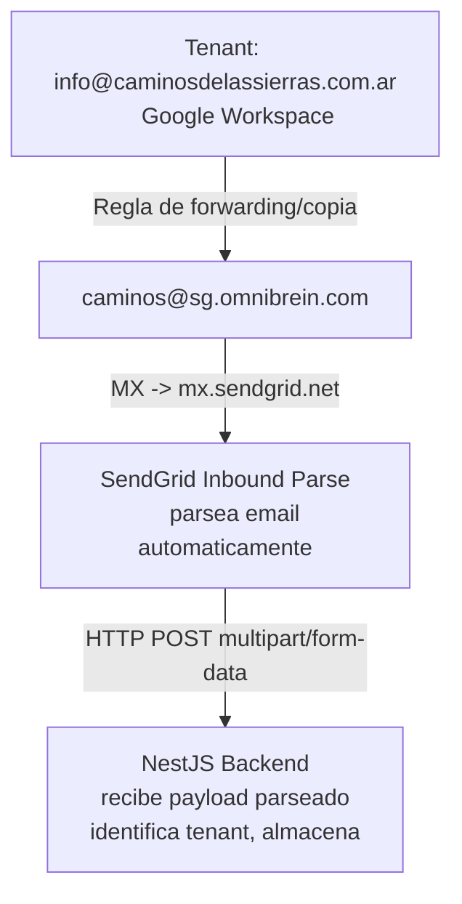
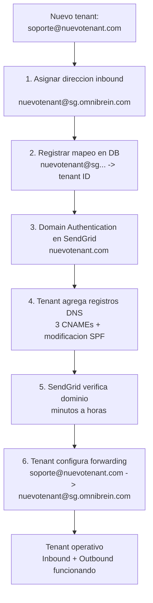

# Evaluacion Tecnica: SendGrid (Twilio)

> **Proveedor**: SendGrid (Twilio)
>
> **Sitio**: https://sendgrid.com
>
> **API Docs**: https://docs.sendgrid.com
>
> **Fecha de investigacion**: 2026-02
>
> **Estado**: Contrato existente con Twilio/SendGrid. Experiencia previa del equipo con la plataforma.
>
> **Contexto**: Evaluar SendGrid para una arquitectura **multi-tenant** de email donde:
>
> - Se usa el subdominio `sg.omnibrein.com` (dominio propio) con MX apuntando a SendGrid para recepcion inbound via Inbound Parse
> - Cada tenant (ej: `info@caminosdelassierras.com.ar`) configura forwarding hacia una direccion dedicada en `sg.omnibrein.com` (ej: `caminos@sg.omnibrein.com`)
> - SendGrid parsea los emails inbound y los envia via webhook POST al backend NestJS/Node.js
> - SendGrid envia respuestas con Domain Authentication del dominio del tenant (ej: `@caminosdelassierras.com.ar`)
>
> **Tenant de referencia**: Caminos de las Sierras (`info@caminosdelassierras.com.ar`, Google Workspace + Cloudflare DNS, DMARC `p=reject`)

---

## Contexto Organizacional

**El equipo ya tiene experiencia y contrato activo con SendGrid/Twilio.** Esto representa una ventaja significativa:

1. **Contrato existente**: No se requiere proceso de adquisicion ni aprobacion de nuevo proveedor
2. **Experiencia del equipo**: Menor curva de aprendizaje y tiempo de implementacion
3. **Soporte**: Acceso a soporte bajo contrato existente
4. **Facturacion**: Ya integrado en los procesos de pago de la empresa

---

## Challenge A - Envio y Recepcion

### A1. Recepcion de Email Inbound via Inbound Parse

#### Arquitectura de recepcion: sg.omnibrein.com

La arquitectura de recepcion se basa en usar un **subdominio propio** (`sg.omnibrein.com`) como punto de entrada para todos los emails inbound de todos los tenants. SendGrid actua como servidor de correo inbound para este subdominio mediante **Inbound Parse**.

El flujo es el siguiente:

1. El tenant configura una **regla de forwarding/copia** en su proveedor de email (ej: Google Workspace) para reenviar los emails entrantes a una direccion dedicada en `sg.omnibrein.com`.
2. El registro MX de `sg.omnibrein.com` apunta a `mx.sendgrid.net`, que recibe el email reenviado.
3. SendGrid parsea el email y hace **HTTP POST** al webhook configurado con los datos estructurados.
4. El backend NestJS recibe el payload parseado, identifica el tenant y lo almacena en la base de datos.



**Ventaja clave vs SES**: SendGrid **parsea el email automaticamente** y envia los datos estructurados (from, to, subject, body, attachments) directamente al webhook. No es necesario construir un pipeline S3/SNS/SQS ni parsear MIME raw.

#### Configuracion del subdominio sg.omnibrein.com

**Paso 1: Registro MX en DNS de omnibrein.com**

```
sg.omnibrein.com    MX    10 mx.sendgrid.net
```

**Paso 2: Configurar Inbound Parse en SendGrid**

En SendGrid Dashboard → Settings → Inbound Parse:

- **Hostname**: `sg.omnibrein.com`
- **URL**: `https://api.omnibrein.com/webhooks/sendgrid/inbound` (endpoint NestJS del backend)
- **Check incoming emails for spam**: Opcional
- **Send raw**: Opcional (si quieres el MIME raw ademas del parsed)

**Paso 3: Verificar que funcione**

SendGrid acepta inmediatamente correo para el hostname configurado. No hay "verificacion de dominio" separada para inbound - solo el MX record y la configuracion en el dashboard.

#### Payload del Inbound Parse

SendGrid envia un POST `multipart/form-data` con los siguientes campos:

| Campo                             | Descripcion                                           |
| --------------------------------- | ----------------------------------------------------- |
| `headers`                         | Headers raw del email entrante                        |
| `dkim`                            | Resultado de verificacion DKIM                        |
| `to`                              | Destinatario(s) - **usar para identificar el tenant** |
| `from`                            | Remitente                                             |
| `cc`                              | Con copia                                             |
| `subject`                         | Asunto                                                |
| `text`                            | Cuerpo texto plano                                    |
| `html`                            | Cuerpo HTML                                           |
| `sender_ip`                       | IP del servidor remitente                             |
| `envelope`                        | JSON con envelope SMTP (to, from)                     |
| `attachments`                     | Cantidad de adjuntos                                  |
| `attachment1`, `attachment2`, ... | Archivos adjuntos (binary)                            |
| `attachment-info`                 | JSON con metadata de adjuntos                         |
| `SPF`                             | Resultado de verificacion SPF                         |

**Modo Raw**: Tambien disponible, envia el email completo en formato MIME en el campo `email`.

**Identificacion del tenant**: El backend identifica a que tenant pertenece el email inbound analizando el campo `to` (ej: `caminos@sg.omnibrein.com` → tenant "Caminos de las Sierras"). Este mapeo se gestiona en la base de datos.

#### Configuracion del forwarding en el tenant

El tenant debe configurar una regla para copiar/reenviar todos los emails entrantes a su direccion dedicada en `sg.omnibrein.com`:

| Proveedor del tenant | Metodo de forwarding                                                     |
| -------------------- | ------------------------------------------------------------------------ |
| **Google Workspace** | Routing rule en Admin Console, o filtro de Gmail con "Forward a copy to" |
| **Microsoft 365**    | Transport rule en Exchange Admin Center, o regla de Outlook              |
| **Otro proveedor**   | Regla de forwarding equivalente en su panel de administracion            |

Para el tenant de referencia (Caminos de las Sierras, Google Workspace):

- Configurar en Google Admin Console → Gmail → Routing → **"Add rule"**
- Condicion: emails recibidos en `info@caminosdelassierras.com.ar`
- Accion: **"Also deliver to"** → `caminos@sg.omnibrein.com`

#### Impacto del forwarding en DMARC/SPF

Cuando Google reenvia un email, el SPF del remitente original puede fallar (porque la IP de Google no esta en el SPF del remitente original). Sin embargo, **las firmas DKIM tipicamente sobreviven al forwarding** si el cuerpo/headers del mensaje no se modifican. Para este caso de uso (recibir y procesar el contenido), no es un bloqueo.

#### Escalabilidad multi-tenant

La arquitectura escala naturalmente a multiples tenants:

| Tenant                 | Email del tenant                  | Direccion en sg.omnibrein.com | Forwarding                    |
| ---------------------- | --------------------------------- | ----------------------------- | ----------------------------- |
| Caminos de las Sierras | `info@caminosdelassierras.com.ar` | `caminos@sg.omnibrein.com`    | Google Workspace routing rule |
| Tenant B               | `contacto@tenantb.com`            | `tenantb@sg.omnibrein.com`    | Segun su proveedor de email   |
| Tenant C               | `soporte@tenantc.com.ar`          | `tenantc@sg.omnibrein.com`    | Segun su proveedor de email   |

**Para agregar un nuevo tenant** al sistema inbound:

1. Asignar una direccion unica en `sg.omnibrein.com` (ej: `nuevotenantX@sg.omnibrein.com`)
2. El tenant configura forwarding desde su email hacia esa direccion
3. El Inbound Parse existente (para todo `sg.omnibrein.com`) ya cubre la nueva direccion automaticamente
4. **No se requieren cambios en DNS, ni en SendGrid, ni en el webhook**

Para outbound (enviar respuestas como `@dominioDelTenant`), si se requiere Domain Authentication del dominio del tenant en SendGrid (ver seccion A3).

---

### A2. Requisitos DNS por dominio

La arquitectura requiere configuracion DNS en **dos dominios distintos** con responsabilidades separadas:

#### DNS en omnibrein.com (dominio propio - control total)

Estos registros se agregan en el DNS de `omnibrein.com` y estan **bajo nuestro control total**. Solo se configuran **una vez** y cubren a todos los tenants.

| #   | Tipo | Nombre | Valor                | Proposito              |
| --- | ---- | ------ | -------------------- | ---------------------- |
| 1   | MX   | `sg`   | `10 mx.sendgrid.net` | SendGrid Inbound Parse |

**Total**: 1 registro MX. Se configura una sola vez.

**Importante**: Los registros MX del dominio raiz `omnibrein.com` **no se modifican**. Solo se agrega MX para el subdominio `sg`.

#### DNS en el dominio del tenant (requiere cooperacion del tenant)

Estos registros se agregan en el DNS del dominio del tenant y son necesarios **solo para envio outbound** (enviar emails como `@caminosdelassierras.com.ar`). Para recepcion inbound, el tenant **solo necesita configurar la regla de forwarding**, sin cambios en DNS.

Ejemplo para el tenant Caminos de las Sierras (`caminosdelassierras.com.ar`, DNS en Cloudflare):

| #   | Tipo               | Nombre                                     | Valor                                           | Proposito                |
| --- | ------------------ | ------------------------------------------ | ----------------------------------------------- | ------------------------ |
| 1   | CNAME              | `em1234.caminosdelassierras.com.ar`        | `u1234567.wl.sendgrid.net`                      | Autenticacion de dominio |
| 2   | CNAME              | `s1._domainkey.caminosdelassierras.com.ar` | `s1.domainkey.u1234567.wl.sendgrid.net`         | DKIM (selector 1)        |
| 3   | CNAME              | `s2._domainkey.caminosdelassierras.com.ar` | `s2.domainkey.u1234567.wl.sendgrid.net`         | DKIM (selector 2)        |
| 4   | TXT (modificacion) | `caminosdelassierras.com.ar`               | Agregar `include:sendgrid.net` al SPF existente | SPF                      |

**Total**: 3 CNAME nuevos + 1 modificacion SPF = **4 cambios DNS por tenant**

**Nota sobre Cloudflare**: Los CNAME deben configurarse como **DNS Only (grey cloud)**, no Proxied (orange cloud).

**SPF actualizado**:

```
v=spf1 include:_spf.google.com include:sendgrid.net ~all
```

#### Resumen: que necesita cada parte

| Requisito                               | omnibrein.com (nosotros)                                       | Dominio del tenant                          |
| --------------------------------------- | -------------------------------------------------------------- | ------------------------------------------- |
| **Para inbound (recibir)**              | MX de `sg.omnibrein.com` + config Inbound Parse (una sola vez) | Solo regla de forwarding (sin cambios DNS)  |
| **Para outbound (enviar como @tenant)** | N/A                                                            | 3 CNAMEs + modificacion SPF (4 cambios DNS) |

---

### A3. Alineacion DMARC

Con Domain Authentication configurado para el dominio del tenant:

- **DKIM alineado**: Si (`d=caminosdelassierras.com.ar` via CNAME chain)
- **SPF alineado**: No por default (Return-Path usa `bounces.sendgrid.net`). Alineacion SPF disponible con Return-Path custom (plan Pro+)
- **DMARC**: **PASS** (DKIM alignment es suficiente con `p=reject`)

### A4. Reply-To y Custom Headers

**Reply-To**: Control total, independiente del From.

**Caso de uso multi-tenant**: Establecer `From` como `info@caminosdelassierras.com.ar` y `Reply-To` a la misma direccion. Cuando el usuario final responde, el email llega a Google Workspace del tenant, que lo reenvia a `caminos@sg.omnibrein.com`, cerrando el ciclo.

Alternativamente, se puede usar `Reply-To` como direccion de tracking (ej: `case-12345@sg.omnibrein.com`) para enrutar respuestas directamente al sistema sin depender del forwarding del tenant para las respuestas.

**Custom Headers**: Soportados (In-Reply-To, References, X-Custom, etc.)

---

## Challenge B - Thread Tracking

### B1. Threading

**SendGrid NO mantiene threading automaticamente.** Implementacion manual requerida (igual que todos los proveedores evaluados):

1. Al recibir email inbound: extraer `Message-ID`, `In-Reply-To`, `References`, `Subject`
2. Almacenar en base de datos vinculado al caso/tenant
3. Al enviar respuesta: setear `In-Reply-To`, `References`, `Subject` con "Re: "

**Message-ID**: SendGrid genera automaticamente. Se puede setear custom via headers (verificar en testing).

**Compatibilidad de threading**:

- Gmail: Funciona via `References`/`In-Reply-To` + mismo Subject
- Outlook: Funciona via `In-Reply-To`/`References` + `Thread-Topic` (opcional)
- Apple Mail: Funciona via `In-Reply-To`/`References`

---

## Challenge C - Email Tracking

### C1. Funcionalidades de Tracking

SendGrid ofrece el **tracking mas completo y maduro** de los proveedores evaluados:

| Metrica         | Disponible | Detalle                                       |
| --------------- | ---------- | --------------------------------------------- |
| **Delivered**   | Si         | Email aceptado por el servidor destino        |
| **Opened**      | Si         | Via pixel de tracking (1x1 transparent GIF)   |
| **Clicked**     | Si         | Via reescritura de URLs                       |
| **Bounced**     | Si         | Hard bounce + soft bounce diferenciados       |
| **Dropped**     | Si         | Email no enviado (suppression list, invalido) |
| **Deferred**    | Si         | Fallo temporal, SendGrid reintenta            |
| **Spam Report** | Si         | Destinatario marco como spam                  |
| **Unsubscribe** | Si         | Click en link de unsub                        |
| **Processed**   | Si         | Aceptado por SendGrid para envio              |

### C2. Event Webhook

Eventos entregados via **Event Webhook** (HTTP POST, JSON array, batched).

**Seguridad**: Firma ECDSA para verificar autenticidad de webhooks (`@sendgrid/eventwebhook`).

**Retry**: SendGrid reintenta Event Webhooks con backoff exponencial si el endpoint falla.

### C3. Tracking por Plan

El tracking esta **incluido en TODOS los planes** (incluyendo trial):

- Open tracking: Si
- Click tracking: Si
- Event Webhook: Si
- Deliverability Insights: Solo Pro+

---

## Pricing (2025-2026)

> **Actualizacion importante (mayo 2025)**: Twilio retiro los planes gratuitos permanentes de SendGrid. Solo existe un **free trial de 60 dias**, tras el cual se requiere upgrade a un plan pago.

| Plan                | Precio/mes   | Emails/mes       | IP Dedicada | Notas                             |
| ------------------- | ------------ | ---------------- | ----------- | --------------------------------- |
| **Free Trial**      | $0 (60 dias) | 100/dia (~3,000) | No          | Temporal, no permanente           |
| **Essentials 50K**  | $19.95       | 50,000           | No          | Minimo sostenido                  |
| **Essentials 100K** | $34.95       | 100,000          | No          | Overage: $0.0009/email            |
| **Pro 100K**        | $89.95       | 100,000          | Incluida    | Return-Path custom, SSO, subusers |
| **Pro 300K**        | $249.00      | 300,000          | Incluida    | Analytics avanzados               |
| **Pro 700K**        | $499.00      | 700,000          | Incluida    | Volumen alto                      |
| **Premier**         | Custom       | Custom           | Incluida    | CSM dedicado, custom SLAs         |

**Costo por 1,000 emails**:

| Plan            | Volumen     | Costo/1K |
| --------------- | ----------- | -------- |
| Essentials 50K  | 50,000/mes  | ~$0.40   |
| Essentials 100K | 100,000/mes | ~$0.35   |
| Pro 100K        | 100,000/mes | ~$0.90   |
| Pro 300K        | 300,000/mes | ~$0.83   |
| Pro 700K        | 700,000/mes | ~$0.71   |

**Nota**: Bajo contrato existente, los precios pueden ser mas favorables que los listados publicamente.

**Nota multi-tenant**: Los limites son por cuenta SendGrid. Si multiples tenants comparten la misma cuenta, los limites de envio se comparten. Para aislamiento, SendGrid ofrece **Subusers** (disponible en Pro+) que permiten gestionar cada tenant con credenciales separadas.

---

## Integracion Tecnica

### SDK y API

| Componente            | Paquete                         |
| --------------------- | ------------------------------- |
| Envio de email        | `@sendgrid/mail`                |
| Cliente REST general  | `@sendgrid/client`              |
| Parser inbound        | `@sendgrid/inbound-mail-parser` |
| Verificacion webhooks | `@sendgrid/eventwebhook`        |

---

## Limitaciones y Consideraciones

| Limitacion                                  | Detalle                                                                                  | Impacto                                                                                   |
| ------------------------------------------- | ---------------------------------------------------------------------------------------- | ----------------------------------------------------------------------------------------- |
| **Sin free tier permanente**                | Solo trial 60 dias, luego minimo $19.95/mes                                              | Bajo (contrato existente)                                                                 |
| **Inbound Parse sin retry**                 | Si el webhook esta caido, emails se pierden                                              | **Alto** (mitigar manteniendo copia en Google Workspace via forwarding "Also deliver to") |
| **4 DNS changes por tenant**                | 3 CNAME + SPF modification (solo para outbound)                                          | Moderado (gestion coordinada con admin DNS del tenant)                                    |
| **IP compartida en Essentials**             | Deliverability depende de otros senders en la IP                                         | Bajo-Medio                                                                                |
| **Event Webhook batching**                  | Eventos pueden llegar con delay (segundos a minutos)                                     | Bajo                                                                                      |
| **Open tracking poco confiable**            | Apple Mail Privacy, image blocking                                                       | Bajo (limitacion universal)                                                               |
| **Timeout de webhook**                      | 3s Inbound Parse, 5s Event Webhook                                                       | Bajo (procesar async)                                                                     |
| **Tamaño max Inbound Parse**                | 30 MB                                                                                    | Bajo                                                                                      |
| **Forwarding puede fallar silenciosamente** | Si el tenant desactiva la regla de forwarding, el inbound se interrumpe sin notificacion | Medio (monitorear actividad por tenant)                                                   |
| **Limites compartidos entre tenants**       | Cuenta unica, bounce/complaint rates compartidos. Subusers disponible en Pro+            | Medio (monitorear por tenant)                                                             |

---

## Onboarding de un nuevo tenant

### Proceso paso a paso



### Que necesita el tenant

| Paso                           | Responsable          | Accion                                          | Dependencia DNS   |
| ------------------------------ | -------------------- | ----------------------------------------------- | ----------------- |
| Configurar regla de forwarding | Tenant               | Crear regla en su proveedor de email            | Ninguna           |
| Agregar registros Domain Auth  | Tenant (o admin DNS) | 3 CNAMEs en su DNS                              | Si - acceso a DNS |
| Modificar SPF                  | Tenant (o admin DNS) | Agregar `include:sendgrid.net` al TXT existente | Si - acceso a DNS |

### Que hacemos nosotros

| Paso                                       | Accion                                    | Frecuencia            |
| ------------------------------------------ | ----------------------------------------- | --------------------- |
| Crear direccion `tenantX@sg.omnibrein.com` | Registrar en BD del backend               | Por cada nuevo tenant |
| Iniciar Domain Authentication en SendGrid  | SendGrid Dashboard o API                  | Por cada nuevo tenant |
| Proporcionar registros DNS al tenant       | Extraer de SendGrid y comunicar al tenant | Por cada nuevo tenant |
| Configurar DNS de `sg.omnibrein.com`       | Ya esta hecho (MX)                        | **Una sola vez**      |
| Configurar Inbound Parse                   | Ya esta hecho (hostname + webhook URL)    | **Una sola vez**      |
| Desarrollar webhook endpoint               | Ya esta hecho (NestJS)                    | **Una sola vez**      |

**Ventaja clave**: La infraestructura base (DNS de `sg.omnibrein.com`, Inbound Parse, webhook endpoint) se configura **una sola vez**. Agregar tenants no requiere cambios en infraestructura.

---

## Ventajas Especificas para esta Arquitectura

1. **Contrato existente**: Sin proceso de adquisicion, facturacion ya integrada
2. **Experiencia del equipo**: Menor tiempo de desarrollo y debugging
3. **Inbound Parse nativo**: Webhook POST con email **ya parseado** (vs DIY S3/SNS/SQS de SES). Significativamente mas simple de implementar.
4. **Tracking completo**: El mas maduro de los evaluados, con webhooks firmados (ECDSA)
5. **SDK robusto**: `@sendgrid/mail` estable, bien mantenido, con tipado TypeScript
6. **1 solo registro DNS para inbound**: MX de `sg.omnibrein.com` → `mx.sendgrid.net` (vs 4 registros de SES)
7. **Multi-tenant natural**: Un hostname de Inbound Parse, multiples tenants, sin cambios por tenant
8. **Seguridad de webhooks**: Firma ECDSA para verificar autenticidad

## Desventajas

1. **Costo**: Mas caro que Amazon SES a cualquier volumen ($0.40-0.90/1K vs $0.10/1K)
2. **4 DNS changes por tenant** para outbound: Mas que Brevo (1) pero menos que SES (5)
3. **Sin free tier permanente**: Trial de 60 dias solamente
4. **Inbound Parse sin retry**: Riesgo de perdida de emails si el webhook falla. **Mitigacion**: el forwarding "Also deliver to" mantiene copia en el buzon del tenant
5. **Dependencia DNS del tenant para outbound**: Cada nuevo tenant requiere que agreguen 4 registros DNS para poder enviar como su dominio
6. **Limites compartidos entre tenants**: Bajo una cuenta unica, bounce/complaint rates son compartidos. Subusers (Pro+) permite aislamiento
7. **Servicio externo a AWS**: A diferencia de SES, requiere API keys, no se integra nativamente con IAM/SNS/SQS

---

## Resumen Ejecutivo

| Criterio                       | Evaluacion                                                                             |
| ------------------------------ | -------------------------------------------------------------------------------------- |
| **Inbound email**              | Nativo via Inbound Parse (webhook POST con datos parseados) a `sg.omnibrein.com`       |
| **Outbound autenticado**       | Si, con Domain Authentication (4 DNS changes por tenant)                               |
| **Threading**                  | Manual pero straightforward                                                            |
| **Tracking**                   | El mas completo y maduro de todos los evaluados                                        |
| **Webhooks**                   | Si, con firma ECDSA y retry (Event Webhook). Inbound Parse **sin retry**.              |
| **Multi-tenant**               | Si (un Inbound Parse hostname, multiples tenants, sin cambios por tenant para inbound) |
| **Precio POC**                 | $0 (trial 60 dias) o bajo contrato existente                                           |
| **Precio produccion**          | $19.95-499/mes (segun plan y volumen)                                                  |
| **Integracion NestJS**         | Excelente (SDK oficial, tipado TS)                                                     |
| **Setup DNS (nuestro)**        | 1 registro MX para `sg.omnibrein.com` (una sola vez)                                   |
| **Setup DNS (por tenant)**     | 4 cambios (3 CNAME + SPF) para outbound                                                |
| **DMARC compliance**           | Si (DKIM alineado via Domain Auth)                                                     |
| **Experiencia del equipo**     | **Si** (contrato y experiencia previa)                                                 |
| **Onboarding de nuevo tenant** | Rapido: registrar en BD + Domain Auth en SendGrid + tenant agrega DNS y forwarding     |

---

## Referencias

### Pricing

- SendGrid Pricing & Plans: <https://sendgrid.com/en-us/pricing>
- Twilio SendGrid Trial Account Plan: <https://support.sendgrid.com/hc/en-us/articles/35270136965403-Twilio-SendGrid-Trial-Account-Plan>
- Cambios en free tier (mayo-julio 2025): <https://support.sendgrid.com/hc/en-us/articles/35270136965403-Twilio-SendGrid-Trial-Account-Plan>

### Inbound Parse

- Inbound Email Parse Webhook: <https://www.twilio.com/docs/sendgrid/for-developers/parsing-email/inbound-email>
- Configure the Inbound Parse Webhook: <https://www.twilio.com/docs/sendgrid/for-developers/parsing-email/setting-up-the-inbound-parse-webhook>
- Inbound Parse (UI settings): <https://www.twilio.com/docs/sendgrid/ui/account-and-settings/inbound-parse>
- Securing your Inbound Parse Webhooks: <https://www.twilio.com/docs/sendgrid/for-developers/parsing-email/securing-your-parse-webhooks>

### Domain Authentication (DKIM/SPF)

- DKIM Records Explained: <https://www.twilio.com/docs/sendgrid/ui/account-and-settings/dkim-records>
- SendGrid Automated Security - Domain Authentication: <https://support.sendgrid.com/hc/en-us/articles/21415314709147-SendGrid-Automated-Security>
- Custom DKIM Selector for Authentication: <https://support.sendgrid.com/hc/en-us/articles/4408024201627-Use-a-Custom-DKIM-Selector-for-Authentication>

### Event Webhook (Tracking)

- Event Webhook Reference: <https://docs.sendgrid.com/for-developers/tracking-events/event>
- Getting started with the Event Webhook: <https://www.twilio.com/docs/sendgrid/for-developers/tracking-events/getting-started-event-webhook>
- How to Track Email Opens: <https://support.sendgrid.com/hc/en-us/articles/360041790933-How-to-Track-Email-Opens>

### Limites de envio y tamaño de mensaje

- Mail Send API Overview - Limitations: <https://docs.sendgrid.com/api-reference/mail-send/limitations>

### SDK y API

- `@sendgrid/mail` (npm): <https://www.npmjs.com/package/@sendgrid/mail>
- `@sendgrid/client` (npm): <https://www.npmjs.com/package/@sendgrid/client>
- `@sendgrid/eventwebhook` (npm): <https://www.npmjs.com/package/@sendgrid/eventwebhook>
- SendGrid API Documentation: <https://docs.sendgrid.com>
- SendGrid v3 API Reference: <https://www.twilio.com/docs/sendgrid/api-reference>
