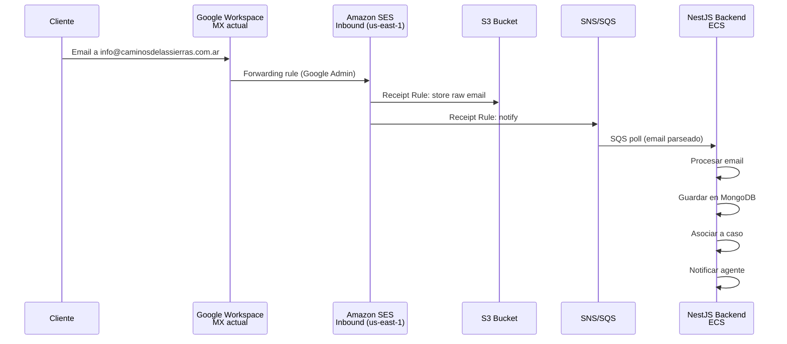
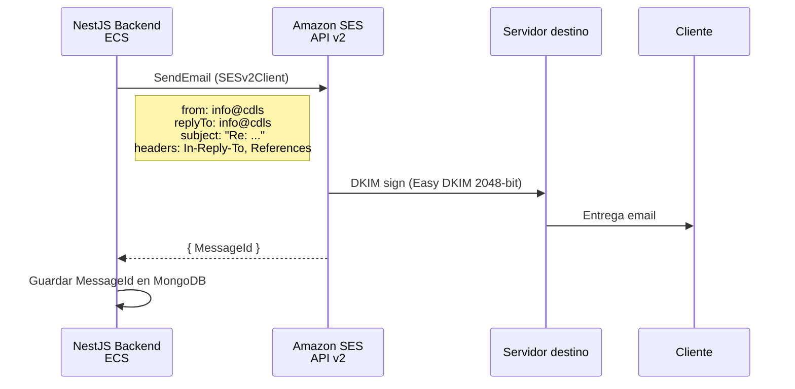
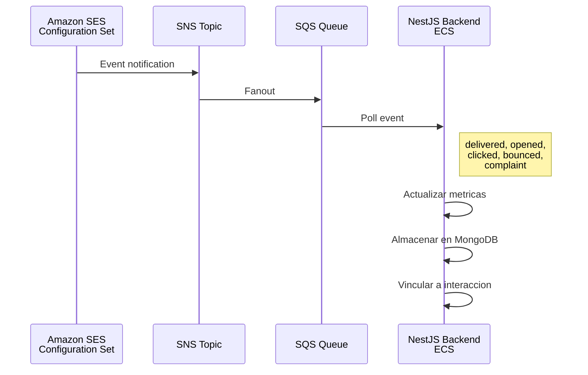
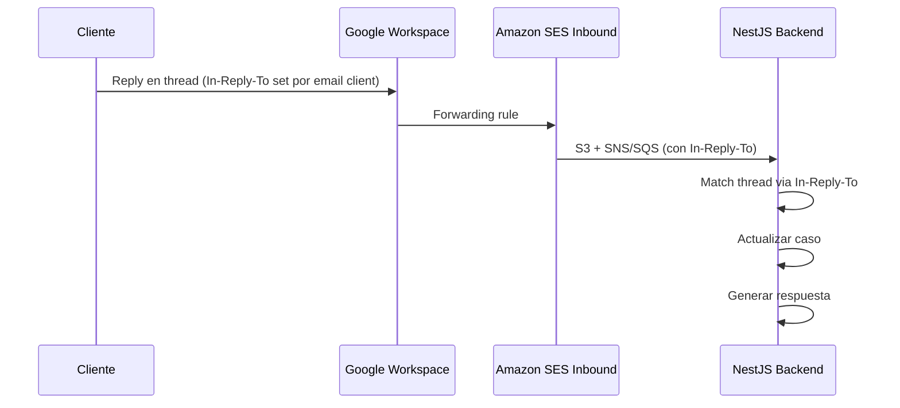

# Recomendacion Final - POC Mail Channel

## Resumen Ejecutivo

Tras evaluar 5 proveedores/enfoques (Amazon SES, SendGrid, Gmail API, Brevo, SMTP Directo) contra los 3 challenges tecnicos, y considerando factores organizacionales clave como **experiencia del equipo, contratos existentes, costos a escala y la restriccion de DMARC `p=reject`**, la recomendacion prioriza los proveedores donde ya existe relacion comercial e infraestructura.

**Factores organizacionales considerados**:

- **AWS**: Experiencia amplia del equipo, contratos vigentes, infraestructura existente (ECS, S3, SNS, SQS). Costo significativamente menor a partir de volumen moderado.
- **SendGrid (Twilio)**: Contrato existente, experiencia previa del equipo con la plataforma.
- **Brevo**: Sin experiencia previa ni contrato. Configuracion DKIM pre-existente en el dominio, pero sin acceso confirmado a la cuenta.

---

## Opciones Evaluadas

### Opcion A (Recomendada): Amazon SES

**Justificacion**:

1. **Experiencia y contratos existentes** - El equipo ya trabaja con AWS (ECS, S3, SNS, SQS) y tiene contratos vigentes. No se requiere proceso de adquisicion de nuevo proveedor
2. **Costo mas bajo a escala** - 62,000 emails/mes gratis desde ECS, luego $0.10/1K. A partir de volumen moderado es significativamente mas economico que las alternativas ($0.10/1K vs $0.40/1K de SendGrid o $0.63/1K de Brevo)
3. **Integracion AWS nativa** - IAM-based auth (sin API keys), SNS/SQS ya en uso, Terraform/IaC nativo, CloudWatch para metricas
4. **Tracking completo** via Configuration Sets + SNS/SQS/EventBridge
5. **Escalabilidad** - Sin hard caps practicos, escala a millones
6. **DKIM con rotacion automatica** - Easy DKIM 2048-bit con rotacion de claves automatica via CNAME

**Requisitos DNS** (5 registros en Cloudflare):

- 3 CNAME para DKIM (Easy DKIM)
- 1 MX para Custom MAIL FROM subdomain
- 1 TXT para SPF del subdomain

**Nota sobre DNS**: Los cambios DNS requeridos son mayores en cantidad que otras opciones, pero se trata de registros en subdominios (`mail.caminosdelassierras.com.ar`, `tokenN._domainkey.caminosdelassierras.com.ar`) que no afectan los registros existentes del dominio raiz. La coordinacion con el equipo IT del cliente para agregar estos registros en Cloudflare es un tramite operativo de bajo riesgo y se puede realizar en una sola sesion.

**Requisito adicional**: Solicitar salida de sandbox SES (24-48h de proceso con AWS Support).

### Opcion B: SendGrid (Twilio)

**Justificacion**:

1. **Contrato existente con Twilio/SendGrid** - Sin proceso de adquisicion, facturacion ya integrada
2. **Experiencia del equipo** - Menor curva de aprendizaje, el equipo ya conoce la plataforma y el SDK
3. **Tracking mas maduro** - El tracking out-of-the-box mas completo de todos los evaluados, con firma ECDSA en webhooks
4. **Inbound Parse nativo** - Webhook POST con email parseado, sin necesidad de armar pipeline DIY
5. **SDK robusto** - `@sendgrid/mail` estable, bien mantenido, con tipado TypeScript

**Requisitos DNS** (4 registros en Cloudflare):

- 3 CNAME para Domain Authentication (DKIM + SPF pass-through)
- 1 modificacion al registro SPF existente (agregar `include:sendgrid.net`)

**Costo**: Desde $19.95/mes (Essentials). Sin free tier permanente desde mayo 2025, pero el contrato existente puede ofrecer condiciones mas favorables.

### Opcion C (Fallback sin DNS): Gmail API

**Justificacion**:

1. **Cero cambios DNS** - Ideal si la coordinacion con IT del cliente resulta demasiado lenta
2. **Costo $0** - Sin costo adicional sobre Workspace existente
3. **Threading nativo** - Gmail threadId + headers = mejor experiencia de threading
4. **Entregabilidad maxima** - Los emails salen desde Google directamente

**Limitaciones aceptables si**:

- El tracking (open/click) no es critico o se acepta implementacion DIY con menor confiabilidad
- El volumen no superara 2,000 emails/dia
- El Workspace admin puede otorgar domain-wide delegation

### Opcion D: SMTP Directo del Cliente

**Justificacion**:

1. **Sin cambios DNS** - El email sale desde la infra que el cliente ya usa
2. **DMARC nativo** - SPF/DKIM/DMARC pasan sin configuracion adicional
3. **Sin costo por email enviado** - Usa la infraestructura que el cliente ya paga
4. **Email genuino** - Indistinguible de uno enviado manualmente desde el webmail del cliente
5. **Enfoque multi-tenant** - Cada cliente nuevo solo necesita: credenciales SMTP + regla de forwarding

**Para inbound**: Se combina con forwarding desde el email del cliente hacia un provider de inbound parsing (SES, SendGrid, o Brevo) que parsea el email y lo entrega via webhook al backend.

**Limitaciones**:

- Sin tracking nativo en outbound (requiere implementacion DIY: pixel + link wrapping)
- Limites de envio del SMTP del cliente (2,000/dia Gmail, 10,000/dia M365)
- Gestion de credenciales SMTP por cliente (incluyendo OAuth2 para Google/Microsoft)
- Complejidad adicional de desarrollo (~5-8 dias extra vs servicio transaccional puro)

**Recomendacion**: Evaluar como segunda fase para multi-tenant. Para la POC actual con Caminos de las Sierras, usar Opcion A o B.

### Opcion E: Brevo (Sendinblue)

**Justificacion**:

1. **DKIM ya configurado** - Solo requiere 1 cambio DNS (agregar SPF include)
2. **Tracking completo nativo** - Open, click, bounce, delivered, spam
3. **Inbound parsing nativo** - Webhook POST con email parseado

**Consideraciones**:

- **No hay experiencia previa ni contrato con Brevo** - Requiere proceso de evaluacion de nuevo proveedor y onboarding
- **Cuenta pre-existente inaccesible** - Existe configuracion DKIM en el dominio desde una cuenta Brevo que nadie ha identificado. Sin acceso a esa cuenta, no se puede usar la firma DKIM existente y habria que crear cuenta nueva + reemplazar el registro DKIM
- **SDK menos maduro** - El SDK de Node.js (`@getbrevo/brevo`) ha recibido criticas por tipado incompleto y actualizaciones lentas
- **Costo**: $0.63-0.75/1K (mas caro que SES a cualquier volumen)

---

## Diagrama Tecnico del Flujo Recomendado (Opcion A: Amazon SES)

### Flujo Inbound

### Flujo Outbound

### Flujo Tracking

### Flujo Reply (cliente responde)

---

## Riesgos Identificados

| #   | Riesgo                                                                                                                    | Probabilidad | Impacto  | Mitigacion                                                                                                                                                                                |
| --- | ------------------------------------------------------------------------------------------------------------------------- | ------------ | -------- | ----------------------------------------------------------------------------------------------------------------------------------------------------------------------------------------- |
| 1   | **Coordinacion DNS con IT del cliente** - El equipo IT de Caminos de las Sierras tarda en agregar registros en Cloudflare | Media        | **Bajo** | Los cambios DNS son un tramite operativo estandar (agregar CNAME y TXT records). Se pueden solicitar todos en una sola comunicacion. Como fallback, Opcion C (Gmail API) no requiere DNS. |
| 2   | **DMARC rejection durante pruebas** - Emails rechazados por configuracion incorrecta                                      | Baja         | Alto     | Probar con dominio de testing primero. SES Easy DKIM genera alineacion DMARC correcta. Usar SES Mailbox Simulator para testing sin riesgo.                                                |
| 3   | **Forwarding de Google pierde emails** - La regla de forwarding falla o tiene delay                                       | Baja         | Alto     | Mantener copia en Google Workspace (no borrar originales); monitorear la regla de forwarding                                                                                              |
| 4   | **Sandbox SES demorado** - El proceso de salida de sandbox tarda mas de 48h                                               | Baja         | Medio    | Se puede hacer toda la POC en sandbox verificando las direcciones de testing. Solicitar salida de sandbox en paralelo al desarrollo.                                                      |
| 5   | **SPF lookup limit (10 max)** - Al agregar includes, se supera el limite de 10 DNS lookups                                | Baja         | Medio    | Verificar cantidad actual de includes en SPF. Con Custom MAIL FROM de SES, el SPF se verifica contra el subdominio, no el dominio raiz.                                                   |
| 6   | **Volumen supera free tier de SES** - Mas de 62K emails/mes                                                               | Baja         | **Bajo** | A $0.10/1K, el costo incremental es minimo.                                                                                                                                               |
| 7   | **IP compartida con mala reputacion** - En SES sin IP dedicada, las IPs son compartidas                                   | Baja         | Medio    | Monitorear deliverability. IP dedicada disponible a $24.95/mes si necesario.                                                                                                              |
| 8   | **Google cambia politica de forwarding** - Actualizaciones de Google Workspace                                            | Muy baja     | Alto     | Tener plan de contingencia con inbound directo (requiere cambio MX a subdominio)                                                                                                          |
| 9   | **Tracking pixel bloqueado** - Apple Mail Privacy, Outlook, etc.                                                          | Alta         | Bajo     | Aceptar que el open rate real sera ~40-60% del reportado; usar click tracking como metrica mas confiable                                                                                  |
| 10  | **Pipeline inbound SES requiere mas desarrollo** - S3/SNS/SQS/Lambda vs webhook simple                                    | Media        | **Bajo** | El equipo ya tiene experiencia con SNS/SQS en el stack existente. Patron conocido.                                                                                                        |

---

## Supuestos y Dependencias

### Supuestos

1. El dominio correcto es `caminosdelassierras.com.ar` (doble "s", TLD argentino)
2. Caminos de las Sierras usa Google Workspace para su email corporativo
3. El volumen estimado de emails es bajo-medio (< 1,000/dia)
4. El equipo de Caminos de las Sierras o su proveedor IT tiene acceso a Cloudflare para agregar registros DNS
5. El backend NestJS corre en AWS ECS (infraestructura existente del ecosistema Omni)
6. Existe contrato vigente con AWS y con Twilio/SendGrid
7. El equipo tiene experiencia previa con AWS y SendGrid

### Dependencias

| Dependencia                                                     | Responsable                          | Criticidad                | Estado          |
| --------------------------------------------------------------- | ------------------------------------ | ------------------------- | --------------- |
| **Acceso a Cloudflare** para agregar registros DNS (CNAME, TXT) | Equipo IT de Caminos de las Sierras  | Media (tramite operativo) | Pendiente       |
| **Acceso a Google Admin Console** para crear forwarding rule    | Admin Google Workspace de Caminos    | Alta                      | Pendiente       |
| **Salida de sandbox SES**                                       | Equipo de desarrollo (request a AWS) | Media (para Opcion A)     | Pendiente       |
| **Endpoint HTTPS publico** para webhooks / SQS consumer         | Equipo de desarrollo                 | Alta                      | Requiere deploy |
| **Domain-wide delegation** (solo si Opcion C)                   | Admin Google Workspace               | Alta (solo Opcion C)      | Pendiente       |

---

## Plan de Implementacion POC (Opcion A: Amazon SES)

### Fase 1: Configuracion AWS + DNS (Dia 1)

- [ ] Verificar dominio `caminosdelassierras.com.ar` en SES (genera DKIM CNAMEs)
- [ ] Solicitar al cliente agregar los 5 registros DNS en Cloudflare (3 CNAME DKIM + MX + TXT para MAIL FROM)
- [ ] Solicitar salida de sandbox SES (en paralelo, se puede testear en sandbox)
- [ ] Crear Configuration Set con event destinations (SNS para tracking)
- [ ] Configurar Receipt Rule Set para inbound (si se usa SES inbound)
- [ ] Configurar forwarding rule en Google Admin Console

### Fase 2: Desarrollo Backend (Dias 2-3)

- [ ] Implementar SQS consumer para inbound email processing
- [ ] Implementar servicio de envio con SESv2Client + threading headers
- [ ] Implementar almacenamiento de Message-IDs para threading
- [ ] Implementar SQS consumer para eventos de tracking
- [ ] Configurar IAM policies para ECS task role

### Fase 3: Validacion (Dia 4)

- [ ] Probar envio de email desde la plataforma
- [ ] Verificar que DMARC pasa (DKIM alineado via Easy DKIM)
- [ ] Probar recepcion de email via forwarding + inbound processing
- [ ] Verificar threading funcional en Gmail y Outlook
- [ ] Validar eventos de tracking (delivered, opened, clicked)
- [ ] Documentar resultados

---

## Matriz de Decision Final

| Criterio (peso)                          | Amazon SES | SendGrid | Gmail API | SMTP Directo | Brevo    |
| ---------------------------------------- | ---------- | -------- | --------- | ------------ | -------- |
| **Challenge A - Envio/Recepcion** (20%)  | 7/10       | 8/10     | 9/10      | 8/10         | 9/10     |
| **Challenge B - Threading** (15%)        | 7/10       | 7/10     | **9/10**  | 7/10         | 7/10     |
| **Challenge C - Tracking** (20%)         | 8/10       | **9/10** | 3/10      | 2/10         | **9/10** |
| **Costo** (15%)                          | **9/10**   | 5/10     | **10/10** | **10/10**    | 7/10     |
| **Esfuerzo DNS/Setup** (10%)             | 5/10       | 6/10     | **10/10** | **10/10**    | 8/10     |
| **Experiencia equipo + Contratos** (20%) | **9/10**   | **8/10** | 5/10      | 5/10         | 2/10     |
| **Score ponderado**                      | **7.8**    | **7.4**  | **7.2**   | **6.7**      | **6.6**  |

> **Nota sobre ponderacion**: Se incorporo el criterio "Experiencia equipo + Contratos" (20%) que refleja la realidad organizacional: familiaridad con la plataforma, contratos vigentes, y procesos de adquisicion ya resueltos. Este factor impacta directamente en tiempo de implementacion, riesgo de ejecucion y costos ocultos.

### Ranking Final

1. **Amazon SES** (7.8/10) - Mejor costo a escala, experiencia AWS del equipo, integracion nativa con stack existente, contratos vigentes
2. **SendGrid** (7.4/10) - Contrato existente, experiencia del equipo, tracking mas maduro, setup mas rapido que SES
3. **Gmail API** (7.2/10) - Ideal si no se puede tocar DNS y el tracking no es critico. Cero costo adicional
4. **SMTP Directo** (6.7/10) - Sin cambios DNS, sin costo, DMARC nativo. Limitado por tracking DIY y gestion de credenciales
5. **Brevo** (6.6/10) - Funcionalidades solidas pero sin experiencia ni contrato existente. La configuracion DKIM pre-existente es una ventaja tecnica, pero la falta de acceso a la cuenta y la ausencia de relacion comercial lo posicionan detras de las opciones donde ya hay experiencia

### Recomendacion Definitiva

**Implementar con Amazon SES como Opcion A**, aprovechando la experiencia del equipo con AWS, los contratos vigentes y el costo significativamente menor a escala.
**SendGrid como Opcion B** si se prefiere un setup mas rapido con menos desarrollo DIY (inbound parse nativo vs pipeline S3/SNS).
**Gmail API como Opcion C (fallback)** si la coordinacion de cambios DNS resulta muy lenta.
