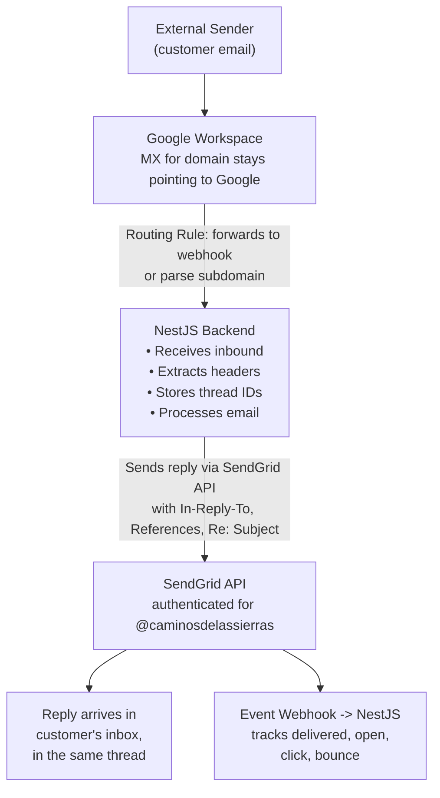

# SendGrid Technical POC Evaluation

**Context**: Receive emails at `info@caminosdelassierras.com.ar` (Google Workspace + Cloudflare DNS, DMARC `p=reject`), process in NestJS/Node.js backend, reply as `@caminosdelassierras.com.ar` maintaining thread continuity and tracking metrics.

**Research Date**: February 2026
**Knowledge basis**: SendGrid documentation and API reference through May 2025. Pricing and very recent feature changes should be verified against https://sendgrid.com/en-us/pricing and https://docs.sendgrid.com.

---

## Challenge A — Sending and Receiving

### A1. Inbound Parse Webhook

#### How It Works
SendGrid's Inbound Parse Webhook intercepts emails sent to a domain (or subdomain) for which the MX records point to SendGrid. When an email arrives, SendGrid parses it and POSTs the content to a URL you configure.

**Setup Steps:**
1. Add an MX record for the receiving domain/subdomain pointing to `mx.sendgrid.net` (priority 10).
2. In the SendGrid dashboard (Settings → Inbound Parse), configure:
   - The hostname/domain that will receive mail.
   - The webhook URL (your backend endpoint, must be publicly accessible HTTPS).
   - Whether to post the raw MIME message or the parsed version.
3. SendGrid then POSTs to your webhook URL every time an email arrives.

#### Payload Format
SendGrid offers **two modes**:

**Parsed Mode (default)** — `multipart/form-data` POST with these fields:

| Field | Description |
|-------|-------------|
| `headers` | Raw headers of the incoming email (full header block as a string) |
| `dkim` | DKIM verification results (e.g., `{@domain.com : pass}`) |
| `to` | Recipient address(es) as a string (e.g., `"Name" <email@domain.com>`) |
| `from` | Sender address as a string |
| `cc` | CC addresses (if any) |
| `subject` | Email subject |
| `text` | Plain text body (if present) |
| `html` | HTML body (if present) |
| `sender_ip` | IP of the sending server |
| `envelope` | JSON string containing SMTP envelope `to` and `from` |
| `attachments` | Number of attachments (integer) |
| `attachment1`, `attachment2`, ... | Actual attachment files (binary, multipart file uploads) |
| `attachment-info` | JSON mapping of attachment metadata (filename, content-type, content-id) |
| `charsets` | JSON object mapping each field to its character encoding |
| `SPF` | SPF verification result |

**Raw Mode** — `multipart/form-data` POST with:

| Field | Description |
|-------|-------------|
| `email` | Full raw MIME message (the complete RFC 2822 email) |
| `to` | Recipient address(es) |
| `from` | Sender address |
| `subject` | Subject |
| `sender_ip` | IP of the sender |
| `envelope` | JSON string with SMTP envelope |
| `charsets` | Charset info |
| `dkim` | DKIM result |
| `SPF` | SPF result |

**Key detail**: Even in "raw" mode, it is **not** a JSON POST. It is always `multipart/form-data`. The raw MIME is in the `email` field.

#### Critical Consideration for This POC — MX Record Conflict

**This is the single biggest architectural decision.**

Currently, `caminosdelassierras.com.ar` has MX records pointing to Google Workspace (e.g., `aspmx.l.google.com`, etc.). For SendGrid Inbound Parse to receive mail at `info@caminosdelassierras.com.ar`, one of the following must be true:

**Option 1: Change MX for the root domain** → All email for `@caminosdelassierras.com.ar` goes to SendGrid, not Google. This **breaks Google Workspace email** for all users. **Not viable** if the company uses Google Workspace for other mailboxes.

**Option 2: Use a subdomain for inbound parse** → e.g., `parse.caminosdelassierras.com.ar` with MX → `mx.sendgrid.net`. Then SendGrid receives mail at `anything@parse.caminosdelassierras.com.ar`. But the actual address `info@caminosdelassierras.com.ar` still delivers to Google Workspace.

**Option 3: Google Workspace routing** → Keep MX pointing to Google. In Google Workspace Admin, set up a **routing rule** for `info@caminosdelassierras.com.ar` to forward all inbound mail to an address on the SendGrid-parsed subdomain (e.g., `info@parse.caminosdelassierras.com.ar`), which then triggers the Inbound Parse webhook. Alternatively, Google Workspace can forward directly to your NestJS webhook endpoint without involving SendGrid Inbound Parse at all.

**Option 4: Google Workspace forwarding (simpler)** → Set up forwarding in Google Workspace (either at the user level or via routing rules in Admin Console) to forward copies of emails arriving at `info@` to your backend webhook directly. Then use SendGrid only for *sending* replies. This avoids the MX conflict entirely.

**Recommendation for this POC**: Option 4 is most pragmatic. Use Google Workspace routing for inbound, SendGrid for outbound. Alternatively, Option 3 if you want SendGrid parsing the inbound emails.

---

### A2. Sending from External Domain — DNS Records Required

To send emails as `@caminosdelassierras.com.ar` via SendGrid with proper authentication (essential since DMARC is `p=reject`), you need **Domain Authentication** (formerly "Whitelabeling").

#### Required DNS Records

SendGrid's Domain Authentication requires you to add **three CNAME records** to your domain's DNS (in Cloudflare):

```
# CNAME records for DKIM signing
em1234.caminosdelassierras.com.ar  →  u1234567.wl.sendgrid.net
s1._domainkey.caminosdelassierras.com.ar  →  s1.domainkey.u1234567.wl.sendgrid.net
s2._domainkey.caminosdelassierras.com.ar  →  s2.domainkey.u1234567.wl.sendgrid.net
```

(The exact subdomains and values are generated by SendGrid during setup and are unique to your account.)

**What these do:**
- `em1234.*` → This is a CNAME that resolves to a SendGrid TXT record containing an SPF `include`. When receiving mail servers look up the SPF for your domain, this path eventually leads to `include:sendgrid.net` being authorized.
- `s1._domainkey.*` and `s2._domainkey.*` → These are CNAME records that point to SendGrid-hosted DKIM public keys. SendGrid signs outgoing mail with the corresponding private keys.

#### SPF Considerations
Since Google Workspace is already using SPF for `caminosdelassierras.com.ar`, the existing SPF record likely looks like:

```
v=spf1 include:_spf.google.com ~all
```

You need to **add** SendGrid's include:

```
v=spf1 include:_spf.google.com include:sendgrid.net ~all
```

**Important**: SPF has a 10-DNS-lookup limit. `include:_spf.google.com` already consumes several lookups. Adding `include:sendgrid.net` adds more. You should verify the total doesn't exceed 10, or use an SPF flattening service.

**Note on Cloudflare**: When adding CNAME records for SendGrid in Cloudflare, you must set them to **DNS Only (grey cloud)**, not Proxied (orange cloud). Cloudflare proxying breaks DNS-based email authentication.

#### DKIM
Handled automatically via the CNAME records above. SendGrid signs with its own private key; the public key is served through the CNAME chain. Both `s1` and `s2` selectors are used for key rotation.

#### DMARC
DMARC alignment is the critical concern here since the domain has `p=reject`.

- **DKIM alignment**: If SendGrid signs with `d=caminosdelassierras.com.ar` (which it does when Domain Authentication is set up correctly via the CNAMEs), DKIM alignment passes.
- **SPF alignment**: The `MAIL FROM` (envelope sender / Return-Path) domain must align with the `From` header domain. SendGrid by default uses its own bounce handling domain for the envelope sender (e.g., `bounces.sendgrid.net`). This means SPF alignment will **fail** by default. However, DMARC only requires **one** of SPF or DKIM to align, so DKIM alignment alone is sufficient.
- **To get SPF alignment too** (belt and suspenders): You can set up **Link Branding** and configure a custom Return-Path domain (available on Pro plan and above). This makes the envelope sender use your domain.

**Bottom line**: With Domain Authentication CNAMEs properly configured, DKIM alignment passes, and emails sent via SendGrid as `@caminosdelassierras.com.ar` will **pass DMARC even with `p=reject`**.

---

### A3. Can It Send from a Domain You Don't Own?

**Technically yes, practically constrained:**

- SendGrid **does not** require you to prove domain ownership in the registrar sense. It requires you to add DNS records (CNAMEs) to the domain's DNS zone.
- If you have **DNS access** (which in this case you do — via Cloudflare), you can authenticate any domain.
- If you do NOT have DNS access, you can still send from the domain, but:
  - Emails will be signed with SendGrid's default DKIM (`d=sendgrid.net`), not your domain.
  - SPF will reference `sendgrid.net`.
  - **DMARC alignment will fail** → With `p=reject`, these emails will be rejected by receiving servers.

**Minimum DNS configuration needed:**
- The 3 CNAME records for Domain Authentication (DKIM + SPF pass-through).
- SPF record update to include `sendgrid.net`.
- That's it — about 4 DNS changes total.

---

### A4. Reply-To Handling

**Yes, Reply-To can be set independently from the From address.**

In the SendGrid v3 Mail Send API:

```json
{
  "from": {
    "email": "info@caminosdelassierras.com.ar",
    "name": "Caminos de las Sierras"
  },
  "reply_to": {
    "email": "support@otherdomain.com",
    "name": "Support Team"
  },
  "reply_to_list": [
    {
      "email": "support@otherdomain.com",
      "name": "Support"
    },
    {
      "email": "backup@otherdomain.com",
      "name": "Backup"
    }
  ]
}
```

- `reply_to` — Sets a single Reply-To address.
- `reply_to_list` — Sets multiple Reply-To addresses (max 1000). If both are provided, `reply_to_list` takes precedence.
- These are completely independent of the `from` field.

**Use case for this POC**: You could send `From: info@caminosdelassierras.com.ar` with `Reply-To: info@caminosdelassierras.com.ar` (or even a different address that routes to your processing system). This is fully supported.

---

### A5. Custom Headers Support

**Yes, fully supported.**

The Mail Send API has a `headers` object where you can set arbitrary custom headers:

```json
{
  "personalizations": [
    {
      "to": [{"email": "recipient@example.com"}],
      "headers": {
        "X-Custom-Header": "custom-value",
        "X-Ticket-ID": "12345"
      }
    }
  ],
  "headers": {
    "X-Global-Header": "value-for-all-recipients"
  }
}
```

- Headers can be set at the **personalization level** (per-recipient) or at the **message level** (global).
- You can set threading headers like `In-Reply-To` and `References` via custom headers.
- **Restriction**: You cannot override certain reserved headers that SendGrid manages (e.g., `Date`, `From`, `To`, `Subject` are set via their dedicated fields). However, `Message-ID`, `In-Reply-To`, and `References` **can** be set via custom headers.

---

## Challenge B — Thread Tracking

### B1. Automatic Threading

**SendGrid does NOT automatically maintain threading.** It is a transactional/marketing email API — it does not have a concept of "conversations" or "threads" built in.

What SendGrid does automatically:
- **Generates a `Message-ID` header** for every outgoing email (e.g., `<filter_id.smtpapi_id@ismtpd-xxx>`).
- **Does NOT set `In-Reply-To` or `References`** automatically. You must set these yourself.

**You are responsible for threading.** This means your NestJS backend must:
1. When receiving an inbound email, extract the `Message-ID`, `In-Reply-To`, `References`, and `Subject` headers.
2. Store these in your database.
3. When sending a reply, set:
   - `In-Reply-To: <original-message-id>`
   - `References: <original-message-id> <any-previous-message-ids>`
   - `Subject: Re: <original-subject>` (preserve the original subject with `Re:` prefix)

### B2. Custom Message-ID

**Yes, you can set a custom `Message-ID`.**

```json
{
  "headers": {
    "Message-ID": "<custom-id-12345@caminosdelassierras.com.ar>"
  }
}
```

- The Message-ID should follow RFC 5322 format: `<unique-part@domain>`.
- Using your own domain in the Message-ID is recommended for consistency.
- **Gotcha**: Some older SendGrid documentation suggests you cannot override Message-ID. In practice, setting it via the `headers` field in the v3 API **does** work. However, some users have reported inconsistencies — **verify this in your POC testing**.
- Alternative: If custom Message-ID doesn't stick, you can use the `X-Message-Id` header that SendGrid adds to every message. This header contains SendGrid's internal message ID and is returned in webhook events.

### B3. Reply Mechanism for Thread Continuity

To maintain thread continuity in Gmail, Outlook, and Apple Mail, you need:

**Gmail threading criteria** (Gmail uses a combination):
1. Same `Subject` line (ignoring `Re:`/`Fwd:` prefixes) — necessary but not sufficient.
2. `References` or `In-Reply-To` headers referencing a Message-ID already in the thread.
3. Sent to/from same participants.

**Outlook threading criteria**:
1. Same normalized `Subject` (the `Thread-Topic` header if present).
2. `In-Reply-To` and `References` headers.
3. Outlook also uses `Thread-Index` header (Microsoft proprietary) for precise threading.

**Implementation in your NestJS backend:**

```typescript
// When sending a reply via SendGrid
const msg = {
  to: originalSender,
  from: { email: 'info@caminosdelassierras.com.ar', name: 'Caminos de las Sierras' },
  subject: `Re: ${originalSubject}`,  // Preserve subject with Re: prefix
  headers: {
    'In-Reply-To': originalMessageId,           // Message-ID of the email being replied to
    'References': `${allPriorMessageIds}`,       // Space-separated list of all Message-IDs in the thread
  },
  text: replyBody,
  html: replyBodyHtml,
};
await sgMail.send(msg);
```

**This works reliably** for Gmail and most clients. For Outlook, adding `Thread-Topic` and `Thread-Index` headers can improve threading but is not strictly required.

### B4. Threading Limitations

1. **No built-in conversation tracking**: SendGrid has no concept of threads or conversations. Your application must track all Message-IDs and build the References chain.
2. **Message-ID reliability**: If SendGrid overrides your custom Message-ID in edge cases, thread continuity breaks. Test this thoroughly.
3. **Subject line sensitivity**: If the subject is modified (e.g., by your system), Gmail may break the thread.
4. **Forwarded messages**: Thread continuity for forwarded messages is harder to maintain and depends on client behavior.
5. **Open/click tracking can break threading**: SendGrid's open/click tracking modifies the HTML body (adds tracking pixel, rewrites links). This doesn't directly break threading but can alter the visual appearance of quoted text in replies.

---

## Challenge C — Email Tracking

### C1. Available Tracking Features

| Feature | Description |
|---------|-------------|
| **Delivered** | Email was accepted by the receiving server (not necessarily to inbox) |
| **Open** | Recipient opened the email (pixel-based, see C4) |
| **Click** | Recipient clicked a tracked link in the email |
| **Bounce** | Email bounced — hard bounce (invalid address) or soft bounce (temporary failure) |
| **Dropped** | SendGrid decided not to send (e.g., recipient on suppression list, invalid email) |
| **Deferred** | Receiving server temporarily rejected; SendGrid will retry |
| **Spam Report** | Recipient marked email as spam (via ISP feedback loop) |
| **Unsubscribe** | Recipient clicked the unsubscribe link (if using SendGrid's subscription management) |
| **Group Unsubscribe** | Recipient unsubscribed from a specific group |
| **Group Resubscribe** | Recipient resubscribed to a group |
| **Processed** | SendGrid accepted the email for delivery (internal event) |

### C2. Webhook Event Types (Event Webhook)

All event types delivered via SendGrid's **Event Webhook**:

**Delivery Events:**
- `processed` — Email accepted by SendGrid for delivery
- `delivered` — Email delivered to receiving server
- `deferred` — Temporary delivery failure, will retry
- `bounce` — Permanent delivery failure
- `dropped` — SendGrid will not deliver (suppression, invalid, etc.)

**Engagement Events:**
- `open` — Email opened (tracking pixel loaded)
- `click` — Link in email clicked
- `spam_report` — Marked as spam by recipient
- `unsubscribe` — Recipient unsubscribed
- `group_unsubscribe` — Unsubscribed from a group
- `group_resubscribe` — Resubscribed to a group

**Webhook payload format** (JSON array):

```json
[
  {
    "email": "recipient@example.com",
    "timestamp": 1676000000,
    "smtp-id": "<unique-smtp-id@sendgrid.net>",
    "event": "delivered",
    "category": ["category1"],
    "sg_event_id": "unique-event-id",
    "sg_message_id": "sendgrid-message-id.filterxxx.xxxxx.xxxxxx",
    "response": "250 OK",
    "attempt": "1",
    "ip": "167.89.xxx.xxx",
    "tls": 1,
    "cert_error": 0,
    "useragent": "Mozilla/5.0...",  // For open/click events
    "url": "https://tracked-url.com",  // For click events
    "reason": "550 User not found",  // For bounce events
    "type": "bounce",  // bounce sub-type
    "status": "5.0.0"  // SMTP status code
  }
]
```

**Important fields for this POC:**
- `sg_message_id` — Correlate webhook events back to the sent email.
- `event` — The event type.
- `email` — The recipient.
- `timestamp` — Unix timestamp of the event.
- Custom `unique_args` can be passed when sending to include your own metadata (e.g., ticket ID) in all webhook events for that email.

### C3. Tracking Inclusion by Plan

| Feature | Free | Essentials | Pro | Premier |
|---------|------|------------|-----|---------|
| Event Webhook | Yes | Yes | Yes | Yes |
| Open Tracking | Yes | Yes | Yes | Yes |
| Click Tracking | Yes | Yes | Yes | Yes |
| Deliverability Insights | No | No | Yes | Yes |
| Expert Insights | No | No | No | Yes |

**All tracking features (open, click, bounce, delivered, dropped, deferred, spam report) and the Event Webhook are available on ALL plans, including the free tier.**

### C4. Open Tracking — How It Works

SendGrid inserts an invisible **tracking pixel** (1x1 transparent GIF) at the bottom of the HTML body of the email:

```html

```

When the recipient's email client loads images, this pixel is fetched from SendGrid's servers, triggering the "open" event.

**Limitations:**
- Does not work if recipient has images disabled (common in Outlook, Apple Mail privacy).
- Apple Mail Privacy Protection (iOS 15+ / macOS Monterey+) pre-loads all images via proxy, causing false opens.
- Some corporate email gateways strip tracking pixels.
- Plain-text emails cannot be open-tracked (no HTML body to embed the pixel).

### C5. Tracking Impact on Deliverability and DMARC

**Click Tracking:**
- SendGrid rewrites links to go through its tracking domain (e.g., `https://u12345.ct.sendgrid.net/ls/click?upn=...`).
- If you set up **Link Branding**, links are rewritten through your own domain (e.g., `https://track.caminosdelassierras.com.ar/ls/click?...`). This looks more professional and avoids domain reputation issues.
- Rewritten links through `sendgrid.net` can occasionally trigger spam filters because the link domain differs from the sender domain.

**Open Tracking:**
- The tracking pixel domain should match your branded domain for consistency.
- Minimal direct impact on deliverability, but some spam filters flag emails with tracking pixels from known ESP domains.

**DMARC Impact:**
- Click tracking via `sendgrid.net` domains does NOT affect DMARC (DMARC checks `From` header domain alignment with DKIM/SPF, not link domains in the body).
- **However**, the visual mismatch between the sender domain and link domains can affect recipient trust and anti-phishing heuristics.
- **Recommendation**: Set up Link Branding with a subdomain like `click.caminosdelassierras.com.ar` or `email.caminosdelassierras.com.ar` to keep everything consistent.

---

## Pricing (updated February 2026)

> **IMPORTANT UPDATE (May 2025)**: Twilio retired SendGrid's permanent free plans on May 28, 2025. After a 60-day transition period, free accounts had their email sending paused. SendGrid now only offers a **60-day free trial**, after which an upgrade to a paid plan is required to continue sending emails. [Source](https://www.twilio.com/en-us/changelog/changes-coming-to-sendgrid-s-free-plans)

### Current Plans

| Plan | Monthly Cost | Emails/Month | Key Features |
|------|-------------|--------------|--------------|
| **Free Trial (60 days)** | $0 (temporary) | 100/day (~3,000/month) | Single sender, basic APIs, **expires after 60 days** |
| **Essentials** | Starting at $19.95/mo | 50,000 | Ticketing + chat support, no IP whitelisting, basic analytics |
| **Pro** | Starting at $89.95/mo | 100,000 | Dedicated IP, sub-user management, advanced analytics, email validation |
| **Premier** | Custom pricing | Custom volume | Dedicated CSM, SSO, custom features |

**Note**: Pricing tiers are based on email volume. Higher volumes have lower per-email costs within each plan. The prices above are starting prices for the lowest volume in each tier. The minimum sustained cost is $19.95/month (Essentials) since the free tier is no longer permanent.

### Cost Per Email (approximate)

| Plan | Volume | Approx. Cost/Email |
|------|--------|-------------------|
| Free | 100/day | $0 |
| Essentials 50K | 50,000/mo | ~$0.0004 |
| Essentials 100K | 100,000/mo | ~$0.00035 |
| Pro 100K | 100,000/mo | ~$0.0009 |
| Pro 300K | 300,000/mo | ~$0.0005 |

### Inbound Parse Availability

**Inbound Parse is available on ALL plans, including the free tier.** There is no additional cost for Inbound Parse — it is a platform feature, not a paid add-on.

**However**: Inbound Parse does not count against your email sending quota. It is purely for receiving/parsing. Your sending quota only applies to outbound emails.

### Tracking Cost

**All tracking features are included in all plans at no additional cost.** Open tracking, click tracking, event webhooks — all free with every plan.

### Free Trial Details (no longer a permanent free tier)

- **60-day trial only** -- after 60 days, email sending is paused and upgrade to a paid plan is required.
- **100 emails per day** during the trial (hard limit, not 100/month).
- Roughly 3,000 emails/month during trial period.
- Access to all APIs (v3 Mail Send, Inbound Parse, Event Webhook).
- Two-factor authentication required.
- Single sender verification (can still authenticate a full domain).
- **No dedicated IP** (shared IP pool).
- Limited to 1 teammate.
- Support: ticket-based during trial only.
- **After trial expires**: Must upgrade to Essentials ($19.95/mo minimum) or higher to continue sending.

---

## Integration Details

### Node.js SDKs

**Official SDK: `@sendgrid/mail`**

```bash
npm install @sendgrid/mail
```

Additional packages:
- `@sendgrid/client` — Low-level REST client for any SendGrid API endpoint.
- `@sendgrid/helpers` — Utility classes for building mail objects.
- `@sendgrid/inbound-mail-parser` — Parser helper for Inbound Parse webhook payloads.
- `@sendgrid/eventwebhook` — Helper for verifying Event Webhook signatures.

**Sending email example (NestJS):**

```typescript
import * as sgMail from '@sendgrid/mail';

sgMail.setApiKey(process.env.SENDGRID_API_KEY);

const msg = {
  to: 'recipient@example.com',
  from: {
    email: 'info@caminosdelassierras.com.ar',
    name: 'Caminos de las Sierras',
  },
  replyTo: {
    email: 'info@caminosdelassierras.com.ar',
    name: 'Caminos de las Sierras',
  },
  subject: 'Re: Original Subject',
  text: 'Plain text body',
  html: '<p>HTML body</p>',
  headers: {
    'In-Reply-To': '<original-message-id@sender-domain.com>',
    'References': '<msg-1@domain.com> <msg-2@domain.com>',
    'X-Custom-Ticket-Id': 'TICKET-12345',
  },
  customArgs: {
    ticketId: 'TICKET-12345',  // Appears in webhook events as unique_args
  },
  trackingSettings: {
    clickTracking: { enable: true },
    openTracking: { enable: true },
  },
};

const [response] = await sgMail.send(msg);
// response.statusCode === 202 means accepted
// response.headers['x-message-id'] contains SendGrid's message ID
```

### REST API vs SMTP

**Both are supported:**

| Method | Endpoint | Best For |
|--------|----------|----------|
| **REST API (v3)** | `POST https://api.sendgrid.com/v3/mail/send` | Programmatic sending, full feature access, recommended for NestJS |
| **SMTP** | `smtp.sendgrid.net:587` (STARTTLS) or `:465` (SSL) | Legacy systems, simple integrations |

**REST API advantages** (recommended for this POC):
- Full access to all features (categories, custom args, personalizations, etc.).
- Better error handling (HTTP status codes + JSON error details).
- No SMTP connection management overhead.
- Supports batch sending via `personalizations` array.

**SMTP details** (if needed):
- Host: `smtp.sendgrid.net`
- Ports: 25, 587 (STARTTLS), 465 (SSL/TLS), 2525 (alternative)
- Username: `apikey` (literal string "apikey")
- Password: Your SendGrid API key
- Custom headers can be set via `X-SMTPAPI` header (JSON blob).

### Webhook Formats

#### Inbound Parse Webhook (receiving email)
- **Method**: POST
- **Content-Type**: `multipart/form-data`
- **Authentication**: No built-in auth. You should:
  - Use a secret token in the webhook URL path (e.g., `https://api.yourapp.com/webhooks/sendgrid/inbound/SECRET_TOKEN`).
  - Verify sender IP is from SendGrid's IP range.
- **No retry mechanism**: If your server returns non-2xx, **the email is lost**. SendGrid does not retry Inbound Parse webhooks.

**NestJS controller example:**

```typescript
import { Controller, Post, Body, UseInterceptors, UploadedFiles } from '@nestjs/common';
import { AnyFilesInterceptor } from '@nestjs/platform-express';

@Controller('webhooks/sendgrid/inbound')
export class InboundParseController {
  @Post()
  @UseInterceptors(AnyFilesInterceptor())
  async handleInbound(
    @Body() body: Record<string, string>,
    @UploadedFiles() files: Express.Multer.File[],
  ) {
    const from = body.from;
    const to = body.to;
    const subject = body.subject;
    const text = body.text;
    const html = body.html;
    const headers = body.headers; // Raw headers as string
    const envelope = JSON.parse(body.envelope);
    const attachmentInfo = body['attachment-info']
      ? JSON.parse(body['attachment-info'])
      : {};

    // Extract threading headers from the raw headers string
    const messageId = this.extractHeader(headers, 'Message-ID');
    const inReplyTo = this.extractHeader(headers, 'In-Reply-To');
    const references = this.extractHeader(headers, 'References');

    // Process the email...
    // files[] contains the actual attachment binaries
  }

  private extractHeader(headers: string, name: string): string | null {
    const regex = new RegExp(`^${name}:\\s*(.+)$`, 'mi');
    const match = headers.match(regex);
    return match ? match[1].trim() : null;
  }
}
```

#### Event Webhook (tracking events)
- **Method**: POST
- **Content-Type**: `application/json`
- **Format**: JSON array of event objects (batched, up to several hundred events per POST).
- **Authentication**: SendGrid signs Event Webhook payloads with an **ECDSA signature** (since 2020). You should verify the signature using the `@sendgrid/eventwebhook` package.
- **Retry mechanism**: SendGrid retries on non-2xx responses with exponential backoff.

```typescript
import { Controller, Post, Body, Headers, HttpCode } from '@nestjs/common';
import { EventWebhook, EventWebhookHeader } from '@sendgrid/eventwebhook';

@Controller('webhooks/sendgrid/events')
export class EventWebhookController {
  @Post()
  @HttpCode(200)
  async handleEvents(
    @Body() events: SendGridEvent[],
    @Headers(EventWebhookHeader.SIGNATURE()) signature: string,
    @Headers(EventWebhookHeader.TIMESTAMP()) timestamp: string,
    @Body() rawBody: string,  // Need raw body for verification
  ) {
    // Verify webhook signature
    const ew = new EventWebhook();
    const publicKey = ew.convertPublicKeyToECDSA(process.env.SENDGRID_WEBHOOK_VERIFICATION_KEY);
    const isValid = ew.verifySignature(publicKey, rawBody, signature, timestamp);

    if (!isValid) {
      throw new UnauthorizedException('Invalid webhook signature');
    }

    for (const event of events) {
      switch (event.event) {
        case 'delivered':
          // Mark email as delivered
          break;
        case 'open':
          // Track open
          break;
        case 'click':
          // Track click, event.url has the clicked URL
          break;
        case 'bounce':
          // Handle bounce, event.reason has details
          break;
        case 'dropped':
          // Handle drop
          break;
        case 'spam_report':
          // Handle spam report, suppress future emails
          break;
      }
    }
  }
}

interface SendGridEvent {
  email: string;
  timestamp: number;
  event: string;
  sg_event_id: string;
  sg_message_id: string;
  category?: string[];
  reason?: string;
  type?: string;
  url?: string;
  useragent?: string;
  ip?: string;
  response?: string;
  attempt?: string;
  unique_args?: Record<string, string>;  // Your custom args
}
```

---

## Architecture Recommendation for This POC

Given the constraints (Google Workspace, Cloudflare DNS, DMARC `p=reject`, NestJS backend):



### DNS Changes Required in Cloudflare

```text
# Existing (keep):
MX  caminosdelassierras.com.ar  →  aspmx.l.google.com (priority 1)
MX  caminosdelassierras.com.ar  →  alt1.aspmx.l.google.com (priority 5)
... (other Google MX records)

# Add for SendGrid Domain Authentication:
CNAME  em1234.caminosdelassierras.com.ar          → u1234567.wl.sendgrid.net  (DNS Only)
CNAME  s1._domainkey.caminosdelassierras.com.ar   → s1.domainkey.u1234567.wl.sendgrid.net  (DNS Only)
CNAME  s2._domainkey.caminosdelassierras.com.ar   → s2.domainkey.u1234567.wl.sendgrid.net  (DNS Only)

# Update SPF:
TXT  caminosdelassierras.com.ar  →  "v=spf1 include:_spf.google.com include:sendgrid.net ~all"

# Optional — for Inbound Parse on subdomain:
MX  parse.caminosdelassierras.com.ar  →  mx.sendgrid.net (priority 10)

# Optional — for Link Branding:
CNAME  url1234.caminosdelassierras.com.ar  →  sendgrid.net  (DNS Only)
CNAME  12345678.caminosdelassierras.com.ar → sendgrid.net  (DNS Only)
```

---

## Key Gotchas and Limitations

1. **Inbound Parse has NO retry**: If your webhook is down, inbound emails are **permanently lost**. Build redundancy (e.g., Google Workspace keeps a copy if you use forwarding rather than MX redirection).

2. **MX record conflict**: You cannot have SendGrid Inbound Parse and Google Workspace receiving mail on the same domain simultaneously. Use subdomain or forwarding strategy.

3. **No permanent free tier**: SendGrid's free plans were retired in May 2025. The free trial lasts only 60 days, after which sending is paused. For a short POC this may be sufficient, but for ongoing testing, Essentials ($19.95/mo) is required.

4. **Shared IP reputation on Free/Essentials**: Your deliverability depends on other senders on the same IP. For production with `p=reject` DMARC, consider Pro plan with dedicated IP.

5. **Open tracking is unreliable**: Apple Mail Privacy Protection, image blocking, and corporate proxies make open rate metrics unreliable (typically 30-50% of actual opens are tracked).

6. **Event Webhook batching**: Events are batched and may arrive with delays (typically seconds, but can be minutes during high load). Do not rely on real-time event delivery.

7. **Cloudflare proxy must be OFF**: CNAME records for SendGrid authentication MUST be set to "DNS Only" (grey cloud) in Cloudflare. Proxying breaks DKIM/SPF verification.

8. **SPF lookup limit**: Adding `include:sendgrid.net` adds DNS lookups. Combined with Google Workspace's SPF includes, you may approach the 10-lookup limit. Test with SPF checking tools.

9. **Custom Message-ID behavior**: While the API accepts custom `Message-ID` headers, verify in testing that SendGrid does not override or append to it. This has been inconsistent in some reports.

10. **Rate limits**: The v3 Mail Send API has rate limits. Free tier is limited to ~100 emails/day. Paid plans vary but typically allow burst sending of several hundred/sec.

11. **DMARC with `p=reject`**: This is the strictest DMARC policy. Domain Authentication via CNAMEs is **mandatory** — without it, every email you send via SendGrid as `@caminosdelassierras.com.ar` will be rejected by receiving mail servers.

12. **Inbound Parse size limit**: Maximum email size for Inbound Parse is **30 MB** (including attachments).

13. **Webhook timeout**: SendGrid expects your webhook to respond within **3 seconds** for Inbound Parse and **5 seconds** for Event Webhook. If processing takes longer, return 200 immediately and process asynchronously.
