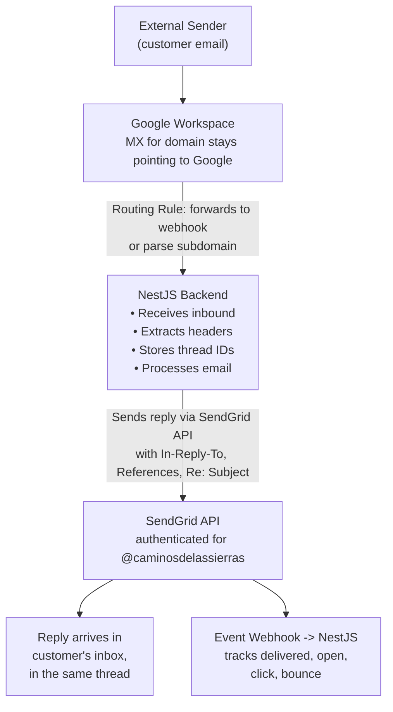

# Evaluación técnica POC de SendGrid

**Contexto**: Recibir emails en `info@caminosdelassierras.com.ar` (Google Workspace + Cloudflare DNS, DMARC `p=reject`), procesarlos en backend NestJS/Node.js, responder como `@caminosdelassierras.com.ar` manteniendo la continuidad del thread y las métricas de tracking.

**Fecha de investigación**: Febrero 2026
**Base de conocimiento**: Documentación y referencia de API de SendGrid hasta mayo de 2025. Los precios y cambios de funcionalidades muy recientes deben verificarse en https://sendgrid.com/en-us/pricing y https://docs.sendgrid.com.

---

## Desafío A — Envío y recepción

### A1. Inbound Parse Webhook

#### Cómo funciona
El Inbound Parse Webhook de SendGrid intercepta los emails enviados a un dominio (o subdominio) cuyos registros MX apuntan a SendGrid. Cuando llega un email, SendGrid lo parsea y hace POST del contenido a una URL que configuras.

**Pasos de configuración:**
1. Añadir un registro MX para el dominio/subdominio receptor que apunte a `mx.sendgrid.net` (prioridad 10).
2. En el dashboard de SendGrid (Settings → Inbound Parse), configurar:
   - El hostname/dominio que recibirá el mail.
   - La URL del webhook (tu endpoint de backend, debe ser HTTPS accesible públicamente).
   - Si enviar el mensaje MIME raw o la versión parseada.
3. SendGrid hace POST a tu URL de webhook cada vez que llega un email.

#### Formato del payload
SendGrid ofrece **dos modos**:

**Modo Parsed (por defecto)** — POST `multipart/form-data` con estos campos:

| Campo | Descripción |
|-------|-------------|
| `headers` | Headers raw del email entrante (bloque completo de headers como string) |
| `dkim` | Resultados de verificación DKIM (ej. `{@domain.com : pass}`) |
| `to` | Dirección(es) del destinatario como string (ej. `"Name" <email@domain.com>`) |
| `from` | Dirección del remitente como string |
| `cc` | Direcciones CC (si las hay) |
| `subject` | Asunto del email |
| `text` | Cuerpo en texto plano (si está presente) |
| `html` | Cuerpo HTML (si está presente) |
| `sender_ip` | IP del servidor remitente |
| `envelope` | String JSON con el envelope SMTP `to` y `from` |
| `attachments` | Número de adjuntos (entero) |
| `attachment1`, `attachment2`, ... | Archivos adjuntos reales (binarios, multipart file uploads) |
| `attachment-info` | JSON con metadata de adjuntos (filename, content-type, content-id) |
| `charsets` | Objeto JSON que mapea cada campo a su codificación de caracteres |
| `SPF` | Resultado de verificación SPF |

**Modo Raw** — POST `multipart/form-data` con:

| Campo | Descripción |
|-------|-------------|
| `email` | Mensaje MIME raw completo (el email RFC 2822 completo) |
| `to` | Dirección(es) del destinatario |
| `from` | Dirección del remitente |
| `subject` | Asunto |
| `sender_ip` | IP del remitente |
| `envelope` | String JSON con el envelope SMTP |
| `charsets` | Info de charset |
| `dkim` | Resultado DKIM |
| `SPF` | Resultado SPF |

**Detalle clave**: Incluso en modo "raw", **no** es un POST JSON. Siempre es `multipart/form-data`. El MIME raw está en el campo `email`.

#### Consideración crítica para esta POC — Conflicto de registros MX

**Esta es la decisión arquitectónica más importante.**

Actualmente, `caminosdelassierras.com.ar` tiene registros MX que apuntan a Google Workspace (ej. `aspmx.l.google.com`, etc.). Para que SendGrid Inbound Parse reciba mail en `info@caminosdelassierras.com.ar`, una de las siguientes opciones debe ser verdadera:

**Opción 1: Cambiar MX del dominio raíz** → Todo el email para `@caminosdelassierras.com.ar` va a SendGrid, no a Google. Esto **rompe el email de Google Workspace** para todos los usuarios. **No viable** si la empresa usa Google Workspace para otras casillas.

**Opción 2: Usar un subdominio para inbound parse** → ej. `parse.caminosdelassierras.com.ar` con MX → `mx.sendgrid.net`. Entonces SendGrid recibe mail en `anything@parse.caminosdelassierras.com.ar`. Pero la dirección real `info@caminosdelassierras.com.ar` sigue entregando a Google Workspace.

**Opción 3: Routing de Google Workspace** → Mantener MX apuntando a Google. En Google Workspace Admin, configurar una **regla de routing** para `info@caminosdelassierras.com.ar` que reenvíe todo el mail entrante a una dirección en el subdominio parseado por SendGrid (ej. `info@parse.caminosdelassierras.com.ar`), que luego dispara el Inbound Parse webhook. Alternativamente, Google Workspace puede reenviar directamente a tu endpoint de webhook NestJS sin involucrar SendGrid Inbound Parse.

**Opción 4: Forwarding de Google Workspace (más simple)** → Configurar forwarding en Google Workspace (a nivel de usuario o vía reglas de routing en Admin Console) para reenviar copias de los emails que llegan a `info@` a tu webhook de backend directamente. Luego usar SendGrid solo para *enviar* respuestas. Esto evita el conflicto MX por completo.

**Recomendación para esta POC**: La Opción 4 es la más pragmática. Usar routing de Google Workspace para inbound, SendGrid para outbound. Alternativamente, Opción 3 si quieres que SendGrid parsee los emails entrantes.

---

### A2. Envío desde dominio externo — Registros DNS requeridos

Para enviar emails como `@caminosdelassierras.com.ar` vía SendGrid con autenticación adecuada (esencial dado que DMARC es `p=reject`), necesitas **Domain Authentication** (antes "Whitelabeling").

#### Registros DNS requeridos

Domain Authentication de SendGrid requiere que añadas **tres registros CNAME** al DNS de tu dominio (en Cloudflare):

```
# CNAME records for DKIM signing
em1234.caminosdelassierras.com.ar  →  u1234567.wl.sendgrid.net
s1._domainkey.caminosdelassierras.com.ar  →  s1.domainkey.u1234567.wl.sendgrid.net
s2._domainkey.caminosdelassierras.com.ar  →  s2.domainkey.u1234567.wl.sendgrid.net
```

(Los subdominios y valores exactos son generados por SendGrid durante el setup y son únicos para tu cuenta.)

**Qué hacen estos registros:**
- `em1234.*` → Es un CNAME que resuelve a un registro TXT de SendGrid que contiene un include SPF. Cuando los servidores de mail receptores buscan el SPF de tu dominio, esta ruta eventualmente lleva a que `include:sendgrid.net` esté autorizado.
- `s1._domainkey.*` y `s2._domainkey.*` → Son registros CNAME que apuntan a claves públicas DKIM alojadas por SendGrid. SendGrid firma el mail saliente con las claves privadas correspondientes.

#### Consideraciones SPF
Dado que Google Workspace ya usa SPF para `caminosdelassierras.com.ar`, el registro SPF existente probablemente se ve así:

```
v=spf1 include:_spf.google.com ~all
```

Necesitas **añadir** el include de SendGrid:

```
v=spf1 include:_spf.google.com include:sendgrid.net ~all
```

**Importante**: SPF tiene un límite de 10 lookups DNS. `include:_spf.google.com` ya consume varios. Añadir `include:sendgrid.net` añade más. Debes verificar que el total no exceda 10, o usar un servicio de SPF flattening.

**Nota sobre Cloudflare**: Al añadir registros CNAME para SendGrid en Cloudflare, debes configurarlos como **DNS Only (nube gris)**, no Proxied (nube naranja). El proxy de Cloudflare rompe la autenticación de email basada en DNS.

#### DKIM
Se maneja automáticamente vía los registros CNAME anteriores. SendGrid firma con su propia clave privada; la clave pública se sirve a través de la cadena CNAME. Ambos selectores `s1` y `s2` se usan para rotación de claves.

#### DMARC
La alineación DMARC es la preocupación crítica aquí dado que el dominio tiene `p=reject`.

- **Alineación DKIM**: Si SendGrid firma con `d=caminosdelassierras.com.ar` (lo cual hace cuando Domain Authentication está configurado correctamente vía los CNAMEs), la alineación DKIM pasa.
- **Alineación SPF**: El dominio `MAIL FROM` (envelope sender / Return-Path) debe alinearse con el dominio del header `From`. SendGrid por defecto usa su propio dominio de manejo de bounce para el envelope sender (ej. `bounces.sendgrid.net`). Esto significa que la alineación SPF **fallará** por defecto. Sin embargo, DMARC solo requiere que **uno** de SPF o DKIM alinee, así que la alineación DKIM sola es suficiente.
- **Para obtener alineación SPF también** (cinturón y tirantes): Puedes configurar **Link Branding** y configurar un dominio Return-Path personalizado (disponible en plan Pro y superiores). Esto hace que el envelope sender use tu dominio.

**Conclusión**: Con los CNAMEs de Domain Authentication correctamente configurados, la alineación DKIM pasa, y los emails enviados vía SendGrid como `@caminosdelassierras.com.ar` **pasarán DMARC incluso con `p=reject`**.

---

### A3. ¿Puede enviar desde un dominio que no posees?

**Técnicamente sí, prácticamente limitado:**

- SendGrid **no** requiere que demuestres propiedad del dominio en el sentido del registrador. Requiere que añadas registros DNS (CNAMEs) a la zona DNS del dominio.
- Si tienes **acceso DNS** (que en este caso tienes — vía Cloudflare), puedes autenticar cualquier dominio.
- Si NO tienes acceso DNS, aún puedes enviar desde el dominio, pero:
  - Los emails se firmarán con el DKIM por defecto de SendGrid (`d=sendgrid.net`), no tu dominio.
  - SPF hará referencia a `sendgrid.net`.
  - **La alineación DMARC fallará** → Con `p=reject`, estos emails serán rechazados por los servidores receptores.

**Configuración DNS mínima necesaria:**
- Los 3 registros CNAME para Domain Authentication (DKIM + pass-through SPF).
- Actualización del registro SPF para incluir `sendgrid.net`.
- Eso es todo — unas 4 cambios DNS en total.

---

### A4. Manejo de Reply-To

**Sí, Reply-To puede configurarse independientemente de la dirección From.**

En la API v3 Mail Send de SendGrid:

```json
{
  "from": {
    "email": "info@caminosdelassierras.com.ar",
    "name": "Caminos de las Sierras"
  },
  "reply_to": {
    "email": "support@otherdomain.com",
    "name": "Support Team"
  },
  "reply_to_list": [
    {
      "email": "support@otherdomain.com",
      "name": "Support"
    },
    {
      "email": "backup@otherdomain.com",
      "name": "Backup"
    }
  ]
}
```

- `reply_to` — Establece una única dirección Reply-To.
- `reply_to_list` — Establece múltiples direcciones Reply-To (máx. 1000). Si ambos se proporcionan, `reply_to_list` tiene precedencia.
- Son completamente independientes del campo `from`.

**Caso de uso para esta POC**: Podrías enviar `From: info@caminosdelassierras.com.ar` con `Reply-To: info@caminosdelassierras.com.ar` (o incluso una dirección diferente que enrute a tu sistema de procesamiento). Esto está totalmente soportado.

---

### A5. Soporte de headers personalizados

**Sí, totalmente soportado.**

La API Mail Send tiene un objeto `headers` donde puedes establecer headers personalizados arbitrarios:

```json
{
  "personalizations": [
    {
      "to": [{"email": "recipient@example.com"}],
      "headers": {
        "X-Custom-Header": "custom-value",
        "X-Ticket-ID": "12345"
      }
    }
  ],
  "headers": {
    "X-Global-Header": "value-for-all-recipients"
  }
}
```

- Los headers pueden establecerse a nivel de **personalización** (por destinatario) o a nivel de **mensaje** (global).
- Puedes establecer headers de threading como `In-Reply-To` y `References` vía headers personalizados.
- **Restricción**: No puedes sobrescribir ciertos headers reservados que SendGrid gestiona (ej. `Date`, `From`, `To`, `Subject` se establecen vía sus campos dedicados). Sin embargo, `Message-ID`, `In-Reply-To` y `References` **sí pueden** establecerse vía headers personalizados.

---

## Desafío B — Thread tracking

### B1. Threading automático

**SendGrid NO mantiene threading automáticamente.** Es una API de email transaccional/marketing — no tiene un concepto de "conversaciones" o "threads" incorporado.

Lo que SendGrid hace automáticamente:
- **Genera un header `Message-ID`** para cada email saliente (ej. `<filter_id.smtpapi_id@ismtpd-xxx>`).
- **NO establece `In-Reply-To` ni `References`** automáticamente. Debes establecerlos tú mismo.

**Eres responsable del threading.** Esto significa que tu backend NestJS debe:
1. Al recibir un email entrante, extraer los headers `Message-ID`, `In-Reply-To`, `References` y `Subject`.
2. Almacenarlos en tu base de datos.
3. Al enviar una respuesta, establecer:
   - `In-Reply-To: <original-message-id>`
   - `References: <original-message-id> <any-previous-message-ids>`
   - `Subject: Re: <original-subject>` (preservar el asunto original con prefijo `Re:`)

### B2. Message-ID personalizado

**Sí, puedes establecer un `Message-ID` personalizado.**

```json
{
  "headers": {
    "Message-ID": "<custom-id-12345@caminosdelassierras.com.ar>"
  }
}
```

- El Message-ID debe seguir el formato RFC 5322: `<unique-part@domain>`.
- Usar tu propio dominio en el Message-ID es recomendado para consistencia.
- **Consideración**: Algunas documentaciones antiguas de SendGrid sugieren que no puedes sobrescribir Message-ID. En la práctica, establecerlo vía el campo `headers` en la API v3 **sí** funciona. Sin embargo, algunos usuarios han reportado inconsistencias — **verifica esto en las pruebas de tu POC**.
- Alternativa: Si el Message-ID personalizado no se mantiene, puedes usar el header `X-Message-Id` que SendGrid añade a cada mensaje. Este header contiene el ID de mensaje interno de SendGrid y se devuelve en los eventos del webhook.

### B3. Mecanismo de respuesta para continuidad del thread

Para mantener la continuidad del thread en Gmail, Outlook y Apple Mail, necesitas:

**Criterios de threading de Gmail** (Gmail usa una combinación):
1. Misma línea de `Subject` (ignorando prefijos `Re:`/`Fwd:`) — necesario pero no suficiente.
2. Headers `References` o `In-Reply-To` que referencien un Message-ID ya en el thread.
3. Enviado a/desde los mismos participantes.

**Criterios de threading de Outlook**:
1. Mismo `Subject` normalizado (el header `Thread-Topic` si está presente).
2. Headers `In-Reply-To` y `References`.
3. Outlook también usa el header `Thread-Index` (propietario de Microsoft) para threading preciso.

**Implementación en tu backend NestJS:**

```typescript
// When sending a reply via SendGrid
const msg = {
  to: originalSender,
  from: { email: 'info@caminosdelassierras.com.ar', name: 'Caminos de las Sierras' },
  subject: `Re: ${originalSubject}`,  // Preserve subject with Re: prefix
  headers: {
    'In-Reply-To': originalMessageId,           // Message-ID of the email being replied to
    'References': `${allPriorMessageIds}`,       // Space-separated list of all Message-IDs in the thread
  },
  text: replyBody,
  html: replyBodyHtml,
};
await sgMail.send(msg);
```

**Esto funciona de forma fiable** para Gmail y la mayoría de clientes. Para Outlook, añadir headers `Thread-Topic` y `Thread-Index` puede mejorar el threading pero no es estrictamente requerido.

### B4. Limitaciones del threading

1. **Sin tracking de conversación incorporado**: SendGrid no tiene concepto de threads o conversaciones. Tu aplicación debe rastrear todos los Message-IDs y construir la cadena References.
2. **Fiabilidad del Message-ID**: Si SendGrid sobrescribe tu Message-ID personalizado en casos límite, la continuidad del thread se rompe. Prueba esto exhaustivamente.
3. **Sensibilidad de la línea de asunto**: Si el asunto se modifica (ej. por tu sistema), Gmail puede romper el thread.
4. **Mensajes reenviados**: La continuidad del thread para mensajes reenviados es más difícil de mantener y depende del comportamiento del cliente.
5. **El tracking de open/click puede romper el threading**: El tracking de open/click de SendGrid modifica el cuerpo HTML (añade pixel de tracking, reescribe links). Esto no rompe el threading directamente pero puede alterar la apariencia visual del texto citado en las respuestas.

---

## Desafío C — Email tracking

### C1. Funcionalidades de tracking disponibles

| Funcionalidad | Descripción |
|---------------|-------------|
| **Delivered** | El email fue aceptado por el servidor receptor (no necesariamente en inbox) |
| **Open** | El destinatario abrió el email (basado en pixel, ver C4) |
| **Click** | El destinatario hizo click en un link rastreado en el email |
| **Bounce** | El email rebotó — hard bounce (dirección inválida) o soft bounce (fallo temporal) |
| **Dropped** | SendGrid decidió no enviar (ej. destinatario en lista de supresión, email inválido) |
| **Deferred** | El servidor receptor rechazó temporalmente; SendGrid reintentará |
| **Spam Report** | El destinatario marcó el email como spam (vía feedback loop del ISP) |
| **Unsubscribe** | El destinatario hizo click en el link de unsubscribe (si usas gestión de suscripciones de SendGrid) |
| **Group Unsubscribe** | El destinatario se dio de baja de un grupo específico |
| **Group Resubscribe** | El destinatario se volvió a suscribir a un grupo |
| **Processed** | SendGrid aceptó el email para entrega (evento interno) |

### C2. Tipos de eventos del webhook (Event Webhook)

Todos los tipos de eventos se entregan vía el **Event Webhook** de SendGrid:

**Eventos de entrega:**
- `processed` — Email aceptado por SendGrid para entrega
- `delivered` — Email entregado al servidor receptor
- `deferred` — Fallo temporal de entrega, se reintentará
- `bounce` — Fallo permanente de entrega
- `dropped` — SendGrid no entregará (supresión, inválido, etc.)

**Eventos de engagement:**
- `open` — Email abierto (pixel de tracking cargado)
- `click` — Click en link del email
- `spam_report` — Marcado como spam por el destinatario
- `unsubscribe` — Destinatario se dio de baja
- `group_unsubscribe` — Se dio de baja de un grupo
- `group_resubscribe` — Se volvió a suscribir a un grupo

**Formato del payload del webhook** (array JSON):

```json
[
  {
    "email": "recipient@example.com",
    "timestamp": 1676000000,
    "smtp-id": "<unique-smtp-id@sendgrid.net>",
    "event": "delivered",
    "category": ["category1"],
    "sg_event_id": "unique-event-id",
    "sg_message_id": "sendgrid-message-id.filterxxx.xxxxx.xxxxxx",
    "response": "250 OK",
    "attempt": "1",
    "ip": "167.89.xxx.xxx",
    "tls": 1,
    "cert_error": 0,
    "useragent": "Mozilla/5.0...",  // For open/click events
    "url": "https://tracked-url.com",  // For click events
    "reason": "550 User not found",  // For bounce events
    "type": "bounce",  // bounce sub-type
    "status": "5.0.0"  // SMTP status code
  }
]
```

**Campos importantes para esta POC:**
- `sg_message_id` — Correlacionar eventos del webhook con el email enviado.
- `event` — El tipo de evento.
- `email` — El destinatario.
- `timestamp` — Timestamp Unix del evento.
- Los `unique_args` personalizados pueden pasarse al enviar para incluir tu propia metadata (ej. ID de ticket) en todos los eventos del webhook para ese email.

### C3. Inclusión de tracking por plan

| Funcionalidad | Free | Essentials | Pro | Premier |
|---------------|------|------------|-----|---------|
| Event Webhook | Yes | Yes | Yes | Yes |
| Open Tracking | Yes | Yes | Yes | Yes |
| Click Tracking | Yes | Yes | Yes | Yes |
| Deliverability Insights | No | No | Yes | Yes |
| Expert Insights | No | No | No | Yes |

**Todas las funcionalidades de tracking (open, click, bounce, delivered, dropped, deferred, spam report) y el Event Webhook están disponibles en TODOS los planes, incluyendo el free tier.**

### C4. Open tracking — Cómo funciona

SendGrid inserta un **tracking pixel** invisible (GIF transparente 1x1) al final del cuerpo HTML del email:

```html

```

Cuando el cliente de email del destinatario carga imágenes, este pixel se solicita a los servidores de SendGrid, disparando el evento "open".

**Limitaciones:**
- No funciona si el destinatario tiene imágenes deshabilitadas (común en Outlook, privacidad de Apple Mail).
- Apple Mail Privacy Protection (iOS 15+ / macOS Monterey+) precarga todas las imágenes vía proxy, causando opens falsos.
- Algunos gateways corporativos eliminan los tracking pixels.
- Los emails en texto plano no pueden rastrearse por open (no hay cuerpo HTML para embeber el pixel).

### C5. Impacto del tracking en deliverability y DMARC

**Click tracking:**
- SendGrid reescribe los links para que pasen por su dominio de tracking (ej. `https://u12345.ct.sendgrid.net/ls/click?upn=...`).
- Si configuras **Link Branding**, los links se reescriben a través de tu propio dominio (ej. `https://track.caminosdelassierras.com.ar/ls/click?...`). Esto se ve más profesional y evita problemas de reputación de dominio.
- Los links reescritos a través de `sendgrid.net` pueden ocasionalmente disparar filtros de spam porque el dominio del link difiere del dominio del remitente.

**Open tracking:**
- El dominio del tracking pixel debería coincidir con tu dominio branded para consistencia.
- Impacto directo mínimo en deliverability, pero algunos filtros de spam marcan emails con tracking pixels de dominios ESP conocidos.

**Impacto en DMARC:**
- El click tracking vía dominios `sendgrid.net` NO afecta DMARC (DMARC verifica la alineación del dominio del header `From` con DKIM/SPF, no los dominios de links en el cuerpo).
- **Sin embargo**, la discrepancia visual entre el dominio del remitente y los dominios de los links puede afectar la confianza del destinatario y las heurísticas anti-phishing.
- **Recomendación**: Configurar Link Branding con un subdominio como `click.caminosdelassierras.com.ar` o `email.caminosdelassierras.com.ar` para mantener todo consistente.

---

## Precios (actualizado febrero 2026)

> **ACTUALIZACIÓN IMPORTANTE (Mayo 2025)**: Twilio retiró los planes free permanentes de SendGrid el 28 de mayo de 2025. Tras un período de transición de 60 días, las cuentas free tuvieron su envío de email pausado. SendGrid ahora solo ofrece una **prueba gratuita de 60 días**, tras la cual se requiere actualizar a un plan de pago para continuar enviando emails. [Fuente](https://www.twilio.com/en-us/changelog/changes-coming-to-sendgrid-s-free-plans)

### Planes actuales

| Plan | Costo mensual | Emails/mes | Funcionalidades clave |
|------|---------------|------------|------------------------|
| **Free Trial (60 días)** | $0 (temporal) | 100/día (~3.000/mes) | Single sender, APIs básicas, **expira tras 60 días** |
| **Essentials** | Desde $19.95/mes | 50.000 | Ticketing + chat support, sin IP whitelisting, analytics básicos |
| **Pro** | Desde $89.95/mes | 100.000 | IP dedicada, gestión de sub-usuarios, analytics avanzados, email validation |
| **Premier** | Precio personalizado | Volumen personalizado | CSM dedicado, SSO, funcionalidades personalizadas |

**Nota**: Los niveles de precios se basan en volumen de email. Volúmenes mayores tienen menor costo por email dentro de cada plan. Los precios anteriores son precios iniciales para el volumen más bajo en cada nivel. El costo mínimo sostenido es $19.95/mes (Essentials) ya que el free tier ya no es permanente.

### Costo por email (aproximado)

| Plan | Volumen | Costo aprox./email |
|------|---------|-------------------|
| Free | 100/día | $0 |
| Essentials 50K | 50.000/mes | ~$0.0004 |
| Essentials 100K | 100.000/mes | ~$0.00035 |
| Pro 100K | 100.000/mes | ~$0.0009 |
| Pro 300K | 300.000/mes | ~$0.0005 |

### Disponibilidad de Inbound Parse

**Inbound Parse está disponible en TODOS los planes, incluyendo el free tier.** No hay costo adicional por Inbound Parse — es una funcionalidad de plataforma, no un add-on de pago.

**Sin embargo**: Inbound Parse no cuenta contra tu cuota de envío de email. Es puramente para recibir/parsear. Tu cuota de envío solo aplica a emails outbound.

### Costo del tracking

**Todas las funcionalidades de tracking están incluidas en todos los planes sin costo adicional.** Open tracking, click tracking, event webhooks — todo gratis con cada plan.

### Detalles del free trial (ya no hay free tier permanente)

- **Solo 60 días de prueba** — tras 60 días, el envío de email se pausa y se requiere actualizar a un plan de pago.
- **100 emails por día** durante la prueba (límite duro, no 100/mes).
- Aproximadamente 3.000 emails/mes durante el período de prueba.
- Acceso a todas las APIs (v3 Mail Send, Inbound Parse, Event Webhook).
- Autenticación de dos factores requerida.
- Verificación de single sender (aún puedes autenticar un dominio completo).
- **Sin IP dedicada** (pool de IP compartida).
- Limitado a 1 teammate.
- Soporte: solo por tickets durante la prueba.
- **Tras expirar la prueba**: Debe actualizar a Essentials ($19.95/mes mínimo) o superior para continuar enviando.

---

## Detalles de integración

### SDKs de Node.js

**SDK oficial: `@sendgrid/mail`**

```bash
npm install @sendgrid/mail
```

Paquetes adicionales:
- `@sendgrid/client` — Cliente REST de bajo nivel para cualquier endpoint de API de SendGrid.
- `@sendgrid/helpers` — Clases de utilidad para construir objetos de mail.
- `@sendgrid/inbound-mail-parser` — Helper parser para payloads del webhook Inbound Parse.
- `@sendgrid/eventwebhook` — Helper para verificar firmas del Event Webhook.

**Ejemplo de envío de email (NestJS):**

```typescript
import * as sgMail from '@sendgrid/mail';

sgMail.setApiKey(process.env.SENDGRID_API_KEY);

const msg = {
  to: 'recipient@example.com',
  from: {
    email: 'info@caminosdelassierras.com.ar',
    name: 'Caminos de las Sierras',
  },
  replyTo: {
    email: 'info@caminosdelassierras.com.ar',
    name: 'Caminos de las Sierras',
  },
  subject: 'Re: Original Subject',
  text: 'Plain text body',
  html: '<p>HTML body</p>',
  headers: {
    'In-Reply-To': '<original-message-id@sender-domain.com>',
    'References': '<msg-1@domain.com> <msg-2@domain.com>',
    'X-Custom-Ticket-Id': 'TICKET-12345',
  },
  customArgs: {
    ticketId: 'TICKET-12345',  // Appears in webhook events as unique_args
  },
  trackingSettings: {
    clickTracking: { enable: true },
    openTracking: { enable: true },
  },
};

const [response] = await sgMail.send(msg);
// response.statusCode === 202 means accepted
// response.headers['x-message-id'] contains SendGrid's message ID
```

### REST API vs SMTP

**Ambos están soportados:**

| Método | Endpoint | Mejor para |
|--------|----------|------------|
| **REST API (v3)** | `POST https://api.sendgrid.com/v3/mail/send` | Envío programático, acceso completo a funcionalidades, recomendado para NestJS |
| **SMTP** | `smtp.sendgrid.net:587` (STARTTLS) o `:465` (SSL) | Sistemas legacy, integraciones simples |

**Ventajas de REST API** (recomendado para esta POC):
- Acceso completo a todas las funcionalidades (categorías, custom args, personalizaciones, etc.).
- Mejor manejo de errores (códigos de estado HTTP + detalles de error JSON).
- Sin sobrecarga de gestión de conexión SMTP.
- Soporta batch sending vía array `personalizations`.

**Detalles SMTP** (si se necesita):
- Host: `smtp.sendgrid.net`
- Puertos: 25, 587 (STARTTLS), 465 (SSL/TLS), 2525 (alternativo)
- Username: `apikey` (string literal "apikey")
- Password: Tu API key de SendGrid
- Los headers personalizados pueden establecerse vía header `X-SMTPAPI` (blob JSON).

### Formatos de webhook

#### Inbound Parse Webhook (recibir email)
- **Método**: POST
- **Content-Type**: `multipart/form-data`
- **Autenticación**: Sin auth incorporada. Deberías:
  - Usar un token secreto en la ruta del webhook (ej. `https://api.yourapp.com/webhooks/sendgrid/inbound/SECRET_TOKEN`).
  - Verificar que la IP del remitente esté en el rango de IPs de SendGrid.
- **Sin mecanismo de retry**: Si tu servidor devuelve algo distinto de 2xx, **el email se pierde**. SendGrid no reintenta los webhooks de Inbound Parse.

**Ejemplo de controlador NestJS:**

```typescript
import { Controller, Post, Body, UseInterceptors, UploadedFiles } from '@nestjs/common';
import { AnyFilesInterceptor } from '@nestjs/platform-express';

@Controller('webhooks/sendgrid/inbound')
export class InboundParseController {
  @Post()
  @UseInterceptors(AnyFilesInterceptor())
  async handleInbound(
    @Body() body: Record<string, string>,
    @UploadedFiles() files: Express.Multer.File[],
  ) {
    const from = body.from;
    const to = body.to;
    const subject = body.subject;
    const text = body.text;
    const html = body.html;
    const headers = body.headers; // Raw headers as string
    const envelope = JSON.parse(body.envelope);
    const attachmentInfo = body['attachment-info']
      ? JSON.parse(body['attachment-info'])
      : {};

    // Extract threading headers from the raw headers string
    const messageId = this.extractHeader(headers, 'Message-ID');
    const inReplyTo = this.extractHeader(headers, 'In-Reply-To');
    const references = this.extractHeader(headers, 'References');

    // Process the email...
    // files[] contains the actual attachment binaries
  }

  private extractHeader(headers: string, name: string): string | null {
    const regex = new RegExp(`^${name}:\\s*(.+)$`, 'mi');
    const match = headers.match(regex);
    return match ? match[1].trim() : null;
  }
}
```

#### Event Webhook (eventos de tracking)
- **Método**: POST
- **Content-Type**: `application/json`
- **Formato**: Array JSON de objetos de evento (en batch, hasta varios cientos de eventos por POST).
- **Autenticación**: SendGrid firma los payloads del Event Webhook con una **firma ECDSA** (desde 2020). Deberías verificar la firma usando el paquete `@sendgrid/eventwebhook`.
- **Mecanismo de retry**: SendGrid reintenta en respuestas no 2xx con exponential backoff.

```typescript
import { Controller, Post, Body, Headers, HttpCode } from '@nestjs/common';
import { EventWebhook, EventWebhookHeader } from '@sendgrid/eventwebhook';

@Controller('webhooks/sendgrid/events')
export class EventWebhookController {
  @Post()
  @HttpCode(200)
  async handleEvents(
    @Body() events: SendGridEvent[],
    @Headers(EventWebhookHeader.SIGNATURE()) signature: string,
    @Headers(EventWebhookHeader.TIMESTAMP()) timestamp: string,
    @Body() rawBody: string,  // Need raw body for verification
  ) {
    // Verify webhook signature
    const ew = new EventWebhook();
    const publicKey = ew.convertPublicKeyToECDSA(process.env.SENDGRID_WEBHOOK_VERIFICATION_KEY);
    const isValid = ew.verifySignature(publicKey, rawBody, signature, timestamp);

    if (!isValid) {
      throw new UnauthorizedException('Invalid webhook signature');
    }

    for (const event of events) {
      switch (event.event) {
        case 'delivered':
          // Mark email as delivered
          break;
        case 'open':
          // Track open
          break;
        case 'click':
          // Track click, event.url has the clicked URL
          break;
        case 'bounce':
          // Handle bounce, event.reason has details
          break;
        case 'dropped':
          // Handle drop
          break;
        case 'spam_report':
          // Handle spam report, suppress future emails
          break;
      }
    }
  }
}

interface SendGridEvent {
  email: string;
  timestamp: number;
  event: string;
  sg_event_id: string;
  sg_message_id: string;
  category?: string[];
  reason?: string;
  type?: string;
  url?: string;
  useragent?: string;
  ip?: string;
  response?: string;
  attempt?: string;
  unique_args?: Record<string, string>;  // Your custom args
}
```

---

## Arquitectura recomendada para esta POC

Dadas las restricciones (Google Workspace, Cloudflare DNS, DMARC `p=reject`, backend NestJS):



### Cambios DNS requeridos en Cloudflare

```text
# Existing (keep):
MX  caminosdelassierras.com.ar  →  aspmx.l.google.com (priority 1)
MX  caminosdelassierras.com.ar  →  alt1.aspmx.l.google.com (priority 5)
... (other Google MX records)

# Add for SendGrid Domain Authentication:
CNAME  em1234.caminosdelassierras.com.ar          → u1234567.wl.sendgrid.net  (DNS Only)
CNAME  s1._domainkey.caminosdelassierras.com.ar   → s1.domainkey.u1234567.wl.sendgrid.net  (DNS Only)
CNAME  s2._domainkey.caminosdelassierras.com.ar   → s2.domainkey.u1234567.wl.sendgrid.net  (DNS Only)

# Update SPF:
TXT  caminosdelassierras.com.ar  →  "v=spf1 include:_spf.google.com include:sendgrid.net ~all"

# Optional — for Inbound Parse on subdomain:
MX  parse.caminosdelassierras.com.ar  →  mx.sendgrid.net (priority 10)

# Optional — for Link Branding:
CNAME  url1234.caminosdelassierras.com.ar  →  sendgrid.net  (DNS Only)
CNAME  12345678.caminosdelassierras.com.ar → sendgrid.net  (DNS Only)
```

---

## Consideraciones y limitaciones clave

1. **Inbound Parse NO tiene retry**: Si tu webhook está caído, los emails entrantes se **pierden permanentemente**. Construye redundancia (ej. Google Workspace mantiene una copia si usas forwarding en lugar de redirección MX).

2. **Conflicto de registros MX**: No puedes tener SendGrid Inbound Parse y Google Workspace recibiendo mail en el mismo dominio simultáneamente. Usa estrategia de subdominio o forwarding.

3. **Sin free tier permanente**: Los planes free de SendGrid fueron retirados en mayo 2025. La prueba gratuita dura solo 60 días, tras los cuales el envío se pausa. Para una POC corta puede ser suficiente, pero para pruebas continuas se requiere Essentials ($19.95/mes).

4. **Reputación de IP compartida en Free/Essentials**: Tu deliverability depende de otros remitentes en la misma IP. Para producción con DMARC `p=reject`, considera plan Pro con IP dedicada.

5. **El open tracking es poco fiable**: Apple Mail Privacy Protection, bloqueo de imágenes y proxies corporativos hacen que las métricas de open rate sean poco fiables (típicamente se rastrea el 30-50% de los opens reales).

6. **Batching del Event Webhook**: Los eventos se envían en batch y pueden llegar con retrasos (típicamente segundos, pero pueden ser minutos en alta carga). No dependas de entrega de eventos en tiempo real.

7. **El proxy de Cloudflare debe estar OFF**: Los registros CNAME para autenticación de SendGrid DEBEN configurarse como "DNS Only" (nube gris) en Cloudflare. El proxying rompe la verificación DKIM/SPF.

8. **Límite de lookups SPF**: Añadir `include:sendgrid.net` añade lookups DNS. Combinado con los includes SPF de Google Workspace, puedes acercarte al límite de 10 lookups. Prueba con herramientas de verificación SPF.

9. **Comportamiento del Message-ID personalizado**: Aunque la API acepta headers personalizados `Message-ID`, verifica en las pruebas que SendGrid no lo sobrescriba o le añada algo. Esto ha sido inconsistente en algunos reportes.

10. **Rate limits**: La API v3 Mail Send tiene rate limits. El free tier está limitado a ~100 emails/día. Los planes de pago varían pero típicamente permiten envío burst de varios cientos/seg.

11. **DMARC con `p=reject`**: Esta es la política DMARC más estricta. Domain Authentication vía CNAMEs es **obligatoria** — sin ella, cada email que envíes vía SendGrid como `@caminosdelassierras.com.ar` será rechazado por los servidores de mail receptores.

12. **Límite de tamaño de Inbound Parse**: El tamaño máximo de email para Inbound Parse es **30 MB** (incluyendo adjuntos).

13. **Timeout del webhook**: SendGrid espera que tu webhook responda en **3 segundos** para Inbound Parse y **5 segundos** para Event Webhook. Si el procesamiento toma más tiempo, devuelve 200 inmediatamente y procesa de forma asíncrona.
